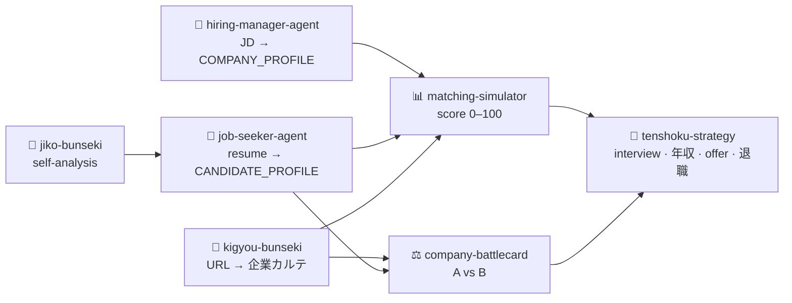

<div align="center">

# 🎯 Japan Recruit AI Agent

**Evaluate yourself through the agency's lens — before they do.**

A suite of Claude Code skills that simulate the matching logic of Japan's major
recruitment agencies (Recruit, Persol Career…) using publicly available frameworks — and run the full Japanese job-change (転職) playbook
from self-analysis to the first day at your new job.

[](./LICENSE)
[](./.claude-plugin/plugin.json)
[](#agent-skills)
[](#installation)
[](https://claude.com/claude-code)
[](#core-features)
[](#agent-skills)

**[English](#English) · [日本語](#日本語) · [한국어](#한국어)**

</div>

---

## 🔁 Suite Pipeline



> **Job seeker:** `jiko-bunseki` → `job-seeker-agent` → `matching-simulator` / `company-battlecard` → `tenshoku-strategy`
> **Hiring side:** `hiring-manager-agent` → `matching-simulator`
> **Company research:** `kigyou-bunseki` → `company-battlecard`

---

<a name="English"></a>
## English

A collection of AI agent skills that simulate the matching logic of major Japanese recruitment agencies (Recruit, Persol Career, etc.) using publicly available frameworks (SPI3, Portable Skills, Skill Ontology) — and then execute the full Japanese job-change (転職) playbook end to end.

> **Evaluate yourself through the agency's lens — before they do.**

### Agent Skills

7 agent skills, each a `SKILL.md` file in its own folder.

**1. jiko-bunseki (Self-Analysis)** — *Direction, before the resume*
The pre-step for everything else. Runs a quantitative snapshot (24 forced-choice strength pairs → 12 strengths → 4 clusters · executing / strategic-thinking / relationship-building / influencing; 6 work-style + 4 well-being Likert items) into a scored profile, then an **optional Phase 3 depth dive** that adds the four things a quantitative test can't reach: **career anchors** (Schein), **derailers** (where each top strength turns dangerous when overused), an **energy map** ("good at" vs "wants to do"), and a one-line **career theme** (Savickas). Supports 新卒 and 中途 tracks. Outputs a `SELF_ANALYSIS_PROFILE` YAML that `job-seeker-agent` reuses to skip redundant questions and seed 自己PR / 志望動機 / 転職軸.

**2. job-seeker-agent** — *Candidate Advisor (CA) lens*
Analyzes your background. Supports **mid-career (転職) and new-graduate (新卒) tracks** (an A/B question at session start routes you). Mid-career: gap analysis → SPI3 (12 statements) → 8 Portable Skills → skill-ontology mapping → **職務経歴書 reproducibility rewrite** (担当業務 → 役割 / 工夫 / 成果 / 再現性) → **志望動機 in a forced 3-part structure** (会社理解 → 自分の経験 → 入社後貢献) with **転職軸** and the **4-WHY consistency chain** (なぜ転職 / なぜこの会社 / なぜこの職種 / なぜ今) → **audience-segmented interview prep** (カジュアル面談 / 一次 / 二次 / 技術・ケース / 最終). New-grad: 学チカ scoring + self-PR / ES. Outputs a `CANDIDATE_PROFILE` YAML.

**3. hiring-manager-agent** — *Recruiting Advisor (RA) lens*
Models the team's top performer (hyperformer), then rewrites the JD so the agency's skill ontology matches it accurately. Designs well-being culture branding and Gakuchika / Portable-Skills interview rubrics. Outputs a `COMPANY_PROFILE` YAML.

**4. matching-simulator**
Combines CA/RA data into a final matching score and acceptance probability. Applies both the Recruit method (SPI3 + hyperformer) and the Persol method (skill-ontology semantic similarity), normalized to 0–100. Includes visa-risk simulation for non-PR foreign nationals (category mismatch, renewal timing, compounded short-tenure refund risk). Now includes three integrated layers: **posting legitimacy check** (ghost-job signals before running the simulation), **STAR+R interview story mapping** (evidence-grounded stories tied to JD requirements, with a mandatory Reflection column), and **職務経歴書 customization plan** (gap-driven rewrite suggestions with ATS keyword mirroring).

**5. company-battlecard**
Compares 2+ companies across 5 dimensions: SPI3 culture fit, skill-stack match, well-being alignment, growth trajectory, and practical factors (salary / remote / visa). Consumes the candidate's `CANDIDATE_PROFILE` for personalized scoring.

**6. kigyou-bunseki (Company Analysis)**
Extracts company data from Japanese job/review-site URLs via a 3-tier pipeline (curl ➔ read_url ➔ search_web) and produces a structured **企業カルテ**. Surfaces objective metrics (salary, overtime, ratings, **中途採用比率**) and a **求人の真正性 (ghost-job legitimacy)** assessment.

> ⚠️ **Unsupported from URL alone:** `jp.indeed.com` (bot-blocked) and `linkedin.com` (login). Provide a screenshot or the company name + job title.

**7. tenshoku-strategy (Job-Change Strategy)**
The execution playbook from "decided to leave" to "first day at the new job": 退職理由 reframing, 面接マナー (入室/着席/退室), **面接後フォロー (お礼メール)**, 年収交渉 (with a 報酬-terminology table and 業務委託 vs 正社員 comparison), **内定対応 (オファー面談 / 内定辞退 / 回答期限 / 入社日)**, 円満退職, 2025–2026 market positioning, and **選考トラッキング + rejection-pattern analysis**.

### Core Features

- **Score-based evaluation** — every score cites explicit evidence from your input. No praise, no guessing.
- **Language auto-detection (Rule A)** — reply in the user's language automatically (KO / JA / EN); pasted Japanese material never forces Japanese output; domain terms (職務経歴書, 志望動機, 年収…) stay in Japanese.
- **Fixed step sequence (Rule B)** — everyone goes through the same ordered steps; background (新卒/中途, 自社開発/SIer/SES/コンサル/スタートアップ/大企業) branches a step's *content*, never its *order*.
- **Output contract (Rule C)** — every generated file lands under the directory you invoked the session from: reports in `./career-docs/`, machine state in `./data/`; after each save the absolute path is printed and verified on disk.
- **Market-stage backbone** — the suite follows the real Japanese 転職 process (自己分析 → 書類 → 企業研究 → 応募 → 面接 → 内定・交渉 → 円満退職 → 入社); onboarding asks which stage you're at and routes you there.
- **Per-company pipeline** — `data/pipeline.yml` tracks every company's stage, match score, 求人 legitimacy, deadlines, and event history in parallel; a new session resumes with a kanban summary ("A社 stage 4 面接, ⚠️ B社 回答期限 in 2 days").
- **Dual track** — mid-career & new-graduate, auto-routed.
- **Conversational diagnosis** — 2–3 questions at a time, then STOP and wait.
- **Cross-skill pipeline** — self-analysis / candidate / company data passed as YAML with no information loss.
- **Auto-documentation** — results saved to `career-docs/` (in your working directory).
- **No fabrication** — never invent STAR stories, metrics, offers, or evidence not in your input.

### Supported Platforms

| Platform | Characteristics | Foreign-national fit |
|----------|----------------|----------------------|
| Recruit Agent | Reproducibility focus; SPI3 | Moderate |
| doda | Portable Skills; CA/RA dual screening | Moderate |
| MyNavi Agent | Under-34 specialist; ~50% doc pass | Low |
| Levtech | IT engineers; tech-stack match first | N2+ |
| Green | Direct-apply; startup; gap-tolerant | High |
| BizReach | Scout-based; 7M+ yen target | Moderate |
| Wantedly | Culture/mission-first; salary hidden | High |
| VISIONARY CAREER | Foreign-national specialist; visa/COE | Specialist |

### Installation

**Claude Code Marketplace (recommended)**

```
/plugin marketplace add younnieCutler/japan-recruit-ai-agent
/plugin install japan-recruit-ai-agent@japan-recruit-ai-agent
```

> ℹ️ **Note:** installs all 7 skills. The root `CLAUDE.md` (session-start pipeline kanban, full
> onboarding menu) only applies when the repo is cloned directly below — plugin installs still get
> full skill routing via each skill's own trigger description, just not the automatic session-start greeting.

**Claude Code (manual, register as slash commands)**

```bash
git clone https://github.com/younnieCutler/japan-recruit-ai-agent ~/japan-recruit-skills

# Copy the 7 skill folders
cp -r ~/japan-recruit-skills/skills/jiko-bunseki \
      ~/japan-recruit-skills/skills/job-seeker-agent \
      ~/japan-recruit-skills/skills/hiring-manager-agent \
      ~/japan-recruit-skills/skills/matching-simulator \
      ~/japan-recruit-skills/skills/company-battlecard \
      ~/japan-recruit-skills/skills/kigyou-bunseki \
      ~/japan-recruit-skills/skills/tenshoku-strategy \
      ~/.claude/skills/

# Copy shared frameworks/schemas (skills reference ../../_shared/)
cp -r ~/japan-recruit-skills/_shared ~/.claude/_shared
```

**Claude Desktop** (via Projects): upload the desired `SKILL.md` as Project Knowledge, then paste your resume to begin. (Or paste the full `SKILL.md` into Settings → Custom Instructions.)

### How to Use

1. Install per above.
2. Invoke a skill (Claude Code: `/jiko-bunseki` to start, or `/job-seeker-agent` if your resume is ready).
3. Provide your resume (e.g. `@resume.md`); attach a target JD to trigger Gap Analysis immediately.
4. Answer the diagnostic questions — in any language; the skill replies in yours.

### Recommended Workflows

| Situation | Path |
|-----------|------|
| Unsure of direction (strengths / values first) | `/jiko-bunseki` ➔ `/job-seeker-agent` |
| New-grad (学チカ → self-PR → ES) | `/job-seeker-agent` → A. 新卒 |
| Mid-career resume analysis & reframing | `/job-seeker-agent` → B. 中途 |
| Acceptance probability for a JD | `/job-seeker-agent` ➔ `/matching-simulator` |
| Company A vs B | `/job-seeker-agent` ➔ `/company-battlecard` |
| Is this posting a ghost job? | `/kigyou-bunseki` (paste URL) |
| Write an attractive JD (as a company) | `/hiring-manager-agent` |
| Interview / salary / offer / resignation / tracking | `/tenshoku-strategy` |
| Foreign national with visa risk | `/job-seeker-agent` ➔ `/matching-simulator` (give visa status) |

### Framework Basis

- **Strength clusters** — 24 forced-choice pairs → 12 strengths → 4 clusters (Executing / Strategic Thinking / Relationship Building / Influencing); `jiko-bunseki`
- **Career anchors** (Schein) & **career theme** (Savickas) — `jiko-bunseki` Phase 3 depth layer
- **SPI3** — 12 agreement-scale statements, 4 quadrants (Creation / Result / Harmony / Order)
- **8 Portable Skills** (MHLW / Recruit standard) — behavioral-anchor rubric, 1–5
- **Hataraku Well-being Index** (Persol) — 4 factors (Autonomy / Social Contribution / Manager Quality / Mutual Respect)
- **Skill Ontology Mapping** — semantic competency network for cosine matching
- **Gakuchika** framework (new-grad)
- **Company-Type Evaluation** — 6 types (自社開発 / SIer / SES / コンサル / スタートアップ / 大企業) with per-type lenses (`_shared/frameworks.md` §7)

### License

MIT License.

---

<a name="日本語"></a>
## 日本語

日本の転職市場で、大手エージェント（リクルート、パーソルキャリア等）のマッチングロジックを公開フレームワーク（SPI3・ポータブルスキル・スキルオントロジー）に基づきシミュレートし、さらに転職の実行プレイブックを最初から最後まで提供する AI エージェントスキル集です。

> **エージェントが自分を評価する前に、エージェントの視点で自分を評価する。**

### Agent Skills

7 つのスキル。各フォルダに `SKILL.md` として存在します。

**1. jiko-bunseki（自己分析）— 履歴書の前に「方向」を決める**
すべての前段ステップ。定量スナップショット（強み24ペアの強制選択 → 12の強み → 4クラスター・実行/戦略思考/関係構築/影響力、仕事スタイル6項目＋ウェルビーイング4項目）をスコア化し、続いて**任意の Phase 3 深掘り**で、定量テストでは届かない4点を補う：**キャリアアンカー**（Schein）、**デレイラー**（強みが過剰使用で毒になる地点）、**エネルギーマップ**（「得意」vs「やりたい」）、一行の**キャリアテーマ**（Savickas）。新卒・中途の両トラック対応。`SELF_ANALYSIS_PROFILE` YAML を出力し、`job-seeker-agent` が再利用して重複質問を省き、自己PR／志望動機／転職軸の種にします。

**2. job-seeker-agent（求職者・CA視点）**
経歴を分析。**中途・新卒の 2 トラック**対応（開始時の A/B 質問で分岐）。中途：ギャップ分析 → SPI3（12 問）→ ポータブルスキル 8 要素 → スキルオントロジー → **職務経歴書の再現性リライト**（担当業務 → 役割／工夫／成果／再現性）→ **志望動機の 3 部構成強制**（会社理解 → 自分の経験 → 入社後貢献）＋**転職軸**＋**4-WHY 一貫性**（なぜ転職／なぜこの会社／なぜこの職種／なぜ今）→ **相手別の面接対策**（カジュアル面談／一次／二次／技術・ケース／最終）。新卒：学チカ評価＋自己PR／ES。`CANDIDATE_PROFILE` YAML を出力。

**3. hiring-manager-agent（採用側・RA視点）**
ハイパフォーマーをモデル化し、エージェントのスキルオントロジーが正確に認識できるよう求人票を最適化。ウェルビーイングによるカルチャーブランディング、学チカ／ポータブルスキルの評価ルーブリックを設計。`COMPANY_PROFILE` YAML を出力。

**4. matching-simulator**
CA/RA 両データを統合し、マッチングスコアと合格確率を算出。リクルート方式（SPI3＋ハイパフォーマー）とパーソル方式（オントロジー意味類似度）を 0〜100 に正規化。非PR外国人のビザリスク（職種カテゴリ不一致・更新時期・短期在籍の複合返金リスク）も評価。

**5. company-battlecard**
2 社以上を 5 次元（SPI3 カルチャー適合・スキル一致・ウェルビーイング・成長性・実用条件 年収/リモート/ビザ）で比較。`CANDIDATE_PROFILE` を取り込み候補者別にスコアリング。

**6. kigyou-bunseki（企業分析）**
日本の求人・口コミサイト URL から 3 段階パイプライン（curl ➔ read_url ➔ search_web）で企業データを抽出し、構造化「**企業カルテ**」を生成。年収・残業・評価・**中途採用比率**などの客観指標と、**求人の真正性（ゴーストジョブ判定）**を提示。

> ⚠️ URL 単体で不可：`jp.indeed.com`（ボット遮断）、`linkedin.com`（ログイン必須）。スクリーンショットか企業名＋職種名を直接入力。

**7. tenshoku-strategy（転職戦略）**
「転職を決めてから初出社まで」の実行プレイブック：退職理由リフレーミング、面接マナー（入室/着席/退室）、**面接後フォロー（お礼メール）**、年収交渉（**報酬用語表**・業務委託 vs 正社員）、**内定対応（オファー面談／内定辞退／回答期限／入社日）**、円満退職、2025–2026 市場ポジショニング、**選考トラッキング＋不合格パターン分析**。

### 主要な特徴

- **スコアベース評価** — すべての点数は入力テキストの明示的根拠から。称賛も推測もしない。
- **言語自動検出（ルール A）** — ユーザーの言語（KO/JA/EN）で自動応答。貼り付けた日本語資料に引きずられない。ドメイン用語（職務経歴書・志望動機・年収…）は日本語のまま。
- **固定ステップ順序（ルール B）** — 誰でも同じ順序。背景（新卒/中途、自社開発/SIer/SES/コンサル/スタートアップ/大企業）はステップの**内容**だけ分岐し、順序は不変。
- **出力契約（ルール C）** — 生成ファイルはすべてセッション起動ディレクトリ配下に保存（レポート → `./career-docs/`、機械可読データ → `./data/`）。保存後は絶対パスを表示し実在を確認。
- **市場ステージ主導** — 実際の転職プロセス（自己分析 → 書類 → 企業研究 → 応募 → 面接 → 内定・交渉 → 円満退職 → 入社）に沿って進行。オンボーディングで現在地を確認しルーティング。
- **企業別パイプライン** — `data/pipeline.yml` が各社のステージ・マッチスコア・求人真正性・期限・イベント履歴を並行トラッキング。新セッションはカンバン要約から再開（「A社 stage 4 面接、⚠️ B社 回答期限まで2日」）。
- **中途・新卒デュアルトラック**（自動分岐）
- **対話型診断** — 一度に 2〜3 問、そこで STOP。
- **クロススキル YAML 連携**（情報ロスなし）
- **自動ドキュメント化**（作業ディレクトリ内の `career-docs/`）
- **捏造禁止** — 入力にない STAR・数値・オファー・根拠を作らない。

### 対応プラットフォーム

| プラットフォーム | 特徴 | 外国人適合 |
|-------------|------|----------|
| Recruit Agent | 再現性重視；SPI3 | 普通 |
| doda | ポータブルスキル；CA/RA 二重審査 | 普通 |
| MyNavi Agent | 20〜30 代前半特化；書類通過 〜50% | 低 |
| Levtech | ITエンジニア；技術スタック最優先 | N2以上 |
| Green | ダイレクト；スタートアップ；空白寛容 | 高 |
| BizReach | スカウト型；700万+ | 普通 |
| Wantedly | カルチャー優先；給与非公開 | 高 |
| VISIONARY CAREER | 外国人特化；ビザ/COE | 専門 |

### インストール

**Claude Code マーケットプレイス（推奨）**

```
/plugin marketplace add younnieCutler/japan-recruit-ai-agent
/plugin install japan-recruit-ai-agent@japan-recruit-ai-agent
```

> ℹ️ **注:** 7スキル全てがインストールされます。ルートの `CLAUDE.md`（セッション開始時のパイプラインかんばん、
> 全体オンボーディングメニュー）はリポジトリを直接クローンした場合のみ有効です — プラグインインストールでも
> 各スキルのトリガー記述によるルーティングは機能しますが、自動セッション開始の挨拶は表示されません。

**Claude Code（手動）**

```bash
git clone https://github.com/younnieCutler/japan-recruit-ai-agent ~/japan-recruit-skills

# 7 つのスキルフォルダをコピー
cp -r ~/japan-recruit-skills/skills/jiko-bunseki \
      ~/japan-recruit-skills/skills/job-seeker-agent \
      ~/japan-recruit-skills/skills/hiring-manager-agent \
      ~/japan-recruit-skills/skills/matching-simulator \
      ~/japan-recruit-skills/skills/company-battlecard \
      ~/japan-recruit-skills/skills/kigyou-bunseki \
      ~/japan-recruit-skills/skills/tenshoku-strategy \
      ~/.claude/skills/

# 共有フレームワーク/スキーマをコピー（各スキルは ../../_shared/ を参照）
cp -r ~/japan-recruit-skills/_shared ~/.claude/_shared
```

Claude Desktop は Projects に `SKILL.md` をアップロード、または設定 → カスタム指示に貼り付け。

### 使い方

1. 上記でインストール。2. スキル起動（まず `/jiko-bunseki`、職務経歴書があれば `/job-seeker-agent`）。3. 職務経歴書を渡す（求人票も添付するとギャップ分析が即実行）。4. どの言語で答えてもスキルはその言語で返答。

### 推奨ワークフロー

| 状況 | パス |
|------|------|
| 方向性が未定（強み・価値観から） | `/jiko-bunseki` ➔ `/job-seeker-agent` |
| 新卒（学チカ→自己PR→ES） | `/job-seeker-agent` → A. 新卒 |
| 中途の職務経歴書分析・リフレーミング | `/job-seeker-agent` → B. 中途 |
| 特定求人の合格確率 | `/job-seeker-agent` ➔ `/matching-simulator` |
| A社 vs B社 | `/job-seeker-agent` ➔ `/company-battlecard` |
| この求人はゴーストジョブ？ | `/kigyou-bunseki`（URL貼付） |
| 魅力的な求人票作成（企業側） | `/hiring-manager-agent` |
| 面接／年収／内定／退職／トラッキング | `/tenshoku-strategy` |
| 外国人・ビザリスク込み | `/job-seeker-agent` ➔ `/matching-simulator`（ビザ状況入力） |

### 技術・フレームワーク基盤

- **強みクラスター** — 強制選択24ペア → 12の強み → 4クラスター（実行／戦略思考／関係構築／影響力）；`jiko-bunseki`
- **キャリアアンカー**（Schein）＆**キャリアテーマ**（Savickas）— `jiko-bunseki` Phase 3 深掘り層
- **SPI3**（12 問同意スケール、4 象限 創造/結果/調和/秩序）
- **ポータブルスキル 8 要素**（厚労省・リクルート標準、行動基準 1–5）
- **Hataraku Well-being Index**（パーソル、4 要素）
- **スキルオントロジーマッピング**
- **学チカ**（新卒）
- **企業タイプ別評価** — 6 タイプ（自社開発／SIer／SES／コンサル／スタートアップ／大企業、`_shared/frameworks.md` §7）

### ライセンス

MIT License.

---

<a name="한국어"></a>
## 한국어

일본 전직 시장에서 대형 에이전트(리쿠르트, 파솔커리어 등)의 매칭 로직을 공개 프레임워크(SPI3, 포터블 스킬, 스킬 온톨로지)로 시뮬레이션하고, 나아가 전직 실행 플레이북을 처음부터 끝까지 제공하는 AI 에이전트 스킬 모음입니다.

> **에이전시가 나를 평가하기 전에, 에이전시의 시선으로 나를 먼저 평가하세요.**

### Agent Skills

7개 스킬, 각 폴더에 `SKILL.md`로 존재.

**1. jiko-bunseki (자기분석) — 이력서 전에 '방향'을 정한다**
모든 단계의 전(前)단계. 정량 스냅샷(강점 24쌍 강제선택 → 12강점 → 4클러스터·실행/전략사고/관계구축/영향력, 업무스타일 6 + 웰빙 4 리커트)을 점수화하고, 이어 **선택적 Phase 3 심층**에서 정량 테스트가 못 잡는 4가지를 보강: **커리어 앵커**(Schein), **디레일러**(강점이 과사용으로 독이 되는 지점), **에너지 맵**("잘하는 일" vs "하고 싶은 일"), 한 줄 **커리어 테마**(Savickas). 신졸·중도 양 트랙 지원. `SELF_ANALYSIS_PROFILE` YAML을 출력하고, `job-seeker-agent`가 이를 재사용해 중복 질문을 줄이고 自己PR/志望動機/転職軸의 씨앗으로 삼습니다.

**2. job-seeker-agent (구직자·CA 시점)**
경력 분석. **중도·신졸 2트랙** 지원(시작 A/B 질문 분기). 중도: 갭분석 → SPI3(12문항) → 포터블 스킬 8요소 → 스킬 온톨로지 → **職務経歴書 재현성 리라이트**(担当業務 → 역할/工夫/성과/재현성) → **志望動機 3단 구조 강제**(会社理解 → 自分の経験 → 入社後貢献) + **転職軸** + **4-WHY 일관성**(왜 전직/왜 이 회사/왜 이 직종/왜 지금) → **상대별 면접 대비**(カジュアル面談/一次/二次/기술·케이스/最終). 신졸: 가쿠치카 평가 + 자기PR/ES. `CANDIDATE_PROFILE` YAML 출력.

**3. hiring-manager-agent (채용측·RA 시점)**
하이퍼포머 모델링 후, 에이전시 스킬 온톨로지가 정확히 인식하도록 구인표 최적화. 웰빙 컬처 브랜딩, 가쿠치카/포터블 스킬 평가 루브릭 설계. `COMPANY_PROFILE` YAML 출력.

**4. matching-simulator**
CA/RA 데이터 통합으로 매칭 스코어·합격 확률 산출. 리쿠르트 방식(SPI3+하이퍼포머)과 파솔 방식(온톨로지 의미 유사도)을 0~100 정규화. 비PR 외국인 비자 리스크(직종 불일치·갱신 시기·단기 재직 복합 환불 리스크) 평가.

**5. company-battlecard**
2개 이상 기업을 5차원(SPI3 문화적합·스킬매칭·웰빙·성장성·실용조건 연봉/리모트/비자)으로 비교. `CANDIDATE_PROFILE`을 받아 후보자 맞춤 스코어링.

**6. kigyou-bunseki (기업 분석)**
일본 구직/리뷰 사이트 URL을 3단계 파이프라인(curl ➔ read_url ➔ search_web)으로 추출해 구조화 「**企業カルテ**」 생성. 연봉·잔업·평점·**中途採用比率** 등 객관 지표와 **求人の真正性(유령 채용 판정)** 제시.

> ⚠️ URL만으로 불가: `jp.indeed.com`(봇 차단), `linkedin.com`(로그인). 스크린샷이나 회사명+직종명 직접 입력.

**7. tenshoku-strategy (이직 전략)**
"이직 결심부터 첫 출근까지"의 실행 플레이북: 退職理由 리프레이밍, 面接マナー(입실/착석/퇴실), **面接後フォロー(お礼メール)**, 年収交渉(**報酬 용어표**·業務委託 vs 正社員), **内定対応(オファー面談/内定辞退/回答期限/入社日)**, 円満退職, 2025–2026 시장 포지셔닝, **選考トラッキング + 거절 패턴 분석**.

### 핵심 특징

- **스코어 기반 평가** — 모든 점수는 입력 텍스트의 명시적 근거에서만. 칭찬·추측 없음.
- **언어 자동 감지 (Rule A)** — 사용자 언어(KO/JA/EN)로 자동 응답. 붙여넣은 일본어 자료에 끌려가지 않음. 도메인 용어(職務経歴書·志望動機·年収…)는 일본어 원문 유지.
- **고정 스텝 순서 (Rule B)** — 누가 하든 같은 순서. 배경(신졸/중도, 自社開発/SIer/SES/コンサル/스타트업/대기업)은 스텝의 **내용**만 분기, 순서 불변.
- **출력 계약 (Rule C)** — 생성 파일은 전부 세션을 실행한 디렉토리 아래에 저장(리포트 → `./career-docs/`, 기계용 데이터 → `./data/`). 저장 후 절대경로 출력 + 실재 확인.
- **시장 스테이지 기반** — 실제 転職 프로세스(自己分析 → 書類 → 企業研究 → 応募 → 面接 → 内定·교섭 → 円満退職 → 入社) 순서대로 진행. 온보딩에서 현재 단계를 묻고 라우팅.
- **회사별 파이프라인** — `data/pipeline.yml`이 회사마다 스테이지·매치 스코어·求人 진정성·기한·이벤트 이력을 병렬 추적. 새 세션은 칸반 요약으로 재개("A社 stage 4 面接, ⚠️ B社 回答期限 2일 전").
- **중도·신졸 듀얼 트랙**(자동 분기)
- **대화형 진단** — 한 번에 2~3문항, 그리고 STOP.
- **크로스 스킬 YAML 연계**(정보 손실 없음)
- **자동 문서화**(작업 디렉토리의 `career-docs/`)
- **날조 금지** — 입력에 없는 STAR·수치·오퍼·근거 생성 금지.

### 지원 플랫폼

| 플랫폼 | 특징 | 외국인 적합 |
|------|------|------------|
| Recruit Agent | 재현성 중심; SPI3 | 보통 |
| doda | 포터블 스킬; CA/RA 이중 심사 | 보통 |
| MyNavi Agent | 20~30대 초반 특화; 서류 ~50% | 낮음 |
| Levtech | IT 엔지니어; 기술 스택 최우선 | N2+ |
| Green | 다이렉트; 스타트업; 공백 관대 | 높음 |
| BizReach | 스카우트형; 700만+ | 보통 |
| Wantedly | 컬처 우선; 급여 비공개 | 높음 |
| VISIONARY CAREER | 외국인 특화; 비자/COE | 전문 |

### 설치

**Claude Code 마켓플레이스 (권장)**

```
/plugin marketplace add younnieCutler/japan-recruit-ai-agent
/plugin install japan-recruit-ai-agent@japan-recruit-ai-agent
```

> ℹ️ **참고:** 7개 스킬이 전부 설치됩니다. 루트 `CLAUDE.md`(세션 시작 시 파이프라인 칸반, 전체 온보딩 메뉴)는
> 리포를 직접 clone했을 때만 적용됩니다 — 마켓플레이스 설치도 각 스킬의 트리거 설명을 통한 라우팅은 그대로
> 작동하지만, 세션 시작 자동 인사만 빠집니다.

**Claude Code (수동)**

```bash
git clone https://github.com/younnieCutler/japan-recruit-ai-agent ~/japan-recruit-skills

# 7개 스킬 폴더 복사
cp -r ~/japan-recruit-skills/skills/jiko-bunseki \
      ~/japan-recruit-skills/skills/job-seeker-agent \
      ~/japan-recruit-skills/skills/hiring-manager-agent \
      ~/japan-recruit-skills/skills/matching-simulator \
      ~/japan-recruit-skills/skills/company-battlecard \
      ~/japan-recruit-skills/skills/kigyou-bunseki \
      ~/japan-recruit-skills/skills/tenshoku-strategy \
      ~/.claude/skills/

# 공유 프레임워크/스키마 복사 (각 스킬은 ../../_shared/ 참조)
cp -r ~/japan-recruit-skills/_shared ~/.claude/_shared
```

Claude Desktop은 Projects에 `SKILL.md` 업로드, 또는 설정 → 커스텀 지침에 붙여넣기.

### 사용법

1. 위 설치. 2. 스킬 호출(먼저 `/jiko-bunseki`, 이력서가 있으면 `/job-seeker-agent`). 3. 이력서 전달(타겟 JD 첨부 시 갭분석 즉시). 4. 어떤 언어로 답하든 스킬은 그 언어로 응답.

### 추천 워크플로우

| 상황 | 경로 |
|------|------|
| 방향이 막막(강점·가치관부터) | `/jiko-bunseki` ➔ `/job-seeker-agent` |
| 신졸(가쿠치카→자기PR→ES) | `/job-seeker-agent` → A. 신졸 |
| 중도 경력기술서 분석·리프레이밍 | `/job-seeker-agent` → B. 중도 |
| 특정 공고 합격 확률 | `/job-seeker-agent` ➔ `/matching-simulator` |
| A사 vs B사 | `/job-seeker-agent` ➔ `/company-battlecard` |
| 이 공고 유령 채용? | `/kigyou-bunseki`(URL 붙여넣기) |
| 매력적 구인표 작성(기업측) | `/hiring-manager-agent` |
| 면접/연봉/내정/퇴직/트래킹 | `/tenshoku-strategy` |
| 외국인·비자 리스크 포함 | `/job-seeker-agent` ➔ `/matching-simulator`(비자 상태 입력) |

### 프레임워크 기반

- **강점 클러스터** — 강제선택 24쌍 → 12강점 → 4클러스터(실행/전략사고/관계구축/영향력); `jiko-bunseki`
- **커리어 앵커**(Schein) & **커리어 테마**(Savickas) — `jiko-bunseki` Phase 3 심층 레이어
- **SPI3**(12문항 동의 척도, 4사분면 창조/성과/조화/질서)
- **포터블 스킬 8요소**(후생노동성·리쿠르트 표준, 행동 기준 1–5)
- **Hataraku Well-being Index**(파솔, 4요소)
- **스킬 온톨로지 매핑**
- **가쿠치카**(신졸)
- **기업 유형별 평가** — 6종(自社開発/SIer/SES/コンサル/스타트업/대기업, `_shared/frameworks.md` §7)

### 라이선스

MIT License.
