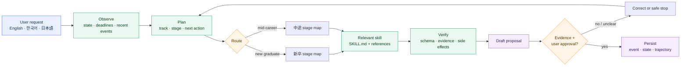
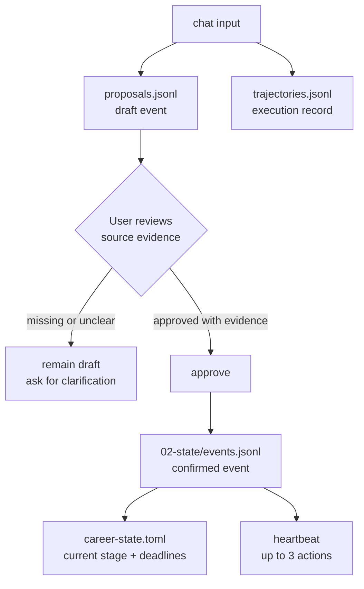
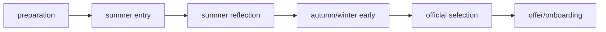

# Japan Recruit AI Agent

[English](README.md) · [한국어](README_ko.md) · [日本語](README_ja.md)

AI skills for Japanese job hunting and recruiting. The suite supports both **新卒** (new graduate)
and **中途** (mid-career) paths, from self-analysis to documents, interviews, offers, resignation,
and onboarding.

[](./LICENSE)
[](./.claude-plugin/plugin.json)
[](#skills)
[](#install)
[](#install)

Seven domain skills do the career work. `career-agent` is the local-first runtime that routes each
request, keeps an append-only event ledger, and proposes the next action. It never submits an
application, sends a message, or edits an installed skill.

## How the system works



The runtime follows a small, inspectable loop:

```text
Observe → Plan → Act → Verify → Correct → Persist
```

It loads only the skill and references needed for the selected stage. It does not inject every
`SKILL.md` into every run.

## Skills

| Skill | Use it for | Main output |
|---|---|---|
| `jiko-bunseki` | Strengths, values, work style, and career direction | `SELF_ANALYSIS_PROFILE` |
| `job-seeker-agent` | Resume, 職務経歴書, 自己PR, 志望動機, ES, and interview content | `CANDIDATE_PROFILE` |
| `hiring-manager-agent` | JD design and hiring-side evaluation criteria | `COMPANY_PROFILE` |
| `matching-simulator` | Candidate/JD fit and evidence-based scoring | Match report |
| `company-battlecard` | Comparing two or more companies | Comparison report |
| `kigyou-bunseki` | Company and public posting research | 企業カルテ |
| `tenshoku-strategy` | Interviews, salary, offers, resignation, onboarding, and tracking | Execution plan |
| `career-agent` | Track routing, event ledger, deadlines, next actions, and posting candidates | Local career state |

Every skill is a `SKILL.md` under `skills/<name>/`. Shared frameworks and schemas live under
`_shared/`.

## Install

### Claude Code — one command

Run in a terminal:

```bash
claude plugin marketplace add younnieCutler/japan-recruit-ai-agent && \
  claude plugin install japan-recruit-ai-agent@japan-recruit-ai-agent
```

Inside an active Claude Code session, the equivalent is:

```text
/plugin marketplace add younnieCutler/japan-recruit-ai-agent
/plugin install japan-recruit-ai-agent@japan-recruit-ai-agent
```

### Codex — one command

```bash
codex plugin marketplace add younnieCutler/japan-recruit-ai-agent && \
  codex plugin add japan-recruit-ai-agent@japan-recruit-ai-agent
```

### Install both at once

```bash
claude plugin marketplace add younnieCutler/japan-recruit-ai-agent && \
  claude plugin install japan-recruit-ai-agent@japan-recruit-ai-agent && \
  codex plugin marketplace add younnieCutler/japan-recruit-ai-agent && \
  codex plugin add japan-recruit-ai-agent@japan-recruit-ai-agent
```

### Local fallback

Use this when you want to run from a clone or inspect the skill files directly:

```bash
git clone https://github.com/younnieCutler/japan-recruit-ai-agent.git ~/japan-recruit-skills
REPO=~/japan-recruit-skills

mkdir -p ~/.claude/skills ~/.claude/_shared
cp -R "$REPO/skills/." ~/.claude/skills/
cp -R "$REPO/_shared/." ~/.claude/_shared/

mkdir -p ~/.codex/skills ~/.codex/_shared
cp -R "$REPO/skills/." ~/.codex/skills/
cp -R "$REPO/_shared/." ~/.codex/_shared/
```

## Run the Career Agent

Create or select a dedicated Career Vault first. The runtime never defaults to the repository or the
current directory; pass `--vault` or set `CAREER_VAULT`.

```bash
VAULT=/path/to/career-agent-vault
python3 skills/career-agent/career_agent.py init --vault "$VAULT"
# Fill 00-control/career-profile.toml, then check the setup.
python3 skills/career-agent/career_agent.py doctor --vault "$VAULT"
python3 skills/career-agent/career_agent.py run --vault "$VAULT" --mode chat \
  --track shinsotsu --message "I want to turn my 学チカ experience into 自己PR material."
python3 skills/career-agent/career_agent.py status --vault "$VAULT"
python3 skills/career-agent/career_agent.py run --vault "$VAULT" --mode heartbeat
python3 skills/career-agent/career_agent.py run --vault "$VAULT" --mode discover --source postings.json
python3 skills/career-agent/career_agent.py approve --vault "$VAULT" <proposal-id> --evidence "resume.md:12"
python3 skills/career-agent/career_agent.py rollback --vault "$VAULT" <version>
python3 skills/career-agent/career_agent.py index --vault "$VAULT"
python3 skills/career-agent/career_agent.py context --vault "$VAULT"
```

`chat` accepts `--message` or stdin. If the track is ambiguous, it stops instead of guessing.
`approve` is required before a draft event enters the confirmed ledger.

### Vault and Obsidian integration

`init` creates this layout, which can be opened directly as an Obsidian Vault:

```text
00-control/    profile and agent policy
01-capture/    unclassified raw material (never automatic context)
02-state/      event ledger, proposals, and current state
03-active/     active applications and companies
04-evidence/   supporting material
05-playbooks/  personal verified guidance
06-reference/  reviewed sources
07-archive/    closed or old material (never automatic context)
```

The runtime always reads `00-control` and `02-state`, then selects at most five verified notes from
the active, evidence, playbook, and reference folders. `index` stores only metadata, headings,
wikilinks, hashes, paths, and source kind in `.career-agent/vault-index.jsonl`; it never imports note
bodies. `01-capture` is excluded, and `07-archive` needs `--include-archives` for a manual audit.

### Shared context for every candidate-side skill

Set `CAREER_VAULT` once. `jiko-bunseki`, `job-seeker-agent`, `kigyou-bunseki`,
`matching-simulator`, `tenshoku-strategy`, and `company-battlecard` then call `context` before work
and receive the same profile, current state, and metadata-only selected notes.

### The approval gate



Confirmed events use a fixed schema: `id`, `track`, `stage`, `flow_phase`, `type`, `occurred_at`, `title`, `summary`,
`evidence`, `source`, `next_action`, `deadline`, and `status`. Numeric claims without matching evidence
are rejected.

## Track map

```mermaid
flowchart TB
    subgraph NS["新卒 / New graduate"]
        NS1["自己分析・就活軸"] --> NS2["学チカ・自己PR素材"]
        NS2 --> NS3["業界研究・企業研究"]
        NS3 --> NS4["ES・履歴書"]
        NS4 --> NS5["適性検査（SPI3）"]
        NS5 --> NS6["書類選考・面接"]
        NS6 --> NS7["内々定・内定・入社準備"]
    end
    subgraph MC["中途 / Mid-career"]
        MC1["自己分析・転職軸"] --> MC2["職務経歴書・自己PR"]
        MC2 --> MC3["業界研究・企業研究"]
        MC3 --> MC4["応募・書類選考"]
        MC4 --> MC5["面接"]
        MC5 --> MC6["内定・条件交渉"]
        MC6 --> MC7["退職・入社準備"]
    end
```



### New-graduate timing layer



`stage` describes the workstream; `flow_phase` describes the time window, so ES, SPI3, and interview
work can overlap. The shared flow is reviewed manually each year against official sources. YouTube
summaries and private retrospectives inform checklists, never universal deadlines or facts.

## Recommended workflows

| Goal | Workflow |
|---|---|
| Direction first | `/jiko-bunseki` → `/job-seeker-agent` |
| 新卒: 学チカ to ES | `/job-seeker-agent` → `/kigyou-bunseki` → `/matching-simulator` |
| 中途: resume to interview | `/job-seeker-agent` → `/kigyou-bunseki` → `/matching-simulator` |
| Compare offers | `/company-battlecard` → `/tenshoku-strategy` |
| Interview content | `/job-seeker-agent` |
| Interview manner, salary, resignation, onboarding | `/tenshoku-strategy` |
| Hiring-side JD improvement | `/hiring-manager-agent` |
| State and next action | `career-agent chat` → `approve` → `heartbeat` |
| Public posting candidates | `career-agent discover` → review manually |

### Public posting discovery

`discover` reads a JSON object, array, or `{ "postings": [...] }`. Each posting needs an original
HTTP(S) URL:

```json
[
  {
    "company": "Example株式会社",
    "role": "データエンジニア",
    "graduation_year": 2027,
    "target": "新卒",
    "deadline": "2026-08-31",
    "url": "https://example.com/jobs/123"
  }
]
```

The runtime records candidates only. It does not search the web, log in, bypass CAPTCHA, submit
applications, or send email.

## Vault files

All state lives inside the selected Career Vault:

| File | Purpose |
|---|---|
| `00-control/career-profile.toml` | Track, target role, status, graduation year when applicable |
| `02-state/career-state.toml` | Human-readable current track, stage, actions, and deadlines |
| `02-state/events.jsonl` | Append-only confirmed event ledger |
| `02-state/proposals.jsonl` | Draft events, heartbeat reports, and posting candidates |
| `02-state/trajectories.jsonl` | ReAct-style execution and verification records |
| `.career-agent/` | Replaceable JSON cache, versions, and metadata-only note index |

Domain skills follow `CLAUDE.md`: human-readable reports go under `career-docs/`, and machine-readable
profiles go under `data/`, relative to the session directory.

## Boundaries

- No invented experience, metrics, offers, or evidence.
- No application submission or message sending without explicit user review.
- No login, CAPTCHA bypass, or access-control bypass.
- No confirmed ledger event without evidence.
- No online edits to an installed `SKILL.md`.

Scores are approximate. Claims must stay grounded in the user's source material.

## Development

```bash
python3 -m unittest -v skills/career-agent/test_career_agent.py
python3 -m py_compile skills/career-agent/career_agent.py
claude plugin validate .
```

The runtime uses Python's standard library and JSONL. SQLite FTS5 can be added later if event volume
requires indexed search.

## License

MIT License.
