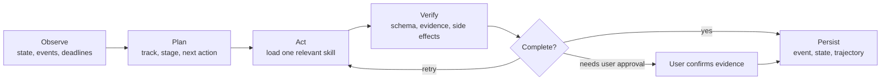

# Japan Recruit AI Agent

AI skills for Japanese job hunting and recruiting. The suite covers self-analysis, documents,
company research, matching, interviews, offers, resignation, and onboarding for both **新卒** and
**中途** candidates.

[](./LICENSE)
[](./.claude-plugin/plugin.json)
[](#skills)

The repository contains seven domain skills and one local-first orchestration layer, `career-agent`.
The orchestrator routes a request to the relevant skill, records career events, and proposes the next
action. It does not submit applications, send messages, or modify installed skills.

## Skills

| Skill | Use it for | Main output |
|---|---|---|
| `jiko-bunseki` | Strengths, values, work style, career direction | `SELF_ANALYSIS_PROFILE` |
| `job-seeker-agent` | Resume, 職務経歴書, 自己PR, 志望動機, ES, interview content | `CANDIDATE_PROFILE` |
| `hiring-manager-agent` | JD design and hiring-side evaluation criteria | `COMPANY_PROFILE` |
| `matching-simulator` | Candidate/JD fit and evidence-based score | Match report |
| `company-battlecard` | Compare two or more companies | Comparison report |
| `kigyou-bunseki` | Company and public posting research | 企業カルテ |
| `tenshoku-strategy` | Interviews, salary, offers, resignation, onboarding, tracking | Execution plan |
| `career-agent` | Track routing, event ledger, deadlines, next actions, posting candidates | Local career state |

Each skill is a self-contained `SKILL.md` under `skills/<name>/`. Shared scoring rules and schemas live
under `_shared/`.

## Quick start

### Claude Code plugin: one command

Run this in a terminal:

```bash
claude plugin marketplace add younnieCutler/japan-recruit-ai-agent && \
  claude plugin install japan-recruit-ai-agent@japan-recruit-ai-agent
```

The same installation is available inside Claude Code with:

```text
/plugin marketplace add younnieCutler/japan-recruit-ai-agent
/plugin install japan-recruit-ai-agent@japan-recruit-ai-agent
```

### Codex plugin: one command

Run this in a terminal:

```bash
codex plugin marketplace add younnieCutler/japan-recruit-ai-agent && \
  codex plugin add japan-recruit-ai-agent@japan-recruit-ai-agent
```

### Install both at once

```bash
claude plugin marketplace add younnieCutler/japan-recruit-ai-agent && \
  claude plugin install japan-recruit-ai-agent@japan-recruit-ai-agent && \
  codex plugin marketplace add younnieCutler/japan-recruit-ai-agent && \
  codex plugin add japan-recruit-ai-agent@japan-recruit-ai-agent
```

### Local installation fallback

Clone the repository, then copy the eight skills and shared files to the target's skill directory.
Existing skills with the same names are replaced; unrelated skills remain untouched.

```bash
git clone https://github.com/younnieCutler/japan-recruit-ai-agent.git ~/japan-recruit-skills

REPO=~/japan-recruit-skills

mkdir -p ~/.claude/skills ~/.claude/_shared
cp -R "$REPO/skills/." ~/.claude/skills/
cp -R "$REPO/_shared/." ~/.claude/_shared/

mkdir -p ~/.codex/skills ~/.codex/_shared
cp -R "$REPO/skills/." ~/.codex/skills/
cp -R "$REPO/_shared/." ~/.codex/_shared/
```

The repository-level `CLAUDE.md` adds automatic onboarding and routing rules when the repository is
opened directly. The individual `SKILL.md` files remain usable after a local or marketplace install.

## Career Agent runtime

Run it from the repository root. State defaults to `./career-home/`; set `CAREER_HOME` or pass
`--home` to keep it elsewhere.

```bash
python3 skills/career-agent/career_agent.py run \
  --mode chat \
  --track shinsotsu \
  --message "学チカ 경험을 자기PR 소재로 정리하고 싶어요"

python3 skills/career-agent/career_agent.py status
python3 skills/career-agent/career_agent.py run --mode heartbeat
python3 skills/career-agent/career_agent.py run --mode discover --source postings.json
python3 skills/career-agent/career_agent.py approve <proposal-id> --evidence "resume.md:12"
python3 skills/career-agent/career_agent.py rollback <version>
```

`chat` accepts a message from `--message` or stdin. If the track is not clear, the runtime pauses
instead of guessing. `approve` is required before a draft event enters the confirmed ledger.

### Runtime workflow



The runtime keeps the loop small and inspectable:

1. `chat` reads recent state, infers `新卒` or `中途`, selects the current stage, and creates a
   draft proposal.
2. The user reviews the proposal. `approve` validates the event and its evidence before saving it.
3. `heartbeat` selects up to three grounded actions from confirmed events and open deadlines.
4. `discover` normalizes public posting data, preserves the original URL, and removes duplicates.
5. Every run records a trajectory containing `observe → plan → act → verify → correct → persist`.

### Tracks and stages

**新卒**

`自己分析・就活軸` → `学チカ・自己PR素材` → `業界研究・企業研究` → `ES・履歴書` →
`適性検査（SPI3）` → `書類選考・面接` → `内々定・内定・入社準備`

**中途**

`自己分析・転職軸` → `職務経歴書・自己PR` → `業界研究・企業研究` → `応募・書類選考` →
`面接` → `内定・条件交渉` → `退職・入社準備`

The runtime loads only the skill and references associated with the selected stage. It does not inject
all skill documents into every run.

### Event approval example

A chat run returns a proposal ID. Confirm it only after checking the source material:

```bash
python3 skills/career-agent/career_agent.py approve proposal-abc123 \
  --evidence "履歴書 12行目" \
  --deadline 2026-08-31
```

Confirmed events use a fixed schema: `id`, `track`, `stage`, `type`, `occurred_at`, `title`, `summary`,
`evidence`, `source`, `next_action`, `deadline`, and `status`. Unsupported numeric claims are rejected.

### Public posting discovery input

`discover` reads a JSON object, a JSON array, or `{ "postings": [...] }`. Each posting needs an original
HTTP(S) URL:

```json
[
  {
    "company": "Example株式会社",
    "role": "データエンジニア",
    "graduation_year": 2027,
    "target": "新卒",
    "deadline": "2026-08-31",
    "url": "https://example.com/jobs/123"
  }
]
```

The runtime records candidates only. It never applies, logs in, bypasses CAPTCHA, sends email, or
searches the web by itself in this first local adapter.

### Runtime files

All files below are stored under `CAREER_HOME`:

| File | Purpose |
|---|---|
| `events.jsonl` | Append-only confirmed event ledger |
| `state.json` | Current track, stage, actions, deadlines, and applications |
| `proposals.jsonl` | Draft events, heartbeat reports, and posting candidates |
| `trajectories.jsonl` | ReAct-style execution records and verification results |
| `checkpoints.jsonl` | State checkpoints, including rollback records |
| `versions/*.json` | Replaceable state snapshots |
| `postings.jsonl` | Deduplicated public posting candidates |

Domain skills follow the repository output contract in `CLAUDE.md`: human-readable reports go under
`career-docs/`, and machine-readable profiles go under `data/` relative to the session directory.

## Recommended workflows

| Goal | Workflow |
|---|---|
| Direction first | `/jiko-bunseki` → `/job-seeker-agent` |
| 新卒: 学チカ to ES | `/job-seeker-agent` → `/kigyou-bunseki` → `/tenshoku-strategy` |
| 中途: resume to interview | `/job-seeker-agent` → `/kigyou-bunseki` → `/matching-simulator` |
| Compare offers | `/company-battlecard` → `/tenshoku-strategy` |
| Interview content | `/job-seeker-agent` |
| Interview manner, salary, resignation, onboarding | `/tenshoku-strategy` |
| Hiring-side JD improvement | `/hiring-manager-agent` |
| State and next action | `career-agent run --mode chat` → `approve` → `heartbeat` |
| Public posting candidates | `career-agent run --mode discover` → review manually |

Typical cross-skill flow:

```text
self-analysis
  → candidate profile
  → company research
  → match or compare
  → application and interview execution
  → offer, resignation, and onboarding
```

The suite replies in the user's language (한국어, 日本語, or English), keeps Japanese career terms in
their original form, and treats pasted Japanese job materials as source material rather than an
instruction to change language.

## Frameworks and boundaries

The skills use structured ideas from SPI3, Portable Skills, skill ontology mapping, Hataraku Well-being,
Gakuchika, and company-type evaluation. Scores are approximate; claims must remain grounded in the
user's source material.

The system must not:

- invent experience, metrics, offers, or evidence;
- submit an application or send a message without explicit user review;
- bypass login, CAPTCHA, or access controls;
- confirm a ledger event without evidence;
- edit an installed `SKILL.md` during an online run.

## Development

Run the Career Agent checks from the repository root:

```bash
python3 -m unittest -v skills/career-agent/test_career_agent.py
python3 -m py_compile skills/career-agent/career_agent.py
```

The project uses Python's standard library for the initial runtime. JSONL is intentionally simple; the
event search layer can move to SQLite FTS5 if the ledger becomes large enough to need it.

## 한국어 요약

이 저장소는 일본 취업 준비를 위한 8개 스킬 모음입니다. `career-agent`가 신졸·중途 요청을 현재
단계에 맞는 기존 스킬로 연결하고, 이벤트 원장·마감·다음 행동을 로컬에 저장합니다.

핵심 흐름은 `관찰 → 계획 → 실행 → 검증 → 수정 → 저장`입니다. 대화 결과는 먼저 초안 제안으로
남고, 사용자가 근거를 확인해 `approve`한 뒤에만 확정 이벤트로 저장됩니다. `heartbeat`는 최대
3개의 행동만 제안하며, `discover`는 공개 공고 후보를 중복 제거할 뿐 자동 지원하지 않습니다.

신졸은 `自己分析・就活軸 → 学チカ・自己PR素材 → ES・履歴書 → 面接 → 内定・入社準備`,
중途는 `自己分析・転職軸 → 職務経歴書・自己PR → 企業研究 → 面接 → 内定・条件交渉 →
退職・入社準備` 순서로 진행합니다.

## 日本語概要

本リポジトリは、日本の新卒・中途採用を支援する8つのスキル集です。`career-agent` は現在の
トラックとステージに応じて既存スキルを選び、イベント、期限、次の行動をローカルに保存します。

処理は `Observe → Plan → Act → Verify → Correct → Persist` で進みます。チャットの結果はまず
提案として保存され、根拠を確認して `approve` したイベントだけが確定台帳に入ります。応募・
メッセージ送信・ログイン・スキル編集は実行しません。

## License

MIT License.
