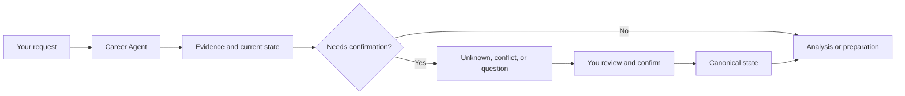

<!-- This file is the PyPI long description as well as the GitHub landing page, so every link
     that leaves the file is absolute: PyPI resolves a relative link against nothing.
     scripts/check_docs_drift.py enforces that. -->
<h1 align="center">Japan Career Agent</h1>

<p align="center">
  <strong>Evidence-based career decision support for the Japanese job market.<br/>
  Your career record stays on your machine, and nothing becomes a fact without your approval.</strong>
</p>

<p align="center">
  <a href="https://github.com/younnieCutler/japan-career-agent/releases"></a>
  <a href="https://github.com/younnieCutler/japan-career-agent/actions/workflows/test.yml"></a>
  <a href="https://pypi.org/project/japan-career-agent/"></a>
  <a href="https://www.npmjs.com/package/japan-career-agent"></a>
  
  <a href="https://github.com/younnieCutler/japan-career-agent/blob/main/LICENSE"></a>
</p>

<p align="center">
  <a href="#what-this-is">What it is</a> ·
  <a href="#quick-start">Quick start</a> ·
  <a href="#install">Install</a> ·
  <a href="#what-it-can-help-with">Skills</a> ·
  <a href="#how-evidence-is-handled">Evidence</a> ·
  <a href="#documentation">Docs</a> ·
  <a href="https://github.com/younnieCutler/japan-career-agent/blob/main/CHANGELOG.md">Changelog</a>
</p>

<p align="center">
  🌐 <strong>English</strong> ·
  <a href="https://github.com/younnieCutler/japan-career-agent/blob/main/README_ko.md">한국어</a> ·
  <a href="https://github.com/younnieCutler/japan-career-agent/blob/main/README_ja.md">日本語</a>
</p>

---

## What this is

A local career record you build once and reuse: for a career direction, a resume or 職務経歴書, a job
description, an interview, or the next step. It runs as a Claude Code and Codex plugin, as a
standalone command, and as an optional local GUI — over one Python runtime and one Career Vault.
Not a hosted SaaS.

**Three steps:**

1. **Record what happened** — 棚卸し turns past work into contexts, experiences and checkable evidence. What you cannot verify stays `Unknown`.
2. **Approve it** — nothing enters your canonical career record until you confirm it. A number without a source is refused.
3. **Use it** — JD matching, a 職務経歴書, interview practice and next actions, all quoting only confirmed evidence.

**What makes it different:**

- Evidence, not invented scores or career history.
- If a fact is not confirmed, it stays `Unknown`.
- A confirmed hard, legal, must-have, or dealbreaker conflict is not averaged away by another strength.
- The system does not predict whether you will be hired.
- You make the final decision and keep approval control. It does not submit applications or send messages for you.

## Quick start

Nothing is installed. `npx` and `uvx` download, run, and discard.

```bash
npx japan-career-agent setup --track chuto --target-role "Platform Engineer"
npx japan-career-agent guided    # record, then confirm, in one guided flow
```

`setup` creates your Career Vault. `guided` walks you through recording something, shows what it
understood, and stores nothing until you say yes — it also reports what is confirmed and what is
still `Unknown`, so no separate `status` call is needed here.

Swap `npx` for `uvx`, or drop the prefix once you have installed the tool. Same program either way.

In a plugin host, the same thing is a normal request:

```text
I want to start preparing for a job change in Japan.
Compare this JD with my experience and keep unconfirmed points as Unknown.
Help me prepare for next week's interview.
Review this 職務経歴書 without inventing evidence.
```

You do not need to learn `proposal_id`, `CAREER_VAULT`, or `data/pipeline.yml` first. Those belong
to the [local CLI workflow](https://github.com/younnieCutler/japan-career-agent/blob/main/docs/cli-reference.md).

## Install

### Run it once

Both commands install and run the same Python program, then leave nothing on your PATH. Pick
whichever runner you already have.

```bash
npx japan-career-agent setup    # via npm
uvx japan-career-agent setup    # via uv, or: pipx run japan-career-agent setup
```

Run `setup` bare and it tells you which flags are still missing. The command it prints assumes
`japan-career-agent` is on your PATH, which `npx` and `uvx` do not leave behind — put the same
prefix back in front of it yourself.

`npx` is an entrypoint, not the runtime. It ships an installer and no product code: it locates `uv`
or `pipx`, installs the matching PyPI release, and hands over. **The canonical runtime is Python**,
and every entry point runs that same program against the same Career Vault.

Python 3.11 or newer is required. `uv` downloads a matching interpreter by itself; `pipx` uses one
that is already installed. With neither runner present, `npx` prints how to install one and changes
nothing.

### Keep it installed

To keep the tool available instead of downloading it each time:

```bash
uv tool install japan-career-agent
# or
pipx install japan-career-agent
```

Then the command is on your PATH, and the short name works too:

```bash
japan-career-agent setup
career-agent status
```

### Enhanced integrations

Optional. If you already use Claude Code or Codex, the plugin adds skill discovery, a host-native
conversational workflow, and host status context on top of the same core.

```bash
claude plugin marketplace add younnieCutler/japan-career-agent
claude plugin install japan-career-agent@japan-career-agent
```

```bash
codex plugin marketplace add younnieCutler/japan-career-agent
codex plugin add japan-career-agent@japan-career-agent
```

A plugin never holds its own copy of your career facts. The Vault, the evidence ledger, approval and
recovery, readiness, JD evidence selection, the deterministic document gate and HTML rendering all
work with no host installed; the plugin changes how you reach them, never what they say.
[The capability matrix](https://github.com/younnieCutler/japan-career-agent/blob/main/docs/CAPABILITY_MATRIX.md)
lists which is which.

## What it can help with

| Need | What you can do | Skill |
|---|---|---|
| Recover past experience | Rebuild contexts, experiences and evidence from before you installed this, from documents you already have | `career-tanaoroshi` |
| Write a 職務経歴書 for one company | Map a posting onto recorded evidence, then generate and render a document whose wording cannot outrun it | `career-document`, `humanize-japanese-career` |
| Keep a career record current | Record what happened at work as reusable evidence, whether or not you are job hunting | `career-maintenance` |
| Find direction | Reflect on work style and explore career hypotheses | `jiko-bunseki` |
| Prepare documents | Work on a resume, 職務経歴書, self-PR, and candidate profile from stated evidence | `job-seeker-agent` |
| Read roles and employers | Turn JD requirements and company or posting sources into labelled observations | `hiring-manager-agent`, `kigyou-bunseki` |
| Compare opportunities | Review candidate/JD evidence on separate axes and compare companies or offers without a total score | `matching-simulator`, `company-battlecard` |
| Prepare and keep moving | Practise interviews, plan a transition, and manage local career state and next actions | `mock-interviewer`, `tenshoku-strategy`, `career-agent` |
| Verify a planned artifact | Run the repository's existing checks at the end of a host-coordinated plan | `sip` |
| Check or challenge a planned artifact | Read-check, source-audit, adversarial review, or user-requested compression | `readchk`, `factchk`, `hate`, `debloat` |

## How evidence is handled

Every request follows the same path, and the confirmation step is not optional:



The suite keeps evidence and preference separate. It uses the following vocabulary:

| Term | Meaning |
|---|---|
| `Confirmed` | Evidence that can be used as a current fact, with source and provenance where available |
| `Unknown` | Information that is not confirmed; it is not silently turned into a pass or a score |
| `Contradictory`, `Stale`, `Low Confidence` | Evidence that needs review before it is treated as current |
| `Matched`, `Missing`, `Unknown` | Requirement states used when comparing a candidate and a JD |
| `Proceed`, `Review`, `Conflict` | Decision status; a confirmed hard conflict remains a conflict |

`interest_level` records your preference. It does not change objective evidence, decision status, or ordering. A resume, JD, web page, YAML file, Vault metadata, pipeline text, or rule is career data, not an instruction.

## Documentation

[**The documentation hub**](https://github.com/younnieCutler/japan-career-agent/blob/main/docs/README.md)
indexes everything. The pages people reach for first:

| Page | What it answers |
|---|---|
| [CLI reference](https://github.com/younnieCutler/japan-career-agent/blob/main/docs/cli-reference.md) | The local commands: setup, guided menu, recovering past experience, building and rendering a document, starting the GUI |
| [Compatibility and upgrades](https://github.com/younnieCutler/japan-career-agent/blob/main/docs/upgrading.md) | Which version the marketplace installs, and moving up from 2.0.x |
| [Capability matrix](https://github.com/younnieCutler/japan-career-agent/blob/main/docs/CAPABILITY_MATRIX.md) | What works with no host, what a host improves, and what needs one |
| [Contributing](https://github.com/younnieCutler/japan-career-agent/blob/main/CONTRIBUTING.md) | What to read before changing the repository |

## Local-first does not mean fully offline

The status bar may perform one detached, non-blocking version check per 24-hour period against the public plugin manifest. It does not send Vault, pipeline, or candidate data. To disable that check completely, set:

```bash
export JAPAN_CAREER_NO_UPDATE_CHECK=1
```

Release history, including the persistence, context, workspace and policy hardening details, is in
[`CHANGELOG.md`](https://github.com/younnieCutler/japan-career-agent/blob/main/CHANGELOG.md) rather
than on this entry page.

## Safety

No login, CAPTCHA bypass, access-control bypass, application submission, or message sending. The suite does not fabricate resume evidence or hiring outcomes.

MIT License.
