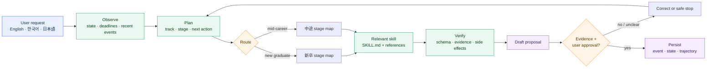
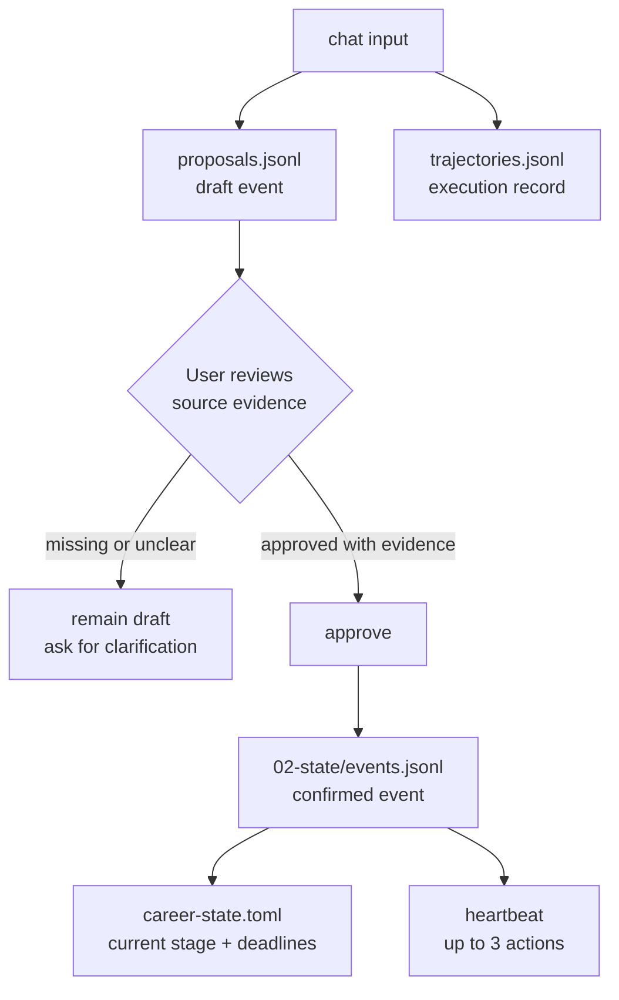
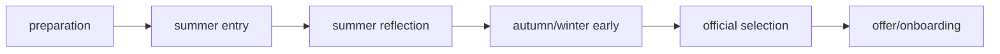

# Japan Recruit AI Agent

[English](README.md) · [한국어](README_ko.md) · [日本語](README_ja.md)

AI skills for Japanese job hunting and recruiting. The suite supports both **新卒** (new graduate)
and **中途** (mid-career) paths, from self-analysis to documents, interviews, offers, resignation,
and onboarding.

[](./LICENSE)
[](./.claude-plugin/plugin.json)
[](#skills)
[](#install)
[](#install)

Eight domain skills do the career work. `career-agent` is the local-first runtime that routes each
request, keeps an append-only event ledger, and proposes the next action. It never submits an
application, sends a message, or edits an installed skill.

## How the system works



The runtime follows a small, inspectable loop:

```text
Observe → Plan → Act → Verify → Correct → Persist
```

It loads only the skill and references needed for the selected stage. It does not inject every
`SKILL.md` into every run.

## Skills

| Skill | Use it for | Main output |
|---|---|---|
| `jiko-bunseki` | Strengths, values, work style, and career direction | `SELF_ANALYSIS_PROFILE` |
| `job-seeker-agent` | 履歴書 (resume), 職務経歴書 (work history), 自己PR (self-PR), 志望動機 (motivation letter), ES (entry sheet), and interview content | `CANDIDATE_PROFILE` |
| `hiring-manager-agent` | JD design and hiring-side evaluation criteria | `COMPANY_PROFILE` |
| `matching-simulator` | Candidate/JD fit — independent axes, no composite score | Fit diagnosis |
| `company-battlecard` | Comparing two or more companies | Comparison report |
| `kigyou-bunseki` | Company and public posting research | 企業カルテ (company card) |
| `tenshoku-strategy` | Interviews, salary, offers, resignation, onboarding, and tracking | Execution plan |
| `mock-interviewer` | Simulated multi-round interviews with 深掘り (deep-dive) follow-up questioning | Readiness gaps |
| `career-agent` | Track routing, event ledger, deadlines, next actions, and posting candidates | Local career state |

Every skill is a `SKILL.md` under `skills/<name>/`. Shared frameworks and schemas live under
`_shared/`.

## Canonical Career Context

`jiko-bunseki` stores Phase 3 anchors, career theme, energy map, and must-have/avoid values in
`data/self_analysis_profile.yml`. They remain draft context until the user explicitly confirms the
complete non-null set with `career_context_confirmed: true`. Downstream skills reuse confirmed values
for 自己PR, 志望動機, 転職軸, matching, battlecards, and interview contradiction checks; they never
invent a replacement motive.

When `CAREER_VAULT` is set, the shared Vault context is canonical. Confirm the profile through the
approval-gated flow before it is returned to other skills:

```bash
python3 skills/career-agent/career_agent.py propose-context --vault "$VAULT" \
  --source data/self_analysis_profile.yml
python3 skills/career-agent/career_agent.py approve --vault "$VAULT" <proposal-id>
python3 skills/career-agent/career_agent.py context --vault "$VAULT"
```

Career Values are reported per item as `Aligned`, `Tradeoff`, `Conflict`, or `Unknown` and are never
merged into a score. A confirmed dealbreaker conflict can make a company ineligible in a battlecard.

## Fit Diagnosis (`evidence_based_v3`)

`matching-simulator` does not output a match score. It reports independent axes and a
**Decision Status** of `Proceed` / `Review` / `Conflict`:

| Axis | What it reports |
|---|---|
| Eligibility | per hard requirement: `pass` / `conflict` / `unknown` |
| Required Skill & Experience | matched / missing / unknown, plus coverage over **confirmed** items only |
| MHLW Portable Skill | Euclidean distance between 29-point composition profiles — not a 0–100 score |
| Career Values & Conditions | aligned / tradeoff / conflict / unknown, per item, never totalled |
| Candidate Interest | the user's own 1–5 rating and reason — excluded from every objective axis |
| Employer Signals | observed events with dates — never converted into a probability |
| Evidence & Missing Information | sources, dates, confidence, contradictions, and what to confirm next |

Four rules hold throughout:

- **Missing is not neutral.** An unknown stays `unknown` — no mean, no 50, no default pass, and
  never inside a coverage denominator.
- **Interest is independent.** Changing `interest_level` from 1 to 5 cannot change any objective
  axis or the Decision Status. There is a regression test for exactly that.
- **No probability.** No pass rate or offer rate is estimated; no calibrated model exists here.
  `Proceed` means nothing blocks a decision on current information — not that you will pass.
- **No brand formulas.** Recruit, doda, MyNavi and BizReach do not publish their matching
  formulas, so nothing here claims to reproduce one.

Run the engine directly:

```bash
python3 _shared/matching_v3.py payload.json --text   # deterministic; same input, same output
python3 _shared/test_matching_v3.py                  # acceptance-criteria regression tests
```

**MHLW reference data:** the official 114 標準職務・職位 profiles are **not bundled** — their
redistributable form and licence are unconfirmed, and generating them with a language model would
fabricate the reference the diagnosis is measured against. Validation, the distance engine, the
versioned dataset interface, and the tests are all implemented; the 114-profile ranking reports
`unavailable` until a dataset is installed. Format:
`skills/matching-simulator/references/mhlw-portable-skill.md`.

**Legacy (`legacy_v1`):** the previous Recruit-style / Persol-style / Culture Fit scores are
retired to `_shared/legacy_experimental.py` and require an explicit `--legacy-experimental` flag.
Culture Fit produces no new values at all. Scores already saved are preserved, tagged
`legacy_v1`, and never merged into a v3 result or ranking.

## Install

### Claude Code — one command

Run in a terminal:

```bash
claude plugin marketplace add younnieCutler/japan-recruit-ai-agent && \
  claude plugin install japan-recruit-ai-agent@japan-recruit-ai-agent
```

Inside an active Claude Code session, the equivalent is:

```text
/plugin marketplace add younnieCutler/japan-recruit-ai-agent
/plugin install japan-recruit-ai-agent@japan-recruit-ai-agent
```

### Codex — one command

```bash
codex plugin marketplace add younnieCutler/japan-recruit-ai-agent && \
  codex plugin add japan-recruit-ai-agent@japan-recruit-ai-agent
```

### Install both at once

```bash
claude plugin marketplace add younnieCutler/japan-recruit-ai-agent && \
  claude plugin install japan-recruit-ai-agent@japan-recruit-ai-agent && \
  codex plugin marketplace add younnieCutler/japan-recruit-ai-agent && \
  codex plugin add japan-recruit-ai-agent@japan-recruit-ai-agent
```

### Local fallback

Use this when you want to run from a clone or inspect the skill files directly:

```bash
git clone https://github.com/younnieCutler/japan-recruit-ai-agent.git ~/japan-recruit-skills
REPO=~/japan-recruit-skills

mkdir -p ~/.claude/skills ~/.claude/_shared
cp -R "$REPO/skills/." ~/.claude/skills/
cp -R "$REPO/_shared/." ~/.claude/_shared/

mkdir -p ~/.codex/skills ~/.codex/_shared
cp -R "$REPO/skills/." ~/.codex/skills/
cp -R "$REPO/_shared/." ~/.codex/_shared/
```

## Updating

Auto-update is **off by default for third-party marketplaces**, including this one. Until you turn
it on, an install keeps serving the version it was installed at.

Turn it on once, in `/plugin` → **Marketplaces** → `japan-recruit-ai-agent` → enable auto-update.
Equivalently, in `~/.claude/settings.json`:

```json
"extraKnownMarketplaces": {
  "japan-recruit-ai-agent": {
    "source": { "source": "github", "repo": "younnieCutler/japan-recruit-ai-agent" },
    "autoUpdate": true
  }
}
```

Claude Code then checks shortly after each session starts. The **running** session keeps the
versions it launched with, so a new release applies from the next launch.

To update once, by hand:

```bash
claude plugin marketplace update japan-recruit-ai-agent   # refresh the marketplace listing
claude plugin update japan-recruit-ai-agent@japan-recruit-ai-agent  # then the plugin itself
claude plugin list                                        # confirm the version
```

Restart Claude Code afterwards; the update does not apply to the session you ran it from.

Releases are delivered by the `version` field in `.claude-plugin/plugin.json`, and each version is
cached in its own directory — so an install stays on the version it has until that field changes.

The status bar tells you when a newer version is published. It reads a cache file and never blocks
a prompt: the version is fetched by a detached background process at most once a day, from
`.claude-plugin/plugin.json` on this repo's `main`. Nothing else is sent, and a failed fetch is
silent. Opt out with `JAPAN_RECRUIT_NO_UPDATE_CHECK=1`.

Since 1.1.0 the plugin ships a `UserPromptSubmit` hook that injects the career status bar
(deadlines, unchecked action items, your own standing rules). Hooks ship with the plugin, so an
install still on 1.0.0 has no status bar and no execution gate. The **Local fallback** install
above copies only `skills/` and `_shared/`, so it does not get the hook either — use the plugin
install if you want it.

## How to operate the agent

Two things trigger a skill, and both end up running the same `SKILL.md`:

- **Talk to it.** Inside a Claude Code (or Codex) chat session, describe your situation in
  natural language — no slash needed. Claude matches your message against each skill's
  frontmatter and activates it. If this repository itself is your session's working directory,
  `CLAUDE.md` also auto-loads and adds onboarding, a pipeline-resume kanban greeting, and a
  richer KO/JA/EN routing table. `CLAUDE.md` lives at the repo root, outside `skills/`, so
  installing the plugin into another project does not carry it — routing there falls back to
  each skill's own frontmatter triggers.
- **Type the slash command.** `/jiko-bunseki`, `/job-seeker-agent`, and so on (see
  [Recommended workflows](#recommended-workflows)) activate the same skill explicitly.

For `career-agent`, activation runs the CLI shown below. Claude normally runs these commands
for you through its Bash tool once the skill is active; you can also run them yourself in a
terminal for direct control, scripting, or debugging. `heartbeat` is not a background job or
scheduler — it is a manual, one-shot check that returns up to three grounded next actions when
you (or Claude) run it.

**Quickstart:** install the plugin (above), then run `career_agent.py setup` once — it creates a
Vault (`~/.career-agent-vault` by default, or pass `--vault`/set `CAREER_VAULT`), fills in the
profile fields you give it, and runs `doctor` (see [Run the Career Agent](#run-the-career-agent)
below; `career-agent` never defaults to the current directory). After that, open Claude Code in
the project and say something like "what's my next career action?" — the agent observes your
Vault state, proposes a next step with evidence, and waits for your approval before recording
anything.

## Run the Career Agent

Create or select a dedicated Career Vault first. The runtime never defaults to the repository or the
current directory; pass `--vault` or set `CAREER_VAULT`.
Claude typically runs the commands below for you inside a chat session (see
[How to operate the agent](#how-to-operate-the-agent)); they also work directly in a terminal.

**Installed via the one-command plugin flow?** `career_agent.py` does not live at
`skills/career-agent/career_agent.py` relative to your project — it lives inside the plugin's
install location. Find it once and export it:

```bash
find ~/.claude/plugins -name career_agent.py   # Claude Code
find ~/.codex -name career_agent.py            # Codex
export CAREER_AGENT_RUNTIME=<path from above>
```

Then replace `skills/career-agent/career_agent.py` in every command below with `"$CAREER_AGENT_RUNTIME"`.
Installed via the Local fallback (git clone) instead? The relative path below works as-is from the repo root.

```bash
VAULT=/path/to/career-agent-vault
python3 skills/career-agent/career_agent.py setup --vault "$VAULT" --track shinsotsu \
  --target-role "LLMOps Engineer"
# setup = init + profile fields + doctor in one call. Safe to re-run — it never clears a field
# you don't pass. Hand-edit 00-control/career-profile.toml for anything its flags don't cover.
python3 skills/career-agent/career_agent.py run --vault "$VAULT" --mode chat \
  --track shinsotsu --message "I want to turn my 学チカ experience into 自己PR material."
python3 skills/career-agent/career_agent.py status --vault "$VAULT"
# Manual one-shot check (not a scheduler) — returns up to 3 grounded next actions.
python3 skills/career-agent/career_agent.py run --vault "$VAULT" --mode heartbeat
python3 skills/career-agent/career_agent.py run --vault "$VAULT" --mode discover --source postings.json
python3 skills/career-agent/career_agent.py approve --vault "$VAULT" <proposal-id> --evidence "resume.md:12"
python3 skills/career-agent/career_agent.py restore-state --vault "$VAULT" <version>
python3 skills/career-agent/career_agent.py index --vault "$VAULT"
python3 skills/career-agent/career_agent.py context --vault "$VAULT"
python3 skills/career-agent/career_agent.py propose-context --vault "$VAULT" \
  --source data/self_analysis_profile.yml
# One-time repair for installs created before 1.2.0:
python3 skills/career-agent/career_agent.py doctor --vault "$VAULT" --fix
```

`chat` accepts `--message` or stdin. If the track is ambiguous, it stops instead of guessing.
`approve` is required before a draft event enters the confirmed ledger.

All domain skills update the company pipeline through the shared writer, for example
`python3 "${CLAUDE_PLUGIN_ROOT:-.}/scripts/pipeline.py" upsert <slug> --json '{"stage":2,"match_model_version":"evidence_based_v3","decision_status":"review"}'`;
do not edit `data/pipeline.yml` directly. The legacy `match_score` field is frozen — existing
values are preserved, and the writer refuses new ones.

### Vault and Obsidian integration

`init` creates this layout, which can be opened directly as an Obsidian Vault:

```text
00-control/    profile and agent policy
01-capture/    unclassified raw material (never automatic context)
02-state/      event ledger, proposals, and current state
03-active/     active applications and companies
04-evidence/   supporting material
05-playbooks/  personal verified guidance
06-reference/  reviewed sources
07-archive/    closed or old material (never automatic context)
```

The runtime always reads `00-control` and `02-state`, then selects at most five verified notes from
the active, evidence, playbook, and reference folders. `index` stores only metadata, headings,
wikilinks, hashes, paths, and source kind in `.career-agent/vault-index.jsonl`; it never imports note
bodies. `01-capture` is excluded, and `07-archive` needs `--include-archives` for a manual audit.

### Shared context for every candidate-side skill

Set `CAREER_VAULT` once. `jiko-bunseki`, `job-seeker-agent`, `kigyou-bunseki`,
`matching-simulator`, `tenshoku-strategy`, and `company-battlecard` then call `context` before work
and receive the same profile, current state, and metadata-only selected notes.

### The approval gate



Confirmed events use a fixed schema: `id`, `track`, `stage`, `flow_phase`, `type`, `occurred_at`, `title`, `summary`,
`evidence`, `source`, `next_action`, `deadline`, and `status`. Numeric claims without matching evidence
are rejected.

## Track map

```mermaid
flowchart TB
    subgraph NS["新卒 / New graduate"]
        NS1["自己分析・就活軸"] --> NS2["学チカ・自己PR素材"]
        NS2 --> NS3["業界研究・企業研究"]
        NS3 --> NS4["ES・履歴書"]
        NS4 --> NS5["適性検査（SPI3）"]
        NS5 --> NS6["書類選考・面接"]
        NS6 --> NS7["内々定・内定・入社準備"]
    end
    subgraph MC["中途 / Mid-career"]
        MC1["自己分析・転職軸"] --> MC2["職務経歴書・自己PR"]
        MC2 --> MC3["業界研究・企業研究"]
        MC3 --> MC4["応募・書類選考"]
        MC4 --> MC5["面接"]
        MC5 --> MC6["内定・条件交渉"]
        MC6 --> MC7["退職・入社準備"]
    end
```



### New-graduate timing layer



`stage` describes the workstream; `flow_phase` describes the time window, so ES, SPI3, and interview
work can overlap. The shared flow is reviewed manually each year against official sources. YouTube
summaries and private retrospectives inform checklists, never universal deadlines or facts.

## Recommended workflows

Use `/skillname` to trigger a skill explicitly, or describe your situation in natural language to
let it auto-activate (see [How to operate the agent](#how-to-operate-the-agent)).

| Goal | Workflow |
|---|---|
| New graduate: usable 学チカ / 自己PR draft now | Tell `/job-seeker-agent` about one activity → review, then deepen or research companies |
| Career change: usable career summary / 転職軸 draft now | Tell `/job-seeker-agent` the target role and recent work → review, then deepen or research companies |
| Direction first | `/jiko-bunseki` → `/job-seeker-agent` |
| 新卒: 学チカ (student achievement story) to ES | `/job-seeker-agent` → `/kigyou-bunseki` → `/matching-simulator` |
| 中途: resume to interview | `/job-seeker-agent` → `/kigyou-bunseki` → `/matching-simulator` |
| Compare offers | `/company-battlecard` → `/tenshoku-strategy` |
| Interview content | `/job-seeker-agent` |
| Interview manner, salary, resignation, onboarding | `/tenshoku-strategy` |
| Hiring-side JD improvement | `/hiring-manager-agent` |
| State and next action | `career-agent chat` → `approve` → `heartbeat` |
| Public posting candidates | `career-agent discover` → review manually |

### Public posting discovery

`discover` reads a JSON object, array, or `{ "postings": [...] }`. Each posting needs an original
HTTP(S) URL:

```json
[
  {
    "company": "Example株式会社",
    "role": "データエンジニア",
    "graduation_year": 2027,
    "target": "新卒",
    "deadline": "2026-08-31",
    "url": "https://example.com/jobs/123"
  }
]
```

The runtime records candidates only. It does not search the web, log in, bypass CAPTCHA, submit
applications, or send email.

## Vault files

All state lives inside the selected Career Vault:

| File | Purpose |
|---|---|
| `00-control/career-profile.toml` | Track, target role, status, graduation year when applicable |
| `02-state/career-state.toml` | Human-readable current track, stage, actions, and deadlines |
| `02-state/events.jsonl` | Append-only confirmed event ledger |
| `02-state/proposals.jsonl` | Draft events, heartbeat reports, and posting candidates |
| `02-state/trajectories.jsonl` | ReAct-style execution and verification records |
| `.career-agent/` | Replaceable JSON cache, versions, and metadata-only note index |

Domain skills follow `CLAUDE.md`: human-readable reports go under `career-docs/`, and machine-readable
profiles go under `data/`, relative to the session directory.

## Boundaries

- No invented experience, metrics, offers, or evidence.
- No application submission or message sending without explicit user review.
- No login, CAPTCHA bypass, or access-control bypass.
- No confirmed ledger event without evidence.
- No online edits to an installed `SKILL.md`.

- No estimated pass or offer probability, and no claim to reproduce a company's internal formula.
- No fabricated reference data — an unavailable dataset is reported as unavailable.

Missing information is reported as missing. Claims must stay grounded in the user's source material.

## Development

```bash
python3 -m unittest -v skills/career-agent/test_career_agent.py
python3 _shared/test_matching_v3.py
python3 _shared/legacy_experimental.py --self-test
python3 -m py_compile skills/career-agent/career_agent.py
claude plugin validate .
```

The runtime uses Python's standard library and JSONL. SQLite FTS5 can be added later if event volume
requires indexed search.

## License

MIT License.
