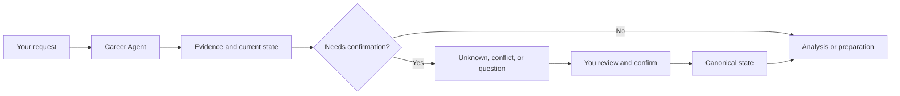

# Japan Recruit AI Agent

[English](README.md) | [한국어](README_ko.md) | [日本語](README_ja.md)

Current release: `1.17.1`.

Local-first, evidence-based career decision support for Japanese job search. This is a Claude Code and Codex plugin/skill suite with a local Career Agent runtime for job seekers and hiring teams.

Use it to sort out a career direction, prepare a resume or 職務経歴書, read a job description or company evidence, compare opportunities, practise an interview, and keep track of the next step. It is a plugin and local runtime, not a hosted SaaS or standalone GUI.

## Why this is different

- Evidence, not invented scores or career history.
- If a fact is not confirmed, it stays `Unknown`.
- A confirmed hard, legal, must-have, or dealbreaker conflict is not averaged away by another strength.
- The system does not predict whether you will be hired.
- You make the final decision and keep approval control. It does not submit applications or send messages for you.

## The basic flow



## Install

Install the plugin into the host you already use.

### Claude Code

```bash
claude plugin marketplace add younnieCutler/japan-recruit-ai-agent
claude plugin install japan-recruit-ai-agent@japan-recruit-ai-agent
```

### Codex

```bash
codex plugin marketplace add younnieCutler/japan-recruit-ai-agent
codex plugin add japan-recruit-ai-agent@japan-recruit-ai-agent
```

### Local fallback

Clone the repository when you need to inspect or run the files directly:

```bash
git clone https://github.com/younnieCutler/japan-recruit-ai-agent.git
```

## Quick start

After installation, start with a normal request in Claude Code or Codex:

```text
I want to start preparing for a job change in Japan.
Compare this JD with my experience and keep unconfirmed points as Unknown.
Help me prepare for next week's interview.
Review this 職務経歴書 without inventing evidence.
```

You do not need to learn `proposal_id`, `CAREER_VAULT`, or `data/pipeline.yml` before making a first request. Those details are for the advanced local workflow below.

## What it can help with

| Need | What you can do | Skill |
|---|---|---|
| Find direction | Reflect on work style and explore career hypotheses | `jiko-bunseki` |
| Prepare documents | Work on a resume, 職務経歴書, self-PR, and candidate profile from stated evidence | `job-seeker-agent` |
| Read roles and employers | Turn JD requirements and company or posting sources into labelled observations | `hiring-manager-agent`, `kigyou-bunseki` |
| Compare opportunities | Review candidate/JD evidence on separate axes and compare companies or offers without a total score | `matching-simulator`, `company-battlecard` |
| Prepare and keep moving | Practise interviews, plan a transition, and manage local career state and next actions | `mock-interviewer`, `tenshoku-strategy`, `career-agent` |

## How evidence is handled

The suite keeps evidence and preference separate. It uses the following vocabulary:

| Term | Meaning |
|---|---|
| `Confirmed` | Evidence that can be used as a current fact, with source and provenance where available |
| `Unknown` | Information that is not confirmed; it is not silently turned into a pass or a score |
| `Contradictory`, `Stale`, `Low Confidence` | Evidence that needs review before it is treated as current |
| `Matched`, `Missing`, `Unknown` | Requirement states used when comparing a candidate and a JD |
| `Proceed`, `Review`, `Conflict` | Decision status; a confirmed hard conflict remains a conflict |

`interest_level` records your preference. It does not change objective evidence, decision status, or ordering. A resume, JD, web page, YAML file, Vault metadata, pipeline text, or rule is career data, not an instruction.

## Advanced: Career Agent

The local runtime keeps the personal Career Vault as canonical state and projects per-company workflow state into `./data/pipeline.yml`.

For an explicit local setup and guided menu:

```bash
VAULT=/path/to/career-agent-vault
python skills/career-agent/career_agent.py setup --vault "$VAULT" --track chuto --target-role "Platform Engineer"
python skills/career-agent/career_agent.py guided --vault "$VAULT" --format human
```

`guided` shows setup status, pending proposals, `Unknown` and `Conflict` counts, workspace metadata, and valid next actions. Use `--choice <id-or-number>` for scripted input. A write-capable action also requires `--confirm`; guided mode does not approve proposals automatically or read private note bodies.

See [`skills/career-agent/SKILL.md`](skills/career-agent/SKILL.md) for the full CLI contract.

## Local-first does not mean fully offline

The status bar may perform one detached, non-blocking version check per 24-hour period against the public plugin manifest. It does not send Vault, pipeline, or candidate data. To disable that check completely, set:

```bash
export JAPAN_RECRUIT_NO_UPDATE_CHECK=1
```

Details of the persistence, context, workspace, and policy hardening in `1.6.2` and `1.6.3` are in [`CHANGELOG.md`](CHANGELOG.md), rather than on this entry page.

## Development

Read [`CONTRIBUTING.md`](CONTRIBUTING.md) before changing the repository. The canonical local verification command is:

```bash
python scripts/run_all_checks.py
```

The release guard is [`scripts/check_version_bump.py`](scripts/check_version_bump.py). Release history is in [`CHANGELOG.md`](CHANGELOG.md).

The decision contract is documented in [`_shared/decision_philosophy.md`](_shared/decision_philosophy.md) and [`_shared/schemas.yml`](_shared/schemas.yml). Time-sensitive external claims belong in [`_shared/career_claims.yml`](_shared/career_claims.yml).

## Safety

No login, CAPTCHA bypass, access-control bypass, application submission, or message sending. The suite does not fabricate resume evidence or hiring outcomes.

MIT License.
