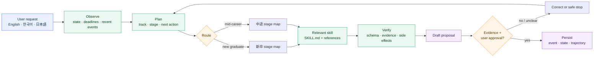
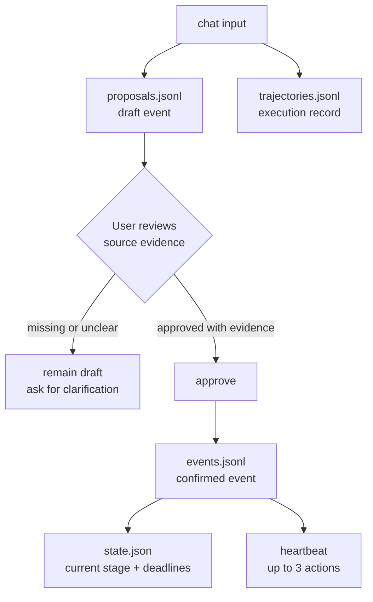

# Japan Recruit AI Agent

[English](README.md) · [한국어](README_ko.md) · [日本語](README_ja.md)

AI skills for Japanese job hunting and recruiting. The suite supports both **新卒** (new graduate)
and **中途** (mid-career) paths, from self-analysis to documents, interviews, offers, resignation,
and onboarding.

[](./LICENSE)
[](./.claude-plugin/plugin.json)
[](#skills)
[](#install)
[](#install)

Seven domain skills do the career work. `career-agent` is the local-first runtime that routes each
request, keeps an append-only event ledger, and proposes the next action. It never submits an
application, sends a message, or edits an installed skill.

## How the system works



The runtime follows a small, inspectable loop:

```text
Observe → Plan → Act → Verify → Correct → Persist
```

It loads only the skill and references needed for the selected stage. It does not inject every
`SKILL.md` into every run.

## Skills

| Skill | Use it for | Main output |
|---|---|---|
| `jiko-bunseki` | Strengths, values, work style, and career direction | `SELF_ANALYSIS_PROFILE` |
| `job-seeker-agent` | Resume, 職務経歴書, 自己PR, 志望動機, ES, and interview content | `CANDIDATE_PROFILE` |
| `hiring-manager-agent` | JD design and hiring-side evaluation criteria | `COMPANY_PROFILE` |
| `matching-simulator` | Candidate/JD fit and evidence-based scoring | Match report |
| `company-battlecard` | Comparing two or more companies | Comparison report |
| `kigyou-bunseki` | Company and public posting research | 企業カルテ |
| `tenshoku-strategy` | Interviews, salary, offers, resignation, onboarding, and tracking | Execution plan |
| `career-agent` | Track routing, event ledger, deadlines, next actions, and posting candidates | Local career state |

Every skill is a `SKILL.md` under `skills/<name>/`. Shared frameworks and schemas live under
`_shared/`.

## Install

### Claude Code — one command

Run in a terminal:

```bash
claude plugin marketplace add younnieCutler/japan-recruit-ai-agent && \
  claude plugin install japan-recruit-ai-agent@japan-recruit-ai-agent
```

Inside an active Claude Code session, the equivalent is:

```text
/plugin marketplace add younnieCutler/japan-recruit-ai-agent
/plugin install japan-recruit-ai-agent@japan-recruit-ai-agent
```

### Codex — one command

```bash
codex plugin marketplace add younnieCutler/japan-recruit-ai-agent && \
  codex plugin add japan-recruit-ai-agent@japan-recruit-ai-agent
```

### Install both at once

```bash
claude plugin marketplace add younnieCutler/japan-recruit-ai-agent && \
  claude plugin install japan-recruit-ai-agent@japan-recruit-ai-agent && \
  codex plugin marketplace add younnieCutler/japan-recruit-ai-agent && \
  codex plugin add japan-recruit-ai-agent@japan-recruit-ai-agent
```

### Local fallback

Use this when you want to run from a clone or inspect the skill files directly:

```bash
git clone https://github.com/younnieCutler/japan-recruit-ai-agent.git ~/japan-recruit-skills
REPO=~/japan-recruit-skills

mkdir -p ~/.claude/skills ~/.claude/_shared
cp -R "$REPO/skills/." ~/.claude/skills/
cp -R "$REPO/_shared/." ~/.claude/_shared/

mkdir -p ~/.codex/skills ~/.codex/_shared
cp -R "$REPO/skills/." ~/.codex/skills/
cp -R "$REPO/_shared/." ~/.codex/_shared/
```

## Run the Career Agent

Run from the repository root. State defaults to `./career-home/`; use `CAREER_HOME` or `--home` to
store it elsewhere.

```bash
python3 skills/career-agent/career_agent.py run \
  --mode chat \
  --track shinsotsu \
  --message "I want to turn my 学チカ experience into 自己PR material."

python3 skills/career-agent/career_agent.py status
python3 skills/career-agent/career_agent.py run --mode heartbeat
python3 skills/career-agent/career_agent.py run --mode discover --source postings.json
python3 skills/career-agent/career_agent.py approve <proposal-id> --evidence "resume.md:12"
python3 skills/career-agent/career_agent.py rollback <version>
```

`chat` accepts `--message` or stdin. If the track is ambiguous, it stops instead of guessing.
`approve` is required before a draft event enters the confirmed ledger.

### The approval gate



Confirmed events use a fixed schema: `id`, `track`, `stage`, `type`, `occurred_at`, `title`, `summary`,
`evidence`, `source`, `next_action`, `deadline`, and `status`. Numeric claims without matching evidence
are rejected.

## Track map

```mermaid
flowchart TB
    subgraph NS["新卒 / New graduate"]
        NS1["自己分析・就活軸"] --> NS2["学チカ・自己PR素材"]
        NS2 --> NS3["業界研究・企業研究"]
        NS3 --> NS4["ES・履歴書"]
        NS4 --> NS5["適性検査（SPI3）"]
        NS5 --> NS6["書類選考・面接"]
        NS6 --> NS7["内々定・内定・入社準備"]
    end
    subgraph MC["中途 / Mid-career"]
        MC1["自己分析・転職軸"] --> MC2["職務経歴書・自己PR"]
        MC2 --> MC3["業界研究・企業研究"]
        MC3 --> MC4["応募・書類選考"]
        MC4 --> MC5["面接"]
        MC5 --> MC6["内定・条件交渉"]
        MC6 --> MC7["退職・入社準備"]
    end
```



## Recommended workflows

| Goal | Workflow |
|---|---|
| Direction first | `/jiko-bunseki` → `/job-seeker-agent` |
| 新卒: 学チカ to ES | `/job-seeker-agent` → `/kigyou-bunseki` → `/tenshoku-strategy` |
| 中途: resume to interview | `/job-seeker-agent` → `/kigyou-bunseki` → `/matching-simulator` |
| Compare offers | `/company-battlecard` → `/tenshoku-strategy` |
| Interview content | `/job-seeker-agent` |
| Interview manner, salary, resignation, onboarding | `/tenshoku-strategy` |
| Hiring-side JD improvement | `/hiring-manager-agent` |
| State and next action | `career-agent chat` → `approve` → `heartbeat` |
| Public posting candidates | `career-agent discover` → review manually |

### Public posting discovery

`discover` reads a JSON object, array, or `{ "postings": [...] }`. Each posting needs an original
HTTP(S) URL:

```json
[
  {
    "company": "Example株式会社",
    "role": "データエンジニア",
    "graduation_year": 2027,
    "target": "新卒",
    "deadline": "2026-08-31",
    "url": "https://example.com/jobs/123"
  }
]
```

The runtime records candidates only. It does not search the web, log in, bypass CAPTCHA, submit
applications, or send email.

## Runtime files

All runtime files are stored under `CAREER_HOME`:

| File | Purpose |
|---|---|
| `events.jsonl` | Append-only confirmed event ledger |
| `state.json` | Current track, stage, actions, deadlines, and applications |
| `proposals.jsonl` | Draft events, heartbeat reports, and posting candidates |
| `trajectories.jsonl` | ReAct-style execution and verification records |
| `checkpoints.jsonl` | State checkpoints and rollback records |
| `versions/*.json` | Replaceable state snapshots |
| `postings.jsonl` | Deduplicated public posting candidates |

Domain skills follow `CLAUDE.md`: human-readable reports go under `career-docs/`, and machine-readable
profiles go under `data/`, relative to the session directory.

## Boundaries

- No invented experience, metrics, offers, or evidence.
- No application submission or message sending without explicit user review.
- No login, CAPTCHA bypass, or access-control bypass.
- No confirmed ledger event without evidence.
- No online edits to an installed `SKILL.md`.

Scores are approximate. Claims must stay grounded in the user's source material.

## Development

```bash
python3 -m unittest -v skills/career-agent/test_career_agent.py
python3 -m py_compile skills/career-agent/career_agent.py
claude plugin validate .
```

The runtime uses Python's standard library and JSONL. SQLite FTS5 can be added later if event volume
requires indexed search.

## License

MIT License.
