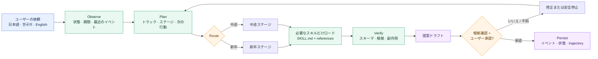
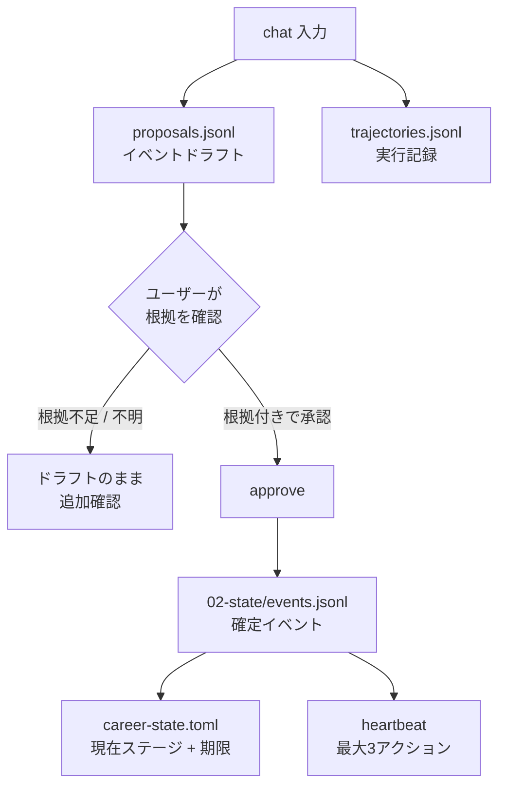
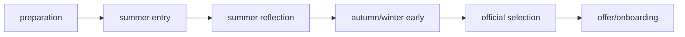

# Japan Recruit AI Agent

[English](README.md) · [한국어](README_ko.md) · [日本語](README_ja.md)

日本の就職・転職と採用業務を支援する AI スキル集です。**新卒**と**中途**の両方に対応し、
自己分析、書類、面接、オファー、退職、入社準備までをつなぎます。

[](./LICENSE)
[](./.claude-plugin/plugin.json)
[](#スキル)
[](#インストール)
[](#インストール)

7つのドメインスキルがキャリア業務を担当し、`career-agent` がリクエストをルーティングします。
Career Agent はイベント台帳、期限、次の行動をローカルに保存し、根拠付きの提案を作成します。
応募、メッセージ送信、インストール済みスキルの編集は実行しません。

## 仕組み



実行ループは次のとおりです。

```text
Observe → Plan → Act → Verify → Correct → Persist
```

現在のステージに必要な `SKILL.md` と reference だけを読み込み、毎回すべてのスキル文書を
注入することはありません。

## スキル

| スキル | 用途 | 主な出力 |
|---|---|---|
| `jiko-bunseki` | 強み、価値観、仕事スタイル、キャリアの方向性 | `SELF_ANALYSIS_PROFILE` |
| `job-seeker-agent` | 履歴書、職務経歴書、自己PR、志望動機、ES、面接内容 | `CANDIDATE_PROFILE` |
| `hiring-manager-agent` | 求人票の設計と採用側の評価基準 | `COMPANY_PROFILE` |
| `matching-simulator` | 候補者と求人の適合度、根拠付きスコア | マッチレポート |
| `company-battlecard` | 2社以上の比較 | 比較レポート |
| `kigyou-bunseki` | 企業と公開求人の調査 | 企業カルテ |
| `tenshoku-strategy` | 面接、年収、内定、退職、入社、選考トラッキング | 実行計画 |
| `career-agent` | トラック、イベント台帳、期限、次の行動、求人候補 | ローカル状態 |

各スキルは `skills/<name>/SKILL.md` にあります。共通フレームワークとスキーマは `_shared/`
にあります。

## インストール

### Claude Code — ワンコマンド

ターミナルで実行します。

```bash
claude plugin marketplace add younnieCutler/japan-recruit-ai-agent && \
  claude plugin install japan-recruit-ai-agent@japan-recruit-ai-agent
```

Claude Code のセッション内では次の2行でも実行できます。

```text
/plugin marketplace add younnieCutler/japan-recruit-ai-agent
/plugin install japan-recruit-ai-agent@japan-recruit-ai-agent
```

### Codex — ワンコマンド

```bash
codex plugin marketplace add younnieCutler/japan-recruit-ai-agent && \
  codex plugin add japan-recruit-ai-agent@japan-recruit-ai-agent
```

### Claude Code と Codex を同時にインストール

```bash
claude plugin marketplace add younnieCutler/japan-recruit-ai-agent && \
  claude plugin install japan-recruit-ai-agent@japan-recruit-ai-agent && \
  codex plugin marketplace add younnieCutler/japan-recruit-ai-agent && \
  codex plugin add japan-recruit-ai-agent@japan-recruit-ai-agent
```

### ローカルインストール（fallback）

リポジトリを直接確認したい場合は clone して、スキルと共有ファイルをコピーします。

```bash
git clone https://github.com/younnieCutler/japan-recruit-ai-agent.git ~/japan-recruit-skills
REPO=~/japan-recruit-skills

mkdir -p ~/.claude/skills ~/.claude/_shared
cp -R "$REPO/skills/." ~/.claude/skills/
cp -R "$REPO/_shared/." ~/.claude/_shared/

mkdir -p ~/.codex/skills ~/.codex/_shared
cp -R "$REPO/skills/." ~/.codex/skills/
cp -R "$REPO/_shared/." ~/.codex/_shared/
```

## アップデート

自動更新はサードパーティのマーケットプレイスでは**既定で無効**です。本プラグインも同様で、有効に
するまではインストール時のバージョンを使い続けます。

一度だけ有効化してください。`/plugin` → **Marketplaces** → `japan-recruit-ai-agent` → auto-update を
有効化。`~/.claude/settings.json` に直接書いても同じです:

```json
"extraKnownMarketplaces": {
  "japan-recruit-ai-agent": {
    "source": { "source": "github", "repo": "younnieCutler/japan-recruit-ai-agent" },
    "autoUpdate": true
  }
}
```

以降は Claude Code がセッション開始直後に確認します。**実行中**のセッションは起動時のバージョンを
保持するため、新しいリリースは次回起動から適用されます。

手動で一度だけ更新する場合:

```bash
claude plugin marketplace update japan-recruit-ai-agent   # マーケットプレイスの一覧を更新
claude plugin update japan-recruit-ai-agent               # プラグイン本体を更新
claude plugin list                                        # バージョンを確認
```

実行したセッションには反映されないため、再起動してください。

リリースは `.claude-plugin/plugin.json` の `version` フィールドで配信され、バージョンごとに別の
キャッシュディレクトリを使います — このフィールドが変わるまでインストール済みの版はそのままです。

1.1.0 からプラグインに `UserPromptSubmit` フックが同梱され、キャリアステータスバー（締切・未チェックの
アクション項目・自分で決めたルール）を注入します。フックはプラグインと一緒に配布されるため、1.0.0 の
ままだとステータスバーも実行ゲートも動きません。上記の**ローカルフォールバック**は `skills/` と
`_shared/` のみをコピーするためフックは含まれません — 必要な場合はプラグインとしてインストールして
ください。

## エージェントの操作方法

スキルを起動する方法は2つあり、どちらも同じ `SKILL.md` を実行します:

- **話しかける。** Claude Code（または Codex）のチャットセッション内で状況を自然言語で説明するだけ
  です — スラッシュは不要です。Claude がメッセージを各スキルの frontmatter と照合して起動します。
  セッションの作業ディレクトリがこのリポジトリ自体である場合は `CLAUDE.md` も自動読み込みされ、
  オンボーディング、パイプライン再開の kanban 挨拶、より詳細な韓/日/英ルーティング表が加わります。
  `CLAUDE.md` は `skills/` の外、リポジトリのルートにあるため、プラグインを別のプロジェクトに
  インストールしてもこの挙動は付いてきません — その場合は各スキル自身の frontmatter トリガーに
  よるルーティングになります。
- **スラッシュコマンドを入力する。** `/jiko-bunseki`、`/job-seeker-agent` など（[推奨ワークフロー]
  (#推奨ワークフロー) 参照）が同じスキルを明示的に起動します。

`career-agent` の場合、起動すると以下の CLI が実行されます。スキルが起動した後は通常 Claude が
Bash ツール経由で以下のコマンドを代わりに実行しますが、直接制御・スクリプト化・デバッグが必要な
場合はターミナルで自分で実行することもできます。`heartbeat` はバックグラウンドジョブやスケジューラ
ではなく、あなた（または Claude）が実行するたびに根拠のある次のアクションを最大3件返す、手動の
単発チェックです。

**クイックスタート:** 上記の手順でプラグインをインストールしたら、まず Vault を一度作成します —
`career_agent.py init --vault <path>` を実行し、`CAREER_VAULT` を設定してください（[Career Agent
の実行](#career-agent-の実行) 参照。`career-agent` は Vault なしでは動作を拒否します）。その後
プロジェクトで Claude Code を開いて「次にやるべきキャリアのアクションは？」のように話しかけてみて
ください — エージェントが Vault の状態を観察し、根拠とともに次のステップを提案し、記録する前に
あなたの承認を待ちます。

## Career Agent の実行

専用の Career Vault を先に作成または指定します。ランタイムはリポジトリやカレントディレクトリを
保存先の初期値にせず、`--vault` または `CAREER_VAULT` が必要です。
Claude は通常チャットセッション内で以下のコマンドを代わりに実行します（[エージェントの操作方法]
(#エージェントの操作方法) 参照）— ターミナルで直接実行しても同様に動作します。

**ワンコマンドのプラグインインストールで導入した場合:** `career_agent.py` はプロジェクト基準の
相対パス `skills/career-agent/career_agent.py` には存在しません — プラグインのインストール先
にあります。一度だけ探して export してください:

```bash
find ~/.claude/plugins -name career_agent.py   # Claude Code
find ~/.codex -name career_agent.py            # Codex
export CAREER_AGENT_RUNTIME=<上で見つけたパス>
```

その後、以下すべてのコマンドで `skills/career-agent/career_agent.py` を `"$CAREER_AGENT_RUNTIME"`
に置き換えてください。ローカルインストール（fallback、git clone）で導入した場合は、以下の相対パスが
リポジトリのルート基準でそのまま動作します。

```bash
VAULT=/path/to/career-agent-vault
python3 skills/career-agent/career_agent.py init --vault "$VAULT"
# 00-control/career-profile.toml を入力してから検証します。
python3 skills/career-agent/career_agent.py doctor --vault "$VAULT"
python3 skills/career-agent/career_agent.py run --vault "$VAULT" --mode chat --track shinsotsu \
  --message "学チカの経験を自己PRの素材に整理したいです。"
python3 skills/career-agent/career_agent.py status --vault "$VAULT"
# 手動の単発チェック（スケジューラではありません）— 根拠のある次のアクションを最大3件返します。
python3 skills/career-agent/career_agent.py run --vault "$VAULT" --mode heartbeat
python3 skills/career-agent/career_agent.py run --vault "$VAULT" --mode discover --source postings.json
python3 skills/career-agent/career_agent.py approve --vault "$VAULT" <proposal-id> --evidence "resume.md:12"
python3 skills/career-agent/career_agent.py rollback --vault "$VAULT" <version>
python3 skills/career-agent/career_agent.py index --vault "$VAULT"
python3 skills/career-agent/career_agent.py context --vault "$VAULT"
```

`chat` は `--message` または stdin を受け取ります。トラックが不明確な場合は推測せず停止します。
ドラフトイベントは `approve` するまで確定台帳に入りません。

### Vault と Obsidian 連携

`init` は次の構造を作成し、そのまま Obsidian Vault として開けます。

```text
00-control/    プロフィールと Agent ポリシー
01-capture/    未分類の原文（自動コンテキスト対象外）
02-state/      イベント台帳、提案、現在状態
03-active/     進行中の応募と企業
04-evidence/   事実確認用の資料
05-playbooks/  個人用の検証済みガイダンス
06-reference/  確認済みの参考資料
07-archive/    終了・古い資料（自動コンテキスト対象外）
```

ランタイムは常に `00-control` と `02-state` を読み、残りは検証済みノートを最大5件だけ選択します。
`index` は `.career-agent/vault-index.jsonl` にメタデータ、見出し、wikilink、hash、パス、source kind
だけを保存し、本文は取り込みません。`01-capture` は除外し、`07-archive` は手動監査時だけ
`--include-archives` で読みます。

### 候補者向け全 Agent の共通コンテキスト

`CAREER_VAULT` を一度設定すると、`jiko-bunseki`、`job-seeker-agent`、`kigyou-bunseki`、
`matching-simulator`、`tenshoku-strategy`、`company-battlecard` は作業前に `context` を呼びます。
そのため、同じプロフィール、現在状態、メタデータだけの選択ノートを使います。

### 承認ゲート



確定イベントは `id`, `track`, `stage`, `flow_phase`, `type`, `occurred_at`, `title`, `summary`, `evidence`,
`source`, `next_action`, `deadline`, `status` を使用します。根拠と一致しない数値の主張は拒否されます。

## トラックとステージ

```mermaid
flowchart TB
    subgraph NS["新卒 / New graduate"]
        NS1["自己分析・就活軸"] --> NS2["学チカ・自己PR素材"]
        NS2 --> NS3["業界研究・企業研究"]
        NS3 --> NS4["ES・履歴書"]
        NS4 --> NS5["適性検査（SPI3）"]
        NS5 --> NS6["書類選考・面接"]
        NS6 --> NS7["内々定・内定・入社準備"]
    end
    subgraph MC["中途 / Mid-career"]
        MC1["自己分析・転職軸"] --> MC2["職務経歴書・自己PR"]
        MC2 --> MC3["業界研究・企業研究"]
        MC3 --> MC4["応募・書類選考"]
        MC4 --> MC5["面接"]
        MC5 --> MC6["内定・条件交渉"]
        MC6 --> MC7["退職・入社準備"]
    end
```



### 新卒の時期レイヤー



`stage` は作業の種類、`flow_phase` は時期を表すため、ES・SPI3・面接は並行できます。共通の流れは
毎年公式ソースで手動確認します。YouTube 要約や個人の振り返りはチェックリストだけに使い、
普遍的な日程や事実としては扱いません。

## 推奨ワークフロー

`/skillname` でスキルを明示的に起動するか、状況を自然言語で説明して自動起動させることもできます
（[エージェントの操作方法](#エージェントの操作方法) 参照）。

| 目的 | ワークフロー |
|---|---|
| 方向性から始める | `/jiko-bunseki` → `/job-seeker-agent` |
| 新卒: 学チカからESまで | `/job-seeker-agent` → `/kigyou-bunseki` → `/matching-simulator` |
| 中途: 職務経歴書から面接まで | `/job-seeker-agent` → `/kigyou-bunseki` → `/matching-simulator` |
| オファーを比較する | `/company-battlecard` → `/tenshoku-strategy` |
| 面接の回答内容 | `/job-seeker-agent` |
| 面接マナー、年収、退職、入社 | `/tenshoku-strategy` |
| 採用側の求人票改善 | `/hiring-manager-agent` |
| 状態と次の行動 | `career-agent chat` → `approve` → `heartbeat` |
| 公開求人の候補 | `career-agent discover` → 手動レビュー |

### 公開求人の発見

`discover` は JSON オブジェクト、配列、または `{ "postings": [...] }` を読み込みます。各求人には
元の HTTP(S) URL が必要です。

```json
[
  {
    "company": "Example株式会社",
    "role": "データエンジニア",
    "graduation_year": 2027,
    "target": "新卒",
    "deadline": "2026-08-31",
    "url": "https://example.com/jobs/123"
  }
]
```

求人候補だけを保存します。Web検索、ログイン、CAPTCHA の回避、応募、メール送信は行いません。

## Vault の保存ファイル

すべての状態は選択した Career Vault 内に保存されます。

| ファイル | 用途 |
|---|---|
| `00-control/career-profile.toml` | トラック、目標職種、状態、新卒の卒業予定年 |
| `02-state/career-state.toml` | 人が読む現在のトラック、ステージ、行動、期限 |
| `02-state/events.jsonl` | append-only の確定イベント台帳 |
| `02-state/proposals.jsonl` | イベントドラフト、heartbeat、求人候補 |
| `02-state/trajectories.jsonl` | 実行と検証の記録 |
| `.career-agent/` | 置き換え可能な JSON キャッシュ、バージョン、メタデータ専用索引 |

ドメインスキルの文書は `CLAUDE.md` の契約に従い、セッションディレクトリからの相対パスで
`career-docs/` に、機械可読プロフィールは `data/` に保存されます。

## 安全範囲

- 入力にない経験、数値、オファー、根拠を作成しません。
- ユーザーの明示的な確認なしに応募やメッセージ送信を行いません。
- ログイン、CAPTCHA、アクセス制御を回避しません。
- 根拠のないイベントを確定台帳に保存しません。
- オンライン実行中にインストール済みの `SKILL.md` を編集しません。

スコアは近似値です。すべての主張はユーザーが提供した資料に基づきます。

## 開発

```bash
python3 -m unittest -v skills/career-agent/test_career_agent.py
python3 -m py_compile skills/career-agent/career_agent.py
claude plugin validate .
```

初期ランタイムは Python 標準ライブラリと JSONL を使用します。イベント量が増えた場合のみ
SQLite FTS5 による検索を追加します。

## License

MIT License.
