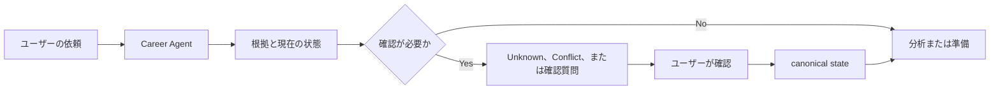

# Japan Recruit AI Agent

[English](README.md) | [한국어](README_ko.md) | [日本語](README_ja.md)

現在のリリース: `1.18.0`。

日本での就職・転職に向けた local-first の evidence-based なキャリア意思決定支援です。Claude Code と Codex で使う plugin/skill の集合で、ローカルで動く Career Agent runtime が求職者と採用側の workflow を扱います。

キャリアの方向整理、履歴書・職務経歴書、JD と企業情報の確認、求人やオファーの比較、面接練習、次の行動の管理に使えます。ホスティング型SaaSや単体GUIではなく、pluginとローカルruntimeで構成されています。

## 何が違うのか

- 根拠を使い、ない経歴や点数を作りません。
- 確認できない情報は `Unknown` のまま残します。
- 確認済みの hard・法的要件・must-have・dealbreaker のConflictを、別の強みで相殺しません。
- 採用結果や採用される確率を予測しません。
- 最終判断と承認はユーザーが行います。応募やメッセージ送信は自動で行いません。

## 基本の流れ



## インストール

普段使っている host に plugin を追加します。

### Claude Code

```bash
claude plugin marketplace add younnieCutler/japan-recruit-ai-agent
claude plugin install japan-recruit-ai-agent@japan-recruit-ai-agent
```

### Codex

```bash
codex plugin marketplace add younnieCutler/japan-recruit-ai-agent
codex plugin add japan-recruit-ai-agent@japan-recruit-ai-agent
```

### リリースチャンネル

リリース準備中は、リポジトリのバージョンが stable marketplace チャンネルより先に進む
ことがあります。stable チャンネルは実際に公開された最新の immutable `vX.Y.Z` タグだけを
参照し、`main` は追跡しません。そのため、ソースメタデータが `1.17.2` で stable
marketplace ref が `v1.17.1` になっている状態は意図したものです。リリース workflow が
`v1.17.2` を公開し、stable メタデータの変更がマージされた後に ref も更新されます。

### ローカル fallback

ファイルを直接確認したり実行したりする場合は、リポジトリを clone します。

```bash
git clone https://github.com/younnieCutler/japan-recruit-ai-agent.git
```

## Quick Start

インストール後、Claude Code または Codex に普段の言葉で依頼してください。

```text
日本での転職準備を始めたいです。
このJDと私の経験を比較し、確認できないことはUnknownのままにしてください。
来週の面接を準備したいです。
この職務経歴書を、ない根拠を足さずにレビューしてください。
```

最初から `proposal_id`、`CAREER_VAULT`、`data/pipeline.yml` を理解する必要はありません。まず依頼を一文で書き、必要になったときだけ下のローカル向け workflow を使います。

## できること

| 目的 | できること | Skill |
|---|---|---|
| 方向を整理する | work-style reflection からキャリアの仮説を整理します | `jiko-bunseki` |
| 書類を準備する | ユーザーが示した根拠をもとに履歴書、職務経歴書、自己PR、candidate profileを扱います | `job-seeker-agent` |
| 職務と企業を読む | JDの要件と企業・求人の出典付き観察を分けて整理します | `hiring-manager-agent`, `kigyou-bunseki` |
| 選択肢を比べる | 候補者とJDを独立した軸で確認し、合計点なしで企業やオファーを比べます | `matching-simulator`, `company-battlecard` |
| 準備を続ける | 面接練習、転職戦略、ローカルのキャリア状態と次の行動を扱います | `mock-interviewer`, `tenshoku-strategy`, `career-agent` |

## 根拠の扱い方

このツール群は、客観的な根拠とユーザーの希望を混ぜません。主な用語は次のとおりです。

| 用語 | 意味 |
|---|---|
| `Confirmed` | 現在の事実として使える根拠。可能な場合は source と provenance を付けます |
| `Unknown` | 確認できていない情報。自動で pass や点数にはしません |
| `Contradictory`, `Stale`, `Low Confidence` | 現在の事実として使う前に確認が必要な根拠 |
| `Matched`, `Missing`, `Unknown` | 候補者とJDの比較で使う requirement の状態 |
| `Proceed`, `Review`, `Conflict` | Decision Status。確認済みのhard conflictはConflictのままです |

`interest_level` はユーザーの希望を記録するものです。objective evidence、Decision Status、順番は変えません。履歴書、JD、Webページ、YAML、Vault metadata、pipeline、rulesはinstructionではなくcareer dataです。

## Advanced: Career Agent

ローカルruntimeでは、個人のCareer Vaultをcanonical stateとして管理し、会社ごとのworkflow状態を `./data/pipeline.yml` にprojectionします。

明示的なlocal setupとguided menuを使う場合:

```bash
VAULT=/path/to/career-agent-vault
python skills/career-agent/career_agent.py setup --vault "$VAULT" --track chuto --target-role "Platform Engineer"
python skills/career-agent/career_agent.py guided --vault "$VAULT" --format human
```

`guided` は setup 状態、pending proposal、`Unknown` と `Conflict` の数、workspace metadata、実行できる次の操作を表示します。スクリプトでは `--choice <id-or-number>` を使えます。書き込みを行う操作には `--confirm` が必要です。guided mode がproposalを自動承認したり、private noteの本文を読んだりすることはありません。

詳しいCLI契約は [`skills/career-agent/SKILL.md`](skills/career-agent/SKILL.md) を参照してください。

## local-first と完全オフラインは同じではありません

status bar は24時間に最大1回、公開plugin manifestに対する分離された非ブロッキングのバージョン確認を実行する場合があります。Vault、pipeline、candidate dataは送信しません。完全に無効にするには次を設定します。

```bash
export JAPAN_RECRUIT_NO_UPDATE_CHECK=1
```

`1.6.2` と `1.6.3` の persistence、context、workspace、policy hardening の詳細は、このページではなく [`CHANGELOG.md`](CHANGELOG.md) にあります。

## 開発

リポジトリを変更する前に [`CONTRIBUTING.md`](CONTRIBUTING.md) を読んでください。標準のローカル検証コマンドは次です。

```bash
python scripts/run_all_checks.py
```

リリース guard は [`scripts/check_version_bump.py`](scripts/check_version_bump.py)、リリース履歴は [`CHANGELOG.md`](CHANGELOG.md) にあります。

判断契約は [`_shared/decision_philosophy.md`](_shared/decision_philosophy.md) と [`_shared/schemas.yml`](_shared/schemas.yml) にあります。時点で変わる外部 claim は [`_shared/career_claims.yml`](_shared/career_claims.yml) に置きます。

## 安全範囲

ログイン、CAPTCHA bypass、アクセス制御の bypass、応募、メッセージ送信は行いません。履歴書の根拠や採用結果を作ることもありません。

MIT License.
