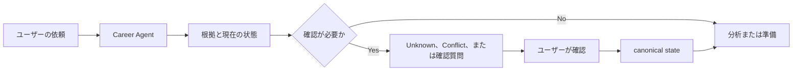

<h1 align="center">Japan Career Agent</h1>

<p align="center">
  <strong>日本での就職・転職のための evidence-based なキャリア意思決定支援。<br/>
  経歴の記録は手元の PC に留まり、承認なしに何も事実になりません。</strong>
</p>

<p align="center">
  <a href="https://github.com/younnieCutler/japan-career-agent/releases"></a>
  <a href="https://github.com/younnieCutler/japan-career-agent/actions/workflows/test.yml"></a>
  <a href="https://pypi.org/project/japan-career-agent/"></a>
  <a href="https://www.npmjs.com/package/japan-career-agent"></a>
  
  <a href="CHANGELOG.md"></a>
  <a href="LICENSE"></a>
</p>

<p align="center">
  <a href="#インストール">インストール</a> ·
  <a href="#何が違うのか">何が違うか</a> ·
  <a href="#基本の流れ">流れ</a> ·
  <a href="#quick-start">Quick start</a> ·
  <a href="#できること">スキル</a> ·
  <a href="CONTRIBUTING.md">コントリビュート</a> ·
  <a href="CHANGELOG.md">変更履歴</a>
</p>

<p align="center">
  🌐 <a href="README.md">English</a> ·
  <a href="README_ko.md">한국어</a> ·
  <strong>日本語</strong>
</p>

---

現在のリリース: `2.9.0`。

**3つのステップ:**

1. **あったことを記録する** — 棚卸しが過去の仕事を context・experience・検証できる根拠に変えます。確認できないものは `Unknown` のまま残ります。
2. **承認する** — 本人が確認するまで、canonical な経歴記録には何も入りません。出典のない数値は拒否されます。
3. **使う** — JD マッチング、職務経歴書、面接練習、次の行動。すべて確認済みの根拠だけを引用します。

Claude Code と Codex の plugin/skill としても、単体のコマンドとしても動き、ローカルの Career Agent runtime の上で求職者と採用側の workflow を扱います。

キャリアの方向整理、履歴書・職務経歴書、JD と企業情報の確認、求人やオファーの比較、面接練習、次の行動の管理に使えます。ホスティング型SaaSではなく、pluginとローカルruntimeで構成され、読み取り画面、再開可能な棚卸し下書き、Company/Applicationを分けたcaseとdigest artifact、読み取り専用のProject/在職中画面を持つローカルGUIも選べます。`career-agent sessions --format json` では同じ再開セッション保存先を確認できます。canonical な根拠の反映には本人の承認が必要です。

## 何が違うのか

- 根拠を使い、ない経歴や点数を作りません。
- 確認できない情報は `Unknown` のまま残します。
- 確認済みの hard・法的要件・must-have・dealbreaker のConflictを、別の強みで相殺しません。
- 採用結果や採用される確率を予測しません。
- 最終判断と承認はユーザーが行います。応募やメッセージ送信は自動で行いません。

## 基本の流れ



## インストール

### 一度だけ実行する

どちらのコマンドも同じ Python プログラムを導入して実行し、PATH には何も残しません。すでに手元に
ある runner を選んでください。

```bash
npx japan-career-agent setup    # npm 経由
uvx japan-career-agent setup    # uv 経由、または: pipx run japan-career-agent setup
```

`setup` は Career Vault を作ります。推測できない値はコマンドラインで渡すか、そのまま実行すれば
どのフラグが足りないかを返します——ただし表示される次のコマンドは `japan-career-agent` が PATH に
ある前提で書かれており、`npx` や `uvx` 経由の実行はそれを残しません。表示されたコマンドの前に、
同じ `npx`/`uvx` を自分で付け直してください。それ以外は初回はこれで終わりです。設定ファイルも、
調べておく識別子もありません。

`npx` は runtime ではなく入口です。取得するのはインストーラだけで製品コードは含まれません。`uv`
か `pipx` を見つけて同じバージョンの PyPI リリースを導入し、実行を委ねます。**canonical runtime は
Python** であり、どの入口から入っても同じプログラムが同じ Career Vault を扱います。

Python 3.11 以降が必要です。`uv` は適合する interpreter を自分で取得し、`pipx` は導入済みの
Python を使います。どちらも無い場合、`npx` は導入方法を案内し、何も変更しません。

### 常時使えるようにする

上のコマンドは一度きりです。取得して実行し、破棄します。手元に残して使うなら導入します。

```bash
uv tool install japan-career-agent
# または
pipx install japan-career-agent
```

導入後はコマンドが PATH に入り、短い名前でも動きます。

```bash
japan-career-agent setup
career-agent status
```

### 追加で使える統合

任意です。すでに Claude Code か Codex を使っているなら、plugin が同じ core の上に skill discovery、
host native な会話 workflow、host の status context を追加します。

```bash
claude plugin marketplace add younnieCutler/japan-career-agent
claude plugin install japan-career-agent@japan-career-agent
```

```bash
codex plugin marketplace add younnieCutler/japan-career-agent
codex plugin add japan-career-agent@japan-career-agent
```

plugin がキャリアの事実を独自に持つことはありません。Vault、根拠の ledger、承認と復旧、readiness、
JD ごとの根拠選択、決定的な書類ゲート、HTML 生成はいずれも host 無しで動きます。plugin が変えるの
は到達の仕方だけで、答えの中身ではありません。どれがどちらかは
[`docs/CAPABILITY_MATRIX.md`](docs/CAPABILITY_MATRIX.md) に一覧があります。

### リリースチャンネル

リリース準備中は、リポジトリのバージョンが stable marketplace チャンネルより先に進む
ことがあります。stable チャンネルは実際に公開された最新の immutable `vX.Y.Z` タグだけを
参照し、`main` は追跡しません。現在はソースメタデータが `2.9.0` である一方、stable marketplace
ref はまだ `v2.1.1` です。このソースに対するタグをリリース workflow がまだ公開していないためで、
marketplace から入れると今日は `2.1.1` が入ります。次のタグが公開され ref が更新されれば差は
閉じます。`uvx` と `npx` はこの ref ではなく公開済みパッケージのバージョンを解決するので、
どちらの場合も影響を受けません。

### ローカル fallback

ファイルを直接確認したり実行したりする場合は、リポジトリを clone します。

```bash
git clone https://github.com/younnieCutler/japan-career-agent.git
```

### 2.0.x からの移行 — 旧名は `japan-recruit-ai-agent`

2.1.0 で名称を変更しました。GitHub が旧リポジトリ URL を redirect するため既存の clone と remote は
そのまま動きますが、marketplace の項目は名前で識別されるため追加し直す必要があります。

```bash
claude plugin marketplace remove japan-recruit-ai-agent
claude plugin marketplace add younnieCutler/japan-career-agent
claude plugin install japan-career-agent@japan-career-agent
```

Career Vault は何も変わりません。vault のパス、event ledger、生成済みの書類はいずれも名称変更の
影響を受けません。`JAPAN_RECRUIT_NO_UPDATE_CHECK=1` も引き続き update check を無効にするため、既存の
設定は新しい `JAPAN_CAREER_NO_UPDATE_CHECK` と併せてそのまま有効です。旧名で公開されたリリース
バンドルも `scripts/verify_release.py` で検証できます。

## Quick Start

起きることは三つ、この順番です。最初のセッションで価値を得るのに、これ以外は必要ありません。

1. **記録する。** やってきた仕事を、自分の言葉で伝えます。
2. **確認する。** 理解した内容と、裏付けが取れなかった点が提示されます。あなたが「はい」と言うまで
   何も保存されません。
3. **応募のときに再利用する。** 確定した記録は、求人票の要件に合わせて書き換えられることなく、
   そのまま答えになります。

plugin host では、普段の言葉で依頼するだけです。

```text
日本での転職準備を始めたいです。
このJDと私の経験を比較し、確認できないことはUnknownのままにしてください。
来週の面接を準備したいです。
この職務経歴書を、ない根拠を足さずにレビューしてください。
```

ターミナルからでも同じ三段階です。以下は一度きりの形なので、上の Quick Start のあと何も導入して
いない状態でそのまま実行できます。

```bash
npx japan-career-agent setup --track chuto --target-role "Platform Engineer"
npx japan-career-agent guided    # 記録して確認するまでを一つの流れで
```

`guided` は何が確定し、何がまだ `Unknown` かも表示します。別に `status` コマンドを呼んでも同じ
内容が返るので、ここでは三つ目のコマンドは不要です（`status` 自体は通常のコマンドで、`guided` から
下のコマンドと同じく `--vault` を明示的に渡します。推測はしません）。`npx` は `uvx` に置き換え
られます。`uv tool install` か `pipx install` で導入済みなら接頭辞ごと外してください。どちらでも
同じプログラムです。

最初から `proposal_id`、`CAREER_VAULT`、`data/pipeline.yml` を理解する必要はありません。まず依頼を
一文で書き、必要になったときだけ下のローカル向け workflow を使います。

## できること

| 目的 | できること | Skill |
|---|---|---|
| 過去の経験を復元する | 導入以前の Context・Experience・根拠を、すでに持っている書類から復元します | `career-tanaoroshi` |
| 応募先ごとの職務経歴書を作る | 求人を記録済みの根拠に対応づけ、表現が根拠を超えない書類を生成・出力します | `career-document` |
| 経歴を最新に保つ | 転職の意思に関わらず、今の仕事で起きたことを再利用できる根拠として記録します | `career-maintenance` |
| 方向を整理する | work-style reflection からキャリアの仮説を整理します | `jiko-bunseki` |
| 書類を準備する | ユーザーが示した根拠をもとに履歴書、職務経歴書、自己PR、candidate profileを扱います | `job-seeker-agent` |
| 職務と企業を読む | JDの要件と企業・求人の出典付き観察を分けて整理します | `hiring-manager-agent`, `kigyou-bunseki` |
| 選択肢を比べる | 候補者とJDを独立した軸で確認し、合計点なしで企業やオファーを比べます | `matching-simulator`, `company-battlecard` |
| 準備を続ける | 面接練習、転職戦略、ローカルのキャリア状態と次の行動を扱います | `mock-interviewer`, `tenshoku-strategy`, `career-agent` |

## 根拠の扱い方

このツール群は、客観的な根拠とユーザーの希望を混ぜません。主な用語は次のとおりです。

| 用語 | 意味 |
|---|---|
| `Confirmed` | 現在の事実として使える根拠。可能な場合は source と provenance を付けます |
| `Unknown` | 確認できていない情報。自動で pass や点数にはしません |
| `Contradictory`, `Stale`, `Low Confidence` | 現在の事実として使う前に確認が必要な根拠 |
| `Matched`, `Missing`, `Unknown` | 候補者とJDの比較で使う requirement の状態 |
| `Proceed`, `Review`, `Conflict` | Decision Status。確認済みのhard conflictはConflictのままです |

`interest_level` はユーザーの希望を記録するものです。objective evidence、Decision Status、順番は変えません。履歴書、JD、Webページ、YAML、Vault metadata、pipeline、rulesはinstructionではなくcareer dataです。

## Advanced: Career Agent

ローカルruntimeでは、個人のCareer Vaultをcanonical stateとして管理し、会社ごとのworkflow状態を `./data/pipeline.yml` にprojectionします。

明示的なlocal setupとguided menuを使う場合:

```bash
VAULT=/path/to/career-agent-vault
python skills/career-agent/career_agent.py setup --vault "$VAULT" --track chuto --target-role "Platform Engineer"
python skills/career-agent/career_agent.py guided --vault "$VAULT" --format human
```

`guided` は setup 状態、pending proposal、`Unknown` と `Conflict` の数、workspace metadata、実行できる次の操作を表示します。スクリプトでは `--choice <id-or-number>` を使えます。書き込みを行う操作には `--confirm` が必要です。guided mode がproposalを自動承認したり、private noteの本文を読んだりすることはありません。


### 過去の経験を復元し、応募先ごとに書類を作る

Vault が空の場合は `readiness` がそれを明示し、そこから何も推測しません。

```bash
python skills/career-agent/career_agent.py readiness --vault "$VAULT"      # bootstrap_suggested
python skills/career-agent/career_agent.py add-context "○○大学" --kind university --vault "$VAULT"
python skills/career-agent/career_agent.py experiences --vault "$VAULT"    # Context → Experience → Evidence
```

Context は経験が起きた場所であり、勤務先とは限りません。`--kind` は会社・大学・インターン・アルバイト先・サークル・ボランティア・個人活動・オープンソースを含みます。Experience もプロジェクトとは限りません。仕事以外の経験は `run --mode chat --non-work` で記録し、学業が職務経歴として扱われないようにします。

根拠がたまったら、応募先ごとに書類を組み立て、出力前に検査します。

```bash
python skills/career-agent/career_agent.py document-model <company-slug> --vault "$VAULT" > model.json
python skills/career-agent/career_agent.py document-check --model model.json --draft draft.json
python skills/career-agent/career_agent.py document-render --model model.json --draft draft.json \
    --template standard-chuto --out ./career-docs
```

検査は deterministic です。記録にない数値、既存の数値の丸め、`支援` を `主導` と書く表現、使っていない技術として提示された求人キーワード、チームの成果を個人の成果として書いた文、`external_label` があるのに露出した社内プロジェクト名を拒否します。通過は **既知の protected claim 違反がない** という意味であり、日本語が事実と一致すると証明したわけではありません。送る前にご自身で読む理由がここにあります。

出力は A4 の print CSS を含む HTML で、PDF はブラウザの印刷から作成します。書類が上書きされることはありません。ファイル名に根拠・求人・template・文面の digest が含まれるため、変更後に再生成すると新しいファイルが作られ、既存のものはそのまま残ります。`./career-docs/` は Git の追跡対象外です。
詳しいCLI契約は [`skills/career-agent/SKILL.md`](skills/career-agent/SKILL.md) を参照してください。

## local-first と完全オフラインは同じではありません

status bar は24時間に最大1回、公開plugin manifestに対する分離された非ブロッキングのバージョン確認を実行する場合があります。Vault、pipeline、candidate dataは送信しません。完全に無効にするには次を設定します。

```bash
export JAPAN_CAREER_NO_UPDATE_CHECK=1
```

`1.6.2` と `1.6.3` の persistence、context、workspace、policy hardening の詳細は、このページではなく [`CHANGELOG.md`](CHANGELOG.md) にあります。

## 開発

リポジトリを変更する前に [`CONTRIBUTING.md`](CONTRIBUTING.md) を読んでください。標準のローカル検証コマンドは次です。

```bash
python scripts/run_all_checks.py
```

リリース guard は [`scripts/check_version_bump.py`](scripts/check_version_bump.py)、リリース履歴は [`CHANGELOG.md`](CHANGELOG.md) にあります。

判断契約は [`_shared/decision_philosophy.md`](_shared/decision_philosophy.md) と [`_shared/schemas.yml`](_shared/schemas.yml) にあります。時点で変わる外部 claim は [`_shared/career_claims.yml`](_shared/career_claims.yml) に置きます。

## 安全範囲

ログイン、CAPTCHA bypass、アクセス制御の bypass、応募、メッセージ送信は行いません。履歴書の根拠や採用結果を作ることもありません。

MIT License.
