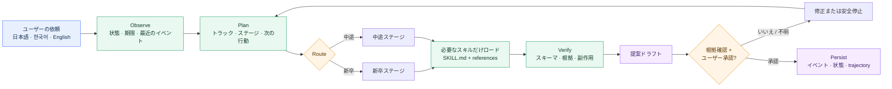
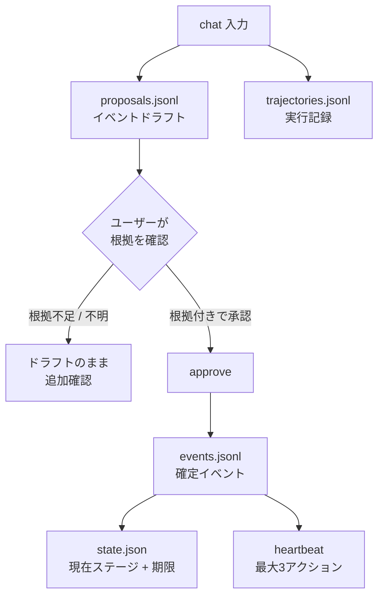

# Japan Recruit AI Agent

[English](README.md) · [한국어](README_ko.md) · [日本語](README_ja.md)

日本の就職・転職と採用業務を支援する AI スキル集です。**新卒**と**中途**の両方に対応し、
自己分析、書類、面接、オファー、退職、入社準備までをつなぎます。

[](./LICENSE)
[](./.claude-plugin/plugin.json)
[](#スキル)
[](#インストール)
[](#インストール)

7つのドメインスキルがキャリア業務を担当し、`career-agent` がリクエストをルーティングします。
Career Agent はイベント台帳、期限、次の行動をローカルに保存し、根拠付きの提案を作成します。
応募、メッセージ送信、インストール済みスキルの編集は実行しません。

## 仕組み



実行ループは次のとおりです。

```text
Observe → Plan → Act → Verify → Correct → Persist
```

現在のステージに必要な `SKILL.md` と reference だけを読み込み、毎回すべてのスキル文書を
注入することはありません。

## スキル

| スキル | 用途 | 主な出力 |
|---|---|---|
| `jiko-bunseki` | 強み、価値観、仕事スタイル、キャリアの方向性 | `SELF_ANALYSIS_PROFILE` |
| `job-seeker-agent` | 履歴書、職務経歴書、自己PR、志望動機、ES、面接内容 | `CANDIDATE_PROFILE` |
| `hiring-manager-agent` | 求人票の設計と採用側の評価基準 | `COMPANY_PROFILE` |
| `matching-simulator` | 候補者と求人の適合度、根拠付きスコア | マッチレポート |
| `company-battlecard` | 2社以上の比較 | 比較レポート |
| `kigyou-bunseki` | 企業と公開求人の調査 | 企業カルテ |
| `tenshoku-strategy` | 面接、年収、内定、退職、入社、選考トラッキング | 実行計画 |
| `career-agent` | トラック、イベント台帳、期限、次の行動、求人候補 | ローカル状態 |

各スキルは `skills/<name>/SKILL.md` にあります。共通フレームワークとスキーマは `_shared/`
にあります。

## インストール

### Claude Code — ワンコマンド

ターミナルで実行します。

```bash
claude plugin marketplace add younnieCutler/japan-recruit-ai-agent && \
  claude plugin install japan-recruit-ai-agent@japan-recruit-ai-agent
```

Claude Code のセッション内では次の2行でも実行できます。

```text
/plugin marketplace add younnieCutler/japan-recruit-ai-agent
/plugin install japan-recruit-ai-agent@japan-recruit-ai-agent
```

### Codex — ワンコマンド

```bash
codex plugin marketplace add younnieCutler/japan-recruit-ai-agent && \
  codex plugin add japan-recruit-ai-agent@japan-recruit-ai-agent
```

### Claude Code と Codex を同時にインストール

```bash
claude plugin marketplace add younnieCutler/japan-recruit-ai-agent && \
  claude plugin install japan-recruit-ai-agent@japan-recruit-ai-agent && \
  codex plugin marketplace add younnieCutler/japan-recruit-ai-agent && \
  codex plugin add japan-recruit-ai-agent@japan-recruit-ai-agent
```

### ローカルインストール（fallback）

リポジトリを直接確認したい場合は clone して、スキルと共有ファイルをコピーします。

```bash
git clone https://github.com/younnieCutler/japan-recruit-ai-agent.git ~/japan-recruit-skills
REPO=~/japan-recruit-skills

mkdir -p ~/.claude/skills ~/.claude/_shared
cp -R "$REPO/skills/." ~/.claude/skills/
cp -R "$REPO/_shared/." ~/.claude/_shared/

mkdir -p ~/.codex/skills ~/.codex/_shared
cp -R "$REPO/skills/." ~/.codex/skills/
cp -R "$REPO/_shared/." ~/.codex/_shared/
```

## Career Agent の実行

リポジトリのルートから実行します。状態の保存先は初期値では `./career-home/` です。別の場所に
保存する場合は `CAREER_HOME` または `--home` を指定します。

```bash
python3 skills/career-agent/career_agent.py run \
  --mode chat \
  --track shinsotsu \
  --message "学チカの経験を自己PRの素材に整理したいです。"

python3 skills/career-agent/career_agent.py status
python3 skills/career-agent/career_agent.py run --mode heartbeat
python3 skills/career-agent/career_agent.py run --mode discover --source postings.json
python3 skills/career-agent/career_agent.py approve <proposal-id> --evidence "resume.md:12"
python3 skills/career-agent/career_agent.py rollback <version>
```

`chat` は `--message` または stdin を受け取ります。トラックが不明確な場合は推測せず停止します。
ドラフトイベントは `approve` するまで確定台帳に入りません。

### 承認ゲート



確定イベントは `id`, `track`, `stage`, `type`, `occurred_at`, `title`, `summary`, `evidence`,
`source`, `next_action`, `deadline`, `status` を使用します。根拠と一致しない数値の主張は拒否されます。

## トラックとステージ

```mermaid
flowchart TB
    subgraph NS["新卒 / New graduate"]
        NS1["自己分析・就活軸"] --> NS2["学チカ・自己PR素材"]
        NS2 --> NS3["業界研究・企業研究"]
        NS3 --> NS4["ES・履歴書"]
        NS4 --> NS5["適性検査（SPI3）"]
        NS5 --> NS6["書類選考・面接"]
        NS6 --> NS7["内々定・内定・入社準備"]
    end
    subgraph MC["中途 / Mid-career"]
        MC1["自己分析・転職軸"] --> MC2["職務経歴書・自己PR"]
        MC2 --> MC3["業界研究・企業研究"]
        MC3 --> MC4["応募・書類選考"]
        MC4 --> MC5["面接"]
        MC5 --> MC6["内定・条件交渉"]
        MC6 --> MC7["退職・入社準備"]
    end
```



## 推奨ワークフロー

| 目的 | ワークフロー |
|---|---|
| 方向性から始める | `/jiko-bunseki` → `/job-seeker-agent` |
| 新卒: 学チカからESまで | `/job-seeker-agent` → `/kigyou-bunseki` → `/tenshoku-strategy` |
| 中途: 職務経歴書から面接まで | `/job-seeker-agent` → `/kigyou-bunseki` → `/matching-simulator` |
| オファーを比較する | `/company-battlecard` → `/tenshoku-strategy` |
| 面接の回答内容 | `/job-seeker-agent` |
| 面接マナー、年収、退職、入社 | `/tenshoku-strategy` |
| 採用側の求人票改善 | `/hiring-manager-agent` |
| 状態と次の行動 | `career-agent chat` → `approve` → `heartbeat` |
| 公開求人の候補 | `career-agent discover` → 手動レビュー |

### 公開求人の発見

`discover` は JSON オブジェクト、配列、または `{ "postings": [...] }` を読み込みます。各求人には
元の HTTP(S) URL が必要です。

```json
[
  {
    "company": "Example株式会社",
    "role": "データエンジニア",
    "graduation_year": 2027,
    "target": "新卒",
    "deadline": "2026-08-31",
    "url": "https://example.com/jobs/123"
  }
]
```

求人候補だけを保存します。Web検索、ログイン、CAPTCHA の回避、応募、メール送信は行いません。

## 保存ファイル

Career Agent のランタイムファイルはすべて `CAREER_HOME` の下に保存されます。

| ファイル | 用途 |
|---|---|
| `events.jsonl` | append-only の確定イベント台帳 |
| `state.json` | 現在のトラック、ステージ、行動、期限、応募状態 |
| `proposals.jsonl` | イベントドラフト、heartbeat、求人候補 |
| `trajectories.jsonl` | 実行と検証の記録 |
| `checkpoints.jsonl` | 状態 checkpoint と rollback の記録 |
| `versions/*.json` | 置き換え可能な状態 snapshot |
| `postings.jsonl` | 重複排除済みの公開求人候補 |

ドメインスキルの文書は `CLAUDE.md` の契約に従い、セッションディレクトリからの相対パスで
`career-docs/` に、機械可読プロフィールは `data/` に保存されます。

## 安全範囲

- 入力にない経験、数値、オファー、根拠を作成しません。
- ユーザーの明示的な確認なしに応募やメッセージ送信を行いません。
- ログイン、CAPTCHA、アクセス制御を回避しません。
- 根拠のないイベントを確定台帳に保存しません。
- オンライン実行中にインストール済みの `SKILL.md` を編集しません。

スコアは近似値です。すべての主張はユーザーが提供した資料に基づきます。

## 開発

```bash
python3 -m unittest -v skills/career-agent/test_career_agent.py
python3 -m py_compile skills/career-agent/career_agent.py
claude plugin validate .
```

初期ランタイムは Python 標準ライブラリと JSONL を使用します。イベント量が増えた場合のみ
SQLite FTS5 による検索を追加します。

## License

MIT License.
