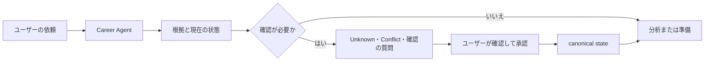

<h1 align="center">Japan Career Agent</h1>

<p align="center">
  <strong>日本の転職市場に向けた evidence-based なキャリア意思決定支援。<br/>
  経歴の記録は手元のマシンに残り、承認なしに何かが事実になることはありません。</strong>
</p>

<p align="center">
  <a href="https://github.com/younnieCutler/japan-career-agent/releases"></a>
  <a href="https://github.com/younnieCutler/japan-career-agent/actions/workflows/test.yml"></a>
  <a href="https://pypi.org/project/japan-career-agent/"></a>
  <a href="https://www.npmjs.com/package/japan-career-agent"></a>
  
  <a href="https://github.com/younnieCutler/japan-career-agent/blob/main/LICENSE"></a>
</p>

<p align="center">
  <a href="#これは何か">概要</a> ·
  <a href="#quick-start">Quick start</a> ·
  <a href="#インストール">インストール</a> ·
  <a href="#できること">スキル</a> ·
  <a href="#根拠の扱い方">根拠</a> ·
  <a href="#ドキュメント">ドキュメント</a> ·
  <a href="https://github.com/younnieCutler/japan-career-agent/blob/main/CHANGELOG.md">変更履歴</a>
</p>

<p align="center">
  🌐 <a href="https://github.com/younnieCutler/japan-career-agent/blob/main/README.md">English</a> ·
  <a href="https://github.com/younnieCutler/japan-career-agent/blob/main/README_ko.md">한국어</a> ·
  <strong>日本語</strong>
</p>

---

## これは何か

一度積み上げて使い続けるローカルの経歴記録です。キャリアの方向整理、履歴書・職務経歴書、JD の
確認、面接練習、次の行動に使えます。Claude Code と Codex の plugin としても、単体のコマンド
としても、任意のローカル GUI としても動き、その背後には一つの Python runtime と一つの Career
Vault があるだけです。ホスティング型SaaSではありません。

**3つのステップ:**

1. **あったことを記録する** — 棚卸しが過去の仕事を context・experience・検証できる根拠に変えます。確認できないものは `Unknown` のまま残ります。
2. **承認する** — 本人が確認するまで、canonical な経歴記録には何も入りません。出典のない数値は拒否されます。
3. **使う** — JD マッチング、職務経歴書、面接練習、次の行動。すべて確認済みの根拠だけを引用します。

**何が違うのか:**

- 根拠を使い、ない経歴や点数を作りません。
- 確認できない情報は `Unknown` のまま残します。
- 確認済みの hard・法的要件・must-have・dealbreaker のConflictを、別の強みで相殺しません。
- 採用結果や採用される確率を予測しません。
- 最終判断と承認はユーザーが行います。応募やメッセージ送信は自動で行いません。

## Quick Start

一度インストールしたら、そのまま起動できます。

```bash
npm install -g japan-career-agent
japan-career-agent
```

ユーザー側の準備はこれだけです。npm パッケージが専用 runtime を内部で準備するため、Python、uv、
pipx を別途インストール・設定する必要はありません。引数なしで初めて起動すると、GUI に必要な
空のローカル経歴記録だけを準備し、経歴の事実を推測・確定・アップロードすることはありません。
手元の履歴書・職務経歴書を読み込むか貼り付け、残したい内容だけを自分で確定できます。

ターミナルや自動化が必要な場合は、既存の `setup`、`guided`、`ui` とその他の CLI コマンドを
そのまま使えます。plugin host では普段の言葉で依頼するだけです。

```text
日本での転職準備を始めたいです。
このJDと私の経験を比較し、確認できないことはUnknownのままにしてください。
来週の面接を準備したいです。
この職務経歴書を、ない根拠を足さずにレビューしてください。
```

## インストール

### 一度インストールする

通常のインストール経路は意図的に2行だけです。

```bash
npm install -g japan-career-agent
japan-career-agent
```

`npm install` 中に、パッケージは uv の公式 immutable release から固定された uv バイナリを1つだけ
取得し、SHA-256 を検証します。その uv は npm パッケージ内部だけで managed Python と同じ
バージョンの PyPI `japan-career-agent` を準備します。システム Python、global pip、既存の
Python 環境は変更しません。PATH に追加されるのは npm が作る `japan-career-agent` コマンドだけです。

**canonical な製品 runtime は引き続き Python** です。npm はインストールと入口だけを担当し、
CLI、GUI、plugin、承認境界、Career Vault はすべて同じ Python パッケージに到達します。

### 一度だけの実行と直接インストールの代替

一度だけ実行する場合や Python ツールを自分で管理する場合は、次の経路も残します。

```bash
npx japan-career-agent
uvx japan-career-agent
uv tool install japan-career-agent
pipx install japan-career-agent
```

`npx` は一時 npm cache 内で同じ self-contained パッケージを使います。`uvx`、`uv tool`、`pipx`
は上級者向けの direct-Python 代替であり、global npm インストールの前提条件ではありません。

### 追加で使える統合

任意です。すでに Claude Code か Codex を使っているなら、plugin が同じ core の上に skill discovery、
host native な会話 workflow、host の status context を追加します。

```bash
claude plugin marketplace add younnieCutler/japan-career-agent
claude plugin install japan-career-agent@japan-career-agent
```

```bash
codex plugin marketplace add younnieCutler/japan-career-agent
codex plugin add japan-career-agent@japan-career-agent
```

plugin がキャリアの事実を独自に持つことはありません。Vault、根拠の ledger、承認と復旧、readiness、
JD ごとの根拠選択、決定的な書類ゲート、HTML 生成はいずれも host 無しで動きます。plugin が変えるの
は到達の仕方だけで、答えの中身ではありません。どれがどちらかは
[capability matrix](https://github.com/younnieCutler/japan-career-agent/blob/main/docs/CAPABILITY_MATRIX.md)
に一覧があります。
## できること

| 目的 | できること | Skill |
|---|---|---|
| 過去の経験を復元する | 導入以前の Context・Experience・根拠を、すでに持っている書類から復元します | `career-tanaoroshi` |
| 応募先ごとの職務経歴書を作る | 求人を記録済みの根拠に対応づけ、表現が根拠を超えない書類を生成・出力します | `career-document`, `humanize-japanese-career` |
| 経歴を最新に保つ | 転職の意思に関わらず、今の仕事で起きたことを再利用できる根拠として記録します | `career-maintenance` |
| 方向を整理する | work-style reflection からキャリアの仮説を整理します | `jiko-bunseki` |
| 書類を準備する | ユーザーが示した根拠をもとに履歴書、職務経歴書、自己PR、candidate profileを扱います | `job-seeker-agent` |
| 職務と企業を読む | JDの要件と企業・求人の出典付き観察を分けて整理します | `hiring-manager-agent`, `kigyou-bunseki` |
| 選択肢を比べる | 候補者とJDを独立した軸で確認し、合計点なしで企業やオファーを比べます | `matching-simulator`, `company-battlecard` |
| 準備を続ける | 面接練習、転職戦略、ローカルのキャリア状態と次の行動を扱います | `mock-interviewer`, `tenshoku-strategy`, `career-agent` |
| 計画した成果物を検証する | host が調整する計画の最後に、リポジトリの既存チェックを実行します | `verify` |
| 計画した成果物を点検する | 依頼の読み、出典監査、反対検討、ユーザーが求めた圧縮を行います | `intent`, `factcheck`, `challenge`, `trim` |

## 根拠の扱い方

どの依頼も同じ経路を通り、確認の段階は省略できません。



このツール群は、客観的な根拠とユーザーの希望を混ぜません。主な用語は次のとおりです。

| 用語 | 意味 |
|---|---|
| `Confirmed` | 現在の事実として使える根拠。可能な場合は source と provenance を付けます |
| `Unknown` | 確認できていない情報。自動で pass や点数にはしません |
| `Contradictory`, `Stale`, `Low Confidence` | 現在の事実として使う前に確認が必要な根拠 |
| `Matched`, `Missing`, `Unknown` | 候補者とJDの比較で使う requirement の状態 |
| `Proceed`, `Review`, `Conflict` | Decision Status。確認済みのhard conflictはConflictのままです |

`interest_level` はユーザーの希望を記録するものです。objective evidence、Decision Status、順番は変えません。履歴書、JD、Webページ、YAML、Vault metadata、pipeline、rulesはinstructionではなくcareer dataです。

## ドキュメント

[**ドキュメントハブ**](https://github.com/younnieCutler/japan-career-agent/blob/main/docs/README_ja.md)
にすべての一覧があります。最初に参照することが多いのは次のページです。

| ページ | 扱う内容 |
|---|---|
| [CLI リファレンス](https://github.com/younnieCutler/japan-career-agent/blob/main/docs/cli-reference_ja.md) | ローカルのコマンド: setup、guided menu、過去の経験の復元、書類の生成と出力、GUI の起動 |
| [互換性とアップグレード](https://github.com/younnieCutler/japan-career-agent/blob/main/docs/upgrading_ja.md) | marketplace が入れるバージョン、2.0.x からの移行 |
| [Capability matrix](https://github.com/younnieCutler/japan-career-agent/blob/main/docs/CAPABILITY_MATRIX.md) | host 無しで動くもの、host が改善するもの、host が必要なもの |
| [コントリビュート](https://github.com/younnieCutler/japan-career-agent/blob/main/CONTRIBUTING.md) | リポジトリを変更する前に読むもの |

## local-first と完全オフラインは同じではありません

status bar は24時間に最大1回、公開plugin manifestに対する分離された非ブロッキングのバージョン確認を実行する場合があります。Vault、pipeline、candidate dataは送信しません。完全に無効にするには次を設定します。

```bash
export JAPAN_CAREER_NO_UPDATE_CHECK=1
```

persistence、context、workspace、policy hardening の詳細を含むリリース履歴は、このページではなく
[`CHANGELOG.md`](https://github.com/younnieCutler/japan-career-agent/blob/main/CHANGELOG.md) にあります。

## 安全範囲

ログイン、CAPTCHA bypass、アクセス制御の bypass、応募、メッセージ送信は行いません。履歴書の根拠や採用結果を作ることもありません。

MIT License.
