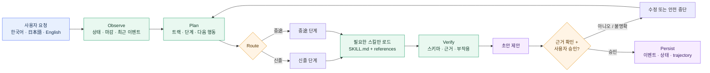
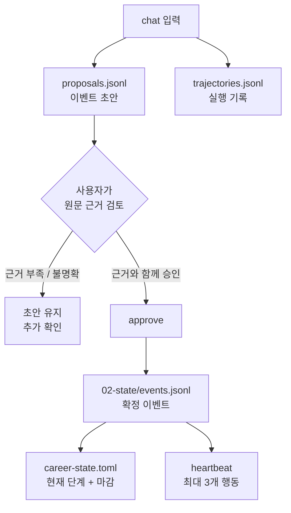
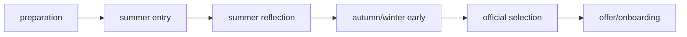

# Japan Recruit AI Agent

[English](README.md) · [한국어](README_ko.md) · [日本語](README_ja.md)

일본 취업·채용 준비를 위한 AI 스킬 모음입니다. **신졸(新卒)**과 **중途** 모두를 지원하며,
자기분석부터 서류, 면접, 오퍼, 퇴직, 입사 준비까지 연결합니다.

[](./LICENSE)
[](./.claude-plugin/plugin.json)
[](#스킬)
[](#설치)
[](#설치)

7개 도메인 스킬이 취업 업무를 처리하고, `career-agent`가 요청을 라우팅합니다. Career Agent는
이벤트 원장, 마감일, 다음 행동을 로컬에 저장하고 근거가 필요한 제안을 만듭니다. 지원서 제출,
메시지 발송, 설치된 스킬 수정은 실행하지 않습니다.

## 어떻게 동작하나요?



실행 루프는 다음과 같습니다.

```text
관찰 → 계획 → 실행 → 검증 → 수정 → 저장
```

현재 단계에 필요한 `SKILL.md`와 reference만 읽으며, 모든 스킬 문서를 매번 주입하지 않습니다.

## 스킬

| 스킬 | 용도 | 주요 결과 |
|---|---|---|
| `jiko-bunseki` | 강점, 가치관, 업무 스타일, 진로 방향 | `SELF_ANALYSIS_PROFILE` |
| `job-seeker-agent` | 이력서, 職務経歴書, 自己PR, 志望動機, ES, 면접 내용 | `CANDIDATE_PROFILE` |
| `hiring-manager-agent` | JD 설계와 채용 측 평가 기준 | `COMPANY_PROFILE` |
| `matching-simulator` | 후보자/JD 적합도와 근거 기반 점수 | 매칭 리포트 |
| `company-battlecard` | 2개 이상 기업 비교 | 비교 리포트 |
| `kigyou-bunseki` | 기업 및 공개 채용공고 조사 | 企業カルテ |
| `tenshoku-strategy` | 면접, 연봉, 오퍼, 퇴직, 입사, 지원 추적 | 실행 계획 |
| `career-agent` | 트랙 라우팅, 이벤트 원장, 마감, 다음 행동, 공고 후보 | 로컬 커리어 상태 |

각 스킬은 `skills/<name>/SKILL.md`에 있으며, 공통 프레임워크와 스키마는 `_shared/`에 있습니다.

## 설치

### Claude Code — 한 번에 설치

터미널에서 실행합니다.

```bash
claude plugin marketplace add younnieCutler/japan-recruit-ai-agent && \
  claude plugin install japan-recruit-ai-agent@japan-recruit-ai-agent
```

Claude Code 세션 안에서는 다음 두 명령을 사용할 수 있습니다.

```text
/plugin marketplace add younnieCutler/japan-recruit-ai-agent
/plugin install japan-recruit-ai-agent@japan-recruit-ai-agent
```

### Codex — 한 번에 설치

```bash
codex plugin marketplace add younnieCutler/japan-recruit-ai-agent && \
  codex plugin add japan-recruit-ai-agent@japan-recruit-ai-agent
```

### Claude Code와 Codex 모두 설치

```bash
claude plugin marketplace add younnieCutler/japan-recruit-ai-agent && \
  claude plugin install japan-recruit-ai-agent@japan-recruit-ai-agent && \
  codex plugin marketplace add younnieCutler/japan-recruit-ai-agent && \
  codex plugin add japan-recruit-ai-agent@japan-recruit-ai-agent
```

### 로컬 설치 fallback

저장소를 직접 확인하거나 clone한 버전을 사용하려면 다음을 실행합니다.

```bash
git clone https://github.com/younnieCutler/japan-recruit-ai-agent.git ~/japan-recruit-skills
REPO=~/japan-recruit-skills

mkdir -p ~/.claude/skills ~/.claude/_shared
cp -R "$REPO/skills/." ~/.claude/skills/
cp -R "$REPO/_shared/." ~/.claude/_shared/

mkdir -p ~/.codex/skills ~/.codex/_shared
cp -R "$REPO/skills/." ~/.codex/skills/
cp -R "$REPO/_shared/." ~/.codex/_shared/
```

## 업데이트

자동 업데이트는 **서드파티 마켓플레이스에서 기본으로 꺼져 있습니다.** 이 플러그인도 마찬가지라,
켜기 전까지는 설치 시점의 버전을 계속 사용합니다.

한 번만 켜두면 됩니다. `/plugin` → **Marketplaces** → `japan-recruit-ai-agent` → auto-update 활성화.
`~/.claude/settings.json`에 직접 써도 같습니다:

```json
"extraKnownMarketplaces": {
  "japan-recruit-ai-agent": {
    "source": { "source": "github", "repo": "younnieCutler/japan-recruit-ai-agent" },
    "autoUpdate": true
  }
}
```

이후 Claude Code가 세션 시작 직후에 확인합니다. **실행 중인** 세션은 시작 시점의 버전을 유지하므로,
새 릴리스는 다음 실행부터 적용됩니다.

수동으로 한 번만 갱신하려면:

```bash
claude plugin marketplace update japan-recruit-ai-agent   # 마켓플레이스 목록 갱신
claude plugin update japan-recruit-ai-agent@japan-recruit-ai-agent  # 플러그인 본체 갱신
claude plugin list                                        # 버전 확인
```

실행한 세션에는 적용되지 않으니 재시작하세요.

릴리스는 `.claude-plugin/plugin.json`의 `version` 필드로 전달되며 버전마다 별도 캐시 디렉터리를
사용합니다 — 이 필드가 바뀌기 전까지는 설치본이 기존 버전에 머뭅니다.

새 버전이 올라오면 상태바가 알려줍니다. 캐시 파일만 읽으므로 프롬프트를 지연시키지 않습니다 —
버전 확인은 하루 한 번, 분리된 백그라운드 프로세스가 이 저장소 `main`의 `.claude-plugin/plugin.json`을
가져오는 방식입니다. 그 외에 전송되는 정보는 없고, 실패하면 조용히 넘어갑니다. 끄려면
`JAPAN_RECRUIT_NO_UPDATE_CHECK=1`.

1.1.0부터 플러그인이 `UserPromptSubmit` 훅을 동봉해 커리어 상태바(마감일, 미체크 액션 항목,
본인이 정한 규칙)를 주입합니다. 훅은 플러그인과 함께 배포되므로 1.0.0에 머물러 있으면 상태바도
실행 게이트도 없습니다. 위 **로컬 폴백** 방식은 `skills/`와 `_shared/`만 복사하므로 훅이
포함되지 않습니다 — 훅이 필요하면 플러그인으로 설치하세요.

## 에이전트 운영 방법

스킬을 트리거하는 방법은 두 가지이며, 둘 다 결국 같은 `SKILL.md`를 실행합니다:

- **말로 걸기.** Claude Code(또는 Codex) 채팅 세션 안에서 상황을 자연어로 설명하면 됩니다 —
  슬래시 필요 없음. Claude가 메시지를 각 스킬의 frontmatter와 매칭해 활성화합니다. 세션의
  작업 디렉터리가 이 저장소 자체라면 `CLAUDE.md`도 자동 로드되어 온보딩, 파이프라인 재개
  kanban 인사, 더 풍부한 한/일/영 라우팅 표가 추가됩니다. `CLAUDE.md`는 `skills/` 바깥
  저장소 루트에 있으므로, 플러그인을 다른 프로젝트에 설치하면 이 동작은 따라가지 않습니다 —
  그 경우엔 각 스킬 고유의 frontmatter 트리거로 라우팅됩니다.
- **슬래시 커맨드 입력.** `/jiko-bunseki`, `/job-seeker-agent` 등([추천 워크플로우](#추천-워크플로우)
  참고)이 같은 스킬을 명시적으로 활성화합니다.

`career-agent`의 경우 활성화되면 아래 CLI가 실행됩니다. 스킬이 활성화된 뒤 Claude가 보통 Bash
도구로 아래 명령을 대신 실행해 주며, 직접 제어·스크립팅·디버깅이 필요하면 터미널에서 직접
실행해도 됩니다. `heartbeat`는 백그라운드 작업이나 스케줄러가 아니라, 당신(또는 Claude)이
실행할 때마다 근거 있는 다음 액션을 최대 3개 반환하는 수동 1회성 체크입니다.

**퀵스타트:** 위 안내대로 플러그인을 설치한 뒤, Vault를 한 번 만드세요 — `career_agent.py init
--vault <path>` 실행 후 `CAREER_VAULT`를 설정합니다([Career Agent 실행](#career-agent-실행) 참고;
`career-agent`는 Vault 없이는 동작을 거부합니다). 그 다음 프로젝트에서 Claude Code를 연 뒤 "다음
커리어 액션이 뭐야?" 같은 말을 해보세요 — 에이전트가 Vault 상태를 관찰하고 근거와 함께 다음 단계를
제안한 뒤, 기록하기 전에 당신의 승인을 기다립니다.

## Career Agent 실행

전용 Career Vault를 먼저 만들거나 지정합니다. 런타임은 저장소나 현재 폴더를 기본 저장 위치로
사용하지 않으며, `--vault` 또는 `CAREER_VAULT`가 필요합니다.
Claude는 보통 채팅 세션 안에서 아래 명령을 대신 실행합니다([에이전트 운영 방법](#에이전트-운영-방법)
참고) — 터미널에서 직접 실행해도 동일하게 동작합니다.

**원커맨드 플러그인 설치로 깔았다면?** `career_agent.py`는 프로젝트 기준 상대경로
`skills/career-agent/career_agent.py`에 없습니다 — 플러그인 설치 위치 안에 있습니다. 한 번만
찾아서 export하세요:

```bash
find ~/.claude/plugins -name career_agent.py   # Claude Code
find ~/.codex -name career_agent.py            # Codex
export CAREER_AGENT_RUNTIME=<위에서 찾은 경로>
```

그 다음 아래 모든 명령에서 `skills/career-agent/career_agent.py`를 `"$CAREER_AGENT_RUNTIME"`으로
바꿔서 쓰세요. 로컬 설치 fallback(git clone)으로 깔았다면 아래 상대경로가 저장소 루트 기준으로
그대로 동작합니다.

```bash
VAULT=/path/to/career-agent-vault
python3 skills/career-agent/career_agent.py init --vault "$VAULT"
# 00-control/career-profile.toml을 채운 뒤 검증합니다.
python3 skills/career-agent/career_agent.py doctor --vault "$VAULT"
python3 skills/career-agent/career_agent.py run --vault "$VAULT" --mode chat --track shinsotsu \
  --message "가쿠치카 경험을 자기PR 소재로 정리하고 싶어요."
python3 skills/career-agent/career_agent.py status --vault "$VAULT"
# 수동 1회성 체크(스케줄러 아님) — 근거 있는 다음 액션을 최대 3개 반환합니다.
python3 skills/career-agent/career_agent.py run --vault "$VAULT" --mode heartbeat
python3 skills/career-agent/career_agent.py run --vault "$VAULT" --mode discover --source postings.json
python3 skills/career-agent/career_agent.py approve --vault "$VAULT" <proposal-id> --evidence "resume.md:12"
python3 skills/career-agent/career_agent.py rollback --vault "$VAULT" <version>
python3 skills/career-agent/career_agent.py index --vault "$VAULT"
python3 skills/career-agent/career_agent.py context --vault "$VAULT"
```

`chat`은 `--message` 또는 stdin을 받습니다. 트랙이 불명확하면 추측하지 않고 중단합니다.
초안 이벤트는 `approve`하기 전까지 확정 원장에 들어가지 않습니다.

### Vault와 Obsidian 연동

`init`은 아래 구조를 만들며, 그대로 Obsidian Vault로 연결할 수 있습니다.

```text
00-control/    프로필과 Agent 정책
01-capture/    아직 분류하지 않은 원문 (자동 컨텍스트 금지)
02-state/      이벤트 원장, 제안, 현재 상태
03-active/     진행 중인 지원과 기업
04-evidence/   사실 확인용 자료
05-playbooks/  개인화된 검증 지침
06-reference/  검토한 참고 자료
07-archive/    끝난·오래된 자료 (자동 컨텍스트 금지)
```

런타임은 항상 `00-control`과 `02-state`만 읽고, 나머지는 검증된 노트 최대 다섯 개만 선택합니다.
`index`는 `.career-agent/vault-index.jsonl`에 메타데이터·heading·wikilink·hash·경로·source kind만 저장하며
본문을 가져오지 않습니다. `01-capture`는 제외하고, `07-archive`는 수동 감사 때만 `--include-archives`로 읽습니다.

### 모든 취업 Agent의 공통 컨텍스트

`CAREER_VAULT`를 한 번만 설정하면 `jiko-bunseki`, `job-seeker-agent`, `kigyou-bunseki`,
`matching-simulator`, `tenshoku-strategy`, `company-battlecard`가 작업 전에 `context`를 호출합니다.
따라서 모두 같은 프로필·현재 상태·메타데이터 전용 선택 노트를 사용합니다.

### 승인 게이트



확정 이벤트는 `id`, `track`, `stage`, `flow_phase`, `type`, `occurred_at`, `title`, `summary`, `evidence`, `source`,
`next_action`, `deadline`, `status` 필드를 사용합니다. 근거와 일치하지 않는 수치 주장은 거부됩니다.

## 트랙과 단계

```mermaid
flowchart TB
    subgraph NS["신졸 / New graduate"]
        NS1["自己分析・就活軸"] --> NS2["学チカ・自己PR素材"]
        NS2 --> NS3["業界研究・企業研究"]
        NS3 --> NS4["ES・履歴書"]
        NS4 --> NS5["適性検査（SPI3）"]
        NS5 --> NS6["書類選考・面接"]
        NS6 --> NS7["内々定・内定・入社準備"]
    end
    subgraph MC["중途 / Mid-career"]
        MC1["自己分析・転職軸"] --> MC2["職務経歴書・自己PR"]
        MC2 --> MC3["業界研究・企業研究"]
        MC3 --> MC4["応募・書類選考"]
        MC4 --> MC5["面接"]
        MC5 --> MC6["内定・条件交渉"]
        MC6 --> MC7["退職・入社準備"]
    end
```



### 신졸 시기 레이어



`stage`는 작업 종류, `flow_phase`는 시기를 뜻하므로 ES·SPI3·면접은 겹쳐서 진행할 수 있습니다.
공통 흐름은 매년 공식 출처로 수동 검토합니다. 유튜브 요약과 개인 회고는 체크리스트에만 반영하며,
보편적인 일정이나 사실로 취급하지 않습니다.

## 추천 워크플로우

`/skillname`으로 스킬을 명시적으로 실행하거나, 상황을 자연어로 설명해 자동 활성화되게 할 수
있습니다([에이전트 운영 방법](#에이전트-운영-방법) 참고).

| 목표 | 워크플로우 |
|---|---|
| 방향부터 정하기 | `/jiko-bunseki` → `/job-seeker-agent` |
| 신졸: 学チカ에서 ES까지 | `/job-seeker-agent` → `/kigyou-bunseki` → `/matching-simulator` |
| 중途: 경력서에서 면접까지 | `/job-seeker-agent` → `/kigyou-bunseki` → `/matching-simulator` |
| 오퍼 비교 | `/company-battlecard` → `/tenshoku-strategy` |
| 면접 답변 내용 | `/job-seeker-agent` |
| 면접 매너, 연봉, 퇴직, 입사 | `/tenshoku-strategy` |
| 채용 측 JD 개선 | `/hiring-manager-agent` |
| 상태와 다음 행동 | `career-agent chat` → `approve` → `heartbeat` |
| 공개 공고 후보 | `career-agent discover` → 직접 검토 |

### 공개 공고 발견

`discover`는 JSON 객체, 배열 또는 `{ "postings": [...] }`를 읽습니다. 각 공고에는 원문 HTTP(S)
URL이 필요합니다.

```json
[
  {
    "company": "Example株式会社",
    "role": "データエンジニア",
    "graduation_year": 2027,
    "target": "新卒",
    "deadline": "2026-08-31",
    "url": "https://example.com/jobs/123"
  }
]
```

공고 후보만 저장하며 웹 검색, 로그인, CAPTCHA 우회, 자동 지원, 이메일 발송은 하지 않습니다.

## Vault 저장 파일

모든 상태는 선택한 Career Vault 안에 저장됩니다.

| 파일 | 용도 |
|---|---|
| `00-control/career-profile.toml` | 트랙, 목표 직무, 상태, 신졸 졸업예정연도 |
| `02-state/career-state.toml` | 사람이 읽는 현재 트랙·단계·행동·마감 |
| `02-state/events.jsonl` | append-only 확정 이벤트 원장 |
| `02-state/proposals.jsonl` | 이벤트 초안, heartbeat, 공고 후보 |
| `02-state/trajectories.jsonl` | 실행과 검증 기록 |
| `.career-agent/` | 교체 가능한 JSON 캐시, 버전, 메타데이터 전용 인덱스 |

도메인 스킬의 문서는 `CLAUDE.md` 규칙에 따라 세션 디렉터리 기준 `career-docs/`에, 기계용
프로필은 `data/`에 저장됩니다.

## 안전 범위

- 입력에 없는 경험, 수치, 오퍼, 근거를 만들지 않습니다.
- 사용자 검토 없는 지원서 제출·메시지 발송을 하지 않습니다.
- 로그인·CAPTCHA·접근 제어를 우회하지 않습니다.
- 근거 없는 이벤트를 확정 저장하지 않습니다.
- 온라인 실행 중 설치된 `SKILL.md`를 수정하지 않습니다.

점수는 근사치이며, 모든 주장은 사용자가 제공한 원문에 근거해야 합니다.

## 개발

```bash
python3 -m unittest -v skills/career-agent/test_career_agent.py
python3 -m py_compile skills/career-agent/career_agent.py
claude plugin validate .
```

초기 런타임은 Python 표준 라이브러리와 JSONL을 사용합니다. 이벤트 규모가 커질 때만 SQLite FTS5
검색을 추가합니다.

## License

MIT License.
