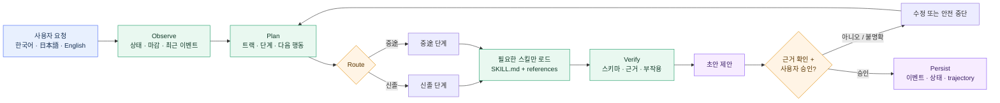
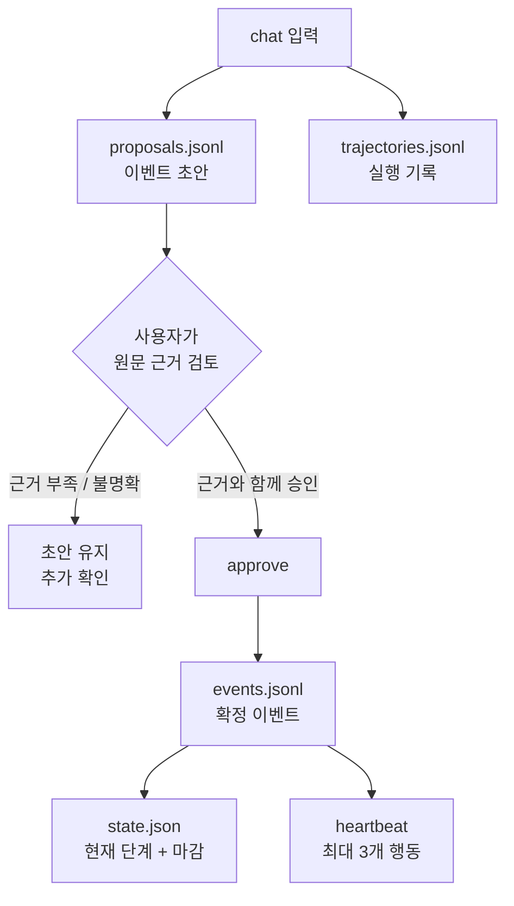

# Japan Recruit AI Agent

[English](README.md) · [한국어](README_ko.md) · [日本語](README_ja.md)

일본 취업·채용 준비를 위한 AI 스킬 모음입니다. **신졸(新卒)**과 **중途** 모두를 지원하며,
자기분석부터 서류, 면접, 오퍼, 퇴직, 입사 준비까지 연결합니다.

[](./LICENSE)
[](./.claude-plugin/plugin.json)
[](#스킬)
[](#설치)
[](#설치)

7개 도메인 스킬이 취업 업무를 처리하고, `career-agent`가 요청을 라우팅합니다. Career Agent는
이벤트 원장, 마감일, 다음 행동을 로컬에 저장하고 근거가 필요한 제안을 만듭니다. 지원서 제출,
메시지 발송, 설치된 스킬 수정은 실행하지 않습니다.

## 어떻게 동작하나요?



실행 루프는 다음과 같습니다.

```text
관찰 → 계획 → 실행 → 검증 → 수정 → 저장
```

현재 단계에 필요한 `SKILL.md`와 reference만 읽으며, 모든 스킬 문서를 매번 주입하지 않습니다.

## 스킬

| 스킬 | 용도 | 주요 결과 |
|---|---|---|
| `jiko-bunseki` | 강점, 가치관, 업무 스타일, 진로 방향 | `SELF_ANALYSIS_PROFILE` |
| `job-seeker-agent` | 이력서, 職務経歴書, 自己PR, 志望動機, ES, 면접 내용 | `CANDIDATE_PROFILE` |
| `hiring-manager-agent` | JD 설계와 채용 측 평가 기준 | `COMPANY_PROFILE` |
| `matching-simulator` | 후보자/JD 적합도와 근거 기반 점수 | 매칭 리포트 |
| `company-battlecard` | 2개 이상 기업 비교 | 비교 리포트 |
| `kigyou-bunseki` | 기업 및 공개 채용공고 조사 | 企業カルテ |
| `tenshoku-strategy` | 면접, 연봉, 오퍼, 퇴직, 입사, 지원 추적 | 실행 계획 |
| `career-agent` | 트랙 라우팅, 이벤트 원장, 마감, 다음 행동, 공고 후보 | 로컬 커리어 상태 |

각 스킬은 `skills/<name>/SKILL.md`에 있으며, 공통 프레임워크와 스키마는 `_shared/`에 있습니다.

## 설치

### Claude Code — 한 번에 설치

터미널에서 실행합니다.

```bash
claude plugin marketplace add younnieCutler/japan-recruit-ai-agent && \
  claude plugin install japan-recruit-ai-agent@japan-recruit-ai-agent
```

Claude Code 세션 안에서는 다음 두 명령을 사용할 수 있습니다.

```text
/plugin marketplace add younnieCutler/japan-recruit-ai-agent
/plugin install japan-recruit-ai-agent@japan-recruit-ai-agent
```

### Codex — 한 번에 설치

```bash
codex plugin marketplace add younnieCutler/japan-recruit-ai-agent && \
  codex plugin add japan-recruit-ai-agent@japan-recruit-ai-agent
```

### Claude Code와 Codex 모두 설치

```bash
claude plugin marketplace add younnieCutler/japan-recruit-ai-agent && \
  claude plugin install japan-recruit-ai-agent@japan-recruit-ai-agent && \
  codex plugin marketplace add younnieCutler/japan-recruit-ai-agent && \
  codex plugin add japan-recruit-ai-agent@japan-recruit-ai-agent
```

### 로컬 설치 fallback

저장소를 직접 확인하거나 clone한 버전을 사용하려면 다음을 실행합니다.

```bash
git clone https://github.com/younnieCutler/japan-recruit-ai-agent.git ~/japan-recruit-skills
REPO=~/japan-recruit-skills

mkdir -p ~/.claude/skills ~/.claude/_shared
cp -R "$REPO/skills/." ~/.claude/skills/
cp -R "$REPO/_shared/." ~/.claude/_shared/

mkdir -p ~/.codex/skills ~/.codex/_shared
cp -R "$REPO/skills/." ~/.codex/skills/
cp -R "$REPO/_shared/." ~/.codex/_shared/
```

## Career Agent 실행

저장소 루트에서 실행합니다. 기본 상태 저장 위치는 `./career-home/`이며, `CAREER_HOME` 또는
`--home`으로 변경할 수 있습니다.

```bash
python3 skills/career-agent/career_agent.py run \
  --mode chat \
  --track shinsotsu \
  --message "학チカ 경험을 자기PR 소재로 정리하고 싶어요."

python3 skills/career-agent/career_agent.py status
python3 skills/career-agent/career_agent.py run --mode heartbeat
python3 skills/career-agent/career_agent.py run --mode discover --source postings.json
python3 skills/career-agent/career_agent.py approve <proposal-id> --evidence "resume.md:12"
python3 skills/career-agent/career_agent.py rollback <version>
```

`chat`은 `--message` 또는 stdin을 받습니다. 트랙이 불명확하면 추측하지 않고 중단합니다.
초안 이벤트는 `approve`하기 전까지 확정 원장에 들어가지 않습니다.

### 승인 게이트



확정 이벤트는 `id`, `track`, `stage`, `type`, `occurred_at`, `title`, `summary`, `evidence`, `source`,
`next_action`, `deadline`, `status` 필드를 사용합니다. 근거와 일치하지 않는 수치 주장은 거부됩니다.

## 트랙과 단계

```mermaid
flowchart TB
    subgraph NS["신졸 / New graduate"]
        NS1["自己分析・就活軸"] --> NS2["学チカ・自己PR素材"]
        NS2 --> NS3["業界研究・企業研究"]
        NS3 --> NS4["ES・履歴書"]
        NS4 --> NS5["適性検査（SPI3）"]
        NS5 --> NS6["書類選考・面接"]
        NS6 --> NS7["内々定・内定・入社準備"]
    end
    subgraph MC["중途 / Mid-career"]
        MC1["自己分析・転職軸"] --> MC2["職務経歴書・自己PR"]
        MC2 --> MC3["業界研究・企業研究"]
        MC3 --> MC4["応募・書類選考"]
        MC4 --> MC5["面接"]
        MC5 --> MC6["内定・条件交渉"]
        MC6 --> MC7["退職・入社準備"]
    end
```



## 추천 워크플로우

| 목표 | 워크플로우 |
|---|---|
| 방향부터 정하기 | `/jiko-bunseki` → `/job-seeker-agent` |
| 신졸: 学チカ에서 ES까지 | `/job-seeker-agent` → `/kigyou-bunseki` → `/tenshoku-strategy` |
| 중途: 경력서에서 면접까지 | `/job-seeker-agent` → `/kigyou-bunseki` → `/matching-simulator` |
| 오퍼 비교 | `/company-battlecard` → `/tenshoku-strategy` |
| 면접 답변 내용 | `/job-seeker-agent` |
| 면접 매너, 연봉, 퇴직, 입사 | `/tenshoku-strategy` |
| 채용 측 JD 개선 | `/hiring-manager-agent` |
| 상태와 다음 행동 | `career-agent chat` → `approve` → `heartbeat` |
| 공개 공고 후보 | `career-agent discover` → 직접 검토 |

### 공개 공고 발견

`discover`는 JSON 객체, 배열 또는 `{ "postings": [...] }`를 읽습니다. 각 공고에는 원문 HTTP(S)
URL이 필요합니다.

```json
[
  {
    "company": "Example株式会社",
    "role": "データエンジニア",
    "graduation_year": 2027,
    "target": "新卒",
    "deadline": "2026-08-31",
    "url": "https://example.com/jobs/123"
  }
]
```

공고 후보만 저장하며 웹 검색, 로그인, CAPTCHA 우회, 자동 지원, 이메일 발송은 하지 않습니다.

## 저장 파일

모든 Career Agent 런타임 파일은 `CAREER_HOME` 아래에 저장됩니다.

| 파일 | 용도 |
|---|---|
| `events.jsonl` | append-only 확정 이벤트 원장 |
| `state.json` | 현재 트랙, 단계, 행동, 마감, 지원 상태 |
| `proposals.jsonl` | 이벤트 초안, heartbeat, 공고 후보 |
| `trajectories.jsonl` | 실행과 검증 기록 |
| `checkpoints.jsonl` | 상태 checkpoint와 rollback 기록 |
| `versions/*.json` | 교체 가능한 상태 snapshot |
| `postings.jsonl` | 중복 제거된 공개 공고 후보 |

도메인 스킬의 문서는 `CLAUDE.md` 규칙에 따라 세션 디렉터리 기준 `career-docs/`에, 기계용
프로필은 `data/`에 저장됩니다.

## 안전 범위

- 입력에 없는 경험, 수치, 오퍼, 근거를 만들지 않습니다.
- 사용자 검토 없는 지원서 제출·메시지 발송을 하지 않습니다.
- 로그인·CAPTCHA·접근 제어를 우회하지 않습니다.
- 근거 없는 이벤트를 확정 저장하지 않습니다.
- 온라인 실행 중 설치된 `SKILL.md`를 수정하지 않습니다.

점수는 근사치이며, 모든 주장은 사용자가 제공한 원문에 근거해야 합니다.

## 개발

```bash
python3 -m unittest -v skills/career-agent/test_career_agent.py
python3 -m py_compile skills/career-agent/career_agent.py
claude plugin validate .
```

초기 런타임은 Python 표준 라이브러리와 JSONL을 사용합니다. 이벤트 규모가 커질 때만 SQLite FTS5
검색을 추가합니다.

## License

MIT License.
