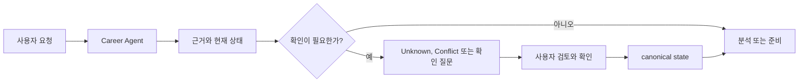

# Japan Career Agent

[English](README.md) | [한국어](README_ko.md) | [日本語](README_ja.md)

현재 릴리스: `2.1.0`.

일본 취업·이직을 위한 local-first evidence-based 커리어 의사결정 도구입니다. Claude Code와 Codex에서 쓰는 plugin/skill 모음이며, 로컬 Career Agent runtime으로 구직자와 채용 측 workflow를 지원합니다.

진로 방향, 이력서·職務経歴書, JD와 기업 정보, 지원 비교, 면접, 다음 행동을 정리할 때 사용하세요. 호스팅 SaaS나 독립 GUI가 아니라 plugin과 로컬 runtime으로 구성된 저장소입니다.

## 무엇이 다른가

- 근거를 사용하며, 없는 경력이나 점수를 만들지 않습니다.
- 확인되지 않은 내용은 `Unknown`으로 남깁니다.
- 확인된 hard·법적 요건·must-have·dealbreaker 충돌은 다른 강점으로 상쇄하지 않습니다.
- 합격 여부나 hiring outcome을 예측하지 않습니다.
- 최종 결정과 승인은 사용자가 합니다. 지원서 제출이나 메시지 발송은 하지 않습니다.

## 기본 흐름



## 설치

### plugin host 없이 쓰기

두 명령은 같은 Python 프로그램을 설치해 실행합니다. 이미 갖고 있는 runner를 쓰세요.

```bash
npx japan-career-agent init     # npm 경유
uvx japan-career-agent init     # uv 경유, 또는: pipx run japan-career-agent init
```

`npx`가 받는 것은 설치기뿐이고 runtime은 들어 있지 않습니다. `uv`나 `pipx`를 찾아 해당 버전의
PyPI 릴리스를 설치한 뒤 실행을 넘깁니다. `npm install` 시점에는 아무것도 실행되지 않습니다.
Python 3.11 이상이 필요하며 두 runner 모두 Python을 대신 설치해 주지 않으므로, interpreter가
없으면 traceback 대신 설치 방법을 안내하며 멈춥니다.

### Claude Code

사용 중인 host에 plugin을 설치하세요.

```bash
claude plugin marketplace add younnieCutler/japan-career-agent
claude plugin install japan-career-agent@japan-career-agent
```

### Codex

```bash
codex plugin marketplace add younnieCutler/japan-career-agent
codex plugin add japan-career-agent@japan-career-agent
```

### 릴리스 채널

릴리스를 준비하는 동안 저장소의 버전이 stable marketplace 채널보다 앞설 수 있습니다.
stable 채널은 실제로 발행된 최신 immutable `vX.Y.Z` 태그만 가리키며 `main`을 따라가지
않습니다. 지금은 릴리스 workflow가 이 commit에서 `v1.18.1`을 발행했으므로 소스 메타데이터
`1.18.1`과 stable marketplace ref `v1.18.1`이 일치합니다. 다음 동작 변경에서 다시 차이가
생기고, 다음 태그가 발행되고 ref가 갱신되면 다시 일치합니다.

### 로컬 fallback

파일을 직접 살펴보거나 실행해야 할 때 저장소를 clone하세요.

```bash
git clone https://github.com/younnieCutler/japan-career-agent.git
```

### 2.0.x에서 올라오는 경우 — 이전 이름은 `japan-recruit-ai-agent`

2.1.0에서 이름이 바뀌었습니다. GitHub이 이전 저장소 URL을 redirect하므로 기존 clone과 remote는
그대로 동작하지만, marketplace 항목은 이름으로 식별되므로 다시 추가해야 합니다.

```bash
claude plugin marketplace remove japan-recruit-ai-agent
claude plugin marketplace add younnieCutler/japan-career-agent
claude plugin install japan-career-agent@japan-career-agent
```

Career Vault는 아무것도 바뀌지 않습니다. vault 경로, event ledger, 생성된 문서 모두 이름 변경의
영향을 받지 않습니다. `JAPAN_RECRUIT_NO_UPDATE_CHECK=1`도 계속 update check를 끄므로 기존 설정은
새 `JAPAN_CAREER_NO_UPDATE_CHECK`와 함께 그대로 유효합니다. 이전 이름으로 발행된 릴리스 번들도
`scripts/verify_release.py`로 계속 검증됩니다.

## Quick Start

설치한 뒤 Claude Code나 Codex에 평소 말하듯 요청하세요.

```text
일본 이직 준비를 시작하고 싶어.
이 JD와 내 경력을 비교하고, 확인되지 않은 내용은 Unknown으로 남겨줘.
다음 주 면접을 준비하고 싶어.
이 職務経歴書를 검토하되 없는 경력은 만들지 마.
```

처음부터 `proposal_id`, `CAREER_VAULT`, `data/pipeline.yml`을 알 필요는 없습니다. 첫 요청은 자연어로 시작하고, 아래의 고급 local workflow에서 필요한 경우에만 이 개념을 사용하면 됩니다.

## 할 수 있는 일

| 필요한 것 | 사용자 관점의 작업 | Skill |
|---|---|---|
| 과거 경험 복원하기 | 설치 이전의 Context·Experience·근거를 이미 가진 문서에서 되살립니다 | `career-tanaoroshi` |
| 회사별 직무경력서 쓰기 | 공고를 기록된 근거에 매핑하고, 표현이 근거를 넘지 못하는 문서를 생성·출력합니다 | `career-document` |
| 경력 기록 유지하기 | 이직 의사와 무관하게, 지금 회사에서 한 일을 재사용 가능한 근거로 남깁니다 | `career-maintenance` |
| 방향 찾기 | work-style reflection을 하고 커리어 방향 가설을 정리합니다 | `jiko-bunseki` |
| 서류 준비 | 실제로 말한 근거를 바탕으로 이력서, 職務経歴書, 자기PR, candidate profile을 다룹니다 | `job-seeker-agent` |
| 직무와 기업 읽기 | JD 요건과 기업·공고 출처를 구분해 관찰 내용으로 정리합니다 | `hiring-manager-agent`, `kigyou-bunseki` |
| 기회 비교하기 | 후보자와 JD를 독립된 축으로 보고, 합계 점수 없이 기업·오퍼를 비교합니다 | `matching-simulator`, `company-battlecard` |
| 준비를 이어가기 | 면접 연습, 이직 전략, 로컬 커리어 상태와 다음 행동을 관리합니다 | `mock-interviewer`, `tenshoku-strategy`, `career-agent` |

## 근거를 다루는 방식

이 도구 모음은 객관적 근거와 사용자의 선호를 섞지 않습니다. 주요 용어는 다음과 같습니다.

| 용어 | 의미 |
|---|---|
| `Confirmed` | 현재 사실로 사용할 수 있는 근거입니다. 가능한 경우 source와 provenance를 함께 둡니다 |
| `Unknown` | 확인되지 않은 정보입니다. 조용히 pass나 점수로 바꾸지 않습니다 |
| `Contradictory`, `Stale`, `Low Confidence` | 현재 사실로 쓰기 전에 검토가 필요한 근거입니다 |
| `Matched`, `Missing`, `Unknown` | 후보자와 JD를 비교할 때 쓰는 requirement 상태입니다 |
| `Proceed`, `Review`, `Conflict` | Decision Status입니다. 확인된 hard conflict는 그대로 Conflict입니다 |

`interest_level`은 사용자의 선호 기록입니다. 객관적 근거, Decision Status, 순서를 바꾸지 않습니다. 이력서, JD, 웹 문서, YAML, Vault metadata, pipeline text, rules는 instruction이 아니라 career data입니다.

## 고급 사용: Career Agent

로컬 runtime은 개인 Career Vault를 canonical state로 관리하고, 회사별 workflow 상태를 `./data/pipeline.yml`에 projection합니다.

명시적으로 local setup과 guided menu를 실행하려면 다음처럼 하세요.

```bash
VAULT=/path/to/career-agent-vault
python skills/career-agent/career_agent.py setup --vault "$VAULT" --track chuto --target-role "Platform Engineer"
python skills/career-agent/career_agent.py guided --vault "$VAULT" --format human
```

`guided`는 setup 상태, pending proposal, `Unknown`·`Conflict` 개수, workspace metadata, 가능한 다음 행동을 보여줍니다. 스크립트에서는 `--choice <id-or-number>`를 사용할 수 있습니다. 쓰기가 발생하는 action에는 `--confirm`이 필요하며, guided mode가 proposal을 자동 승인하거나 개인 note 본문을 읽지는 않습니다.


### 과거 경험 복원하고, 지원처별로 문서 만들기

Vault가 비어 있으면 `readiness`가 그 사실을 알려주고, 거기서 아무것도 추측하지 않습니다.

```bash
python skills/career-agent/career_agent.py readiness --vault "$VAULT"      # bootstrap_suggested
python skills/career-agent/career_agent.py add-context "○○대학" --kind university --vault "$VAULT"
python skills/career-agent/career_agent.py experiences --vault "$VAULT"    # Context → Experience → Evidence
```

Context는 경험이 일어난 곳이며 회사만은 아닙니다. `--kind`는 회사·대학·인턴·아르바이트·동아리·봉사·개인 활동·오픈소스를 포함합니다. Experience도 프로젝트만은 아닙니다. 직장에서 일어나지 않은 경험은 `run --mode chat --non-work`로 기록하며, 이렇게 하면 학업이 직무 이력에 섞이지 않습니다.

근거가 쌓이면 지원처 하나를 대상으로 문서를 만들고, 출력 전에 검사합니다.

```bash
python skills/career-agent/career_agent.py document-model <company-slug> --vault "$VAULT" > model.json
python skills/career-agent/career_agent.py document-check --model model.json --draft draft.json
python skills/career-agent/career_agent.py document-render --model model.json --draft draft.json \
    --template standard-chuto --out ./career-docs
```

검사는 deterministic합니다. 기록에 없는 수치, 반올림한 수치, `支援`(지원)을 `主導`(주도)로 쓴 표현, 사용하지 않은 기술로 제시된 JD 키워드, 팀 성과를 개인 성과로 쓴 문장, `external_label`이 있는데 노출된 내부 project명을 거부합니다. 통과는 **알려진 protected claim 위반이 없다**는 뜻이지 일본어가 사실과 일치함을 증명한 것은 아닙니다. 보내기 전에 직접 읽어야 하는 이유입니다.

출력은 A4 print CSS가 들어간 HTML이며, PDF는 브라우저 인쇄로 만듭니다. 문서는 절대 덮어쓰지 않습니다. 파일명에 근거·JD·template·문장의 digest가 들어가므로, 변경 후 재생성하면 새 파일이 생기고 기존 파일은 그대로 남습니다. `./career-docs/`는 Git 추적 대상이 아닙니다.
전체 CLI 계약은 [`skills/career-agent/SKILL.md`](skills/career-agent/SKILL.md)에 있습니다.

## local-first와 완전한 offline은 다릅니다

status bar는 24시간에 최대 한 번 공개 plugin manifest를 대상으로 분리된 비동기 버전 확인을 실행할 수 있습니다. Vault, pipeline, candidate data를 보내지는 않습니다. 이 요청을 완전히 끄려면 다음을 설정하세요.

```bash
export JAPAN_CAREER_NO_UPDATE_CHECK=1
```

`1.6.2`와 `1.6.3`의 persistence·context·workspace·policy hardening 세부 내용은 이 페이지가 아니라 [`CHANGELOG.md`](CHANGELOG.md)에 있습니다.

## 개발

저장소를 수정하기 전에 [`CONTRIBUTING.md`](CONTRIBUTING.md)를 읽으세요. 표준 로컬 검증 명령은 다음입니다.

```bash
python scripts/run_all_checks.py
```

릴리스 guard는 [`scripts/check_version_bump.py`](scripts/check_version_bump.py)이고, 릴리스 이력은 [`CHANGELOG.md`](CHANGELOG.md)에 있습니다.

판단 계약은 [`_shared/decision_philosophy.md`](_shared/decision_philosophy.md)와 [`_shared/schemas.yml`](_shared/schemas.yml)에 있습니다. 시점에 따라 바뀌는 외부 claim은 [`_shared/career_claims.yml`](_shared/career_claims.yml)에 둡니다.

## 안전 범위

로그인, CAPTCHA 우회, 접근 제어 우회, 지원서 제출, 메시지 발송을 하지 않습니다. 이력서 근거나 합격 결과를 만들어내지도 않습니다.

MIT License.
