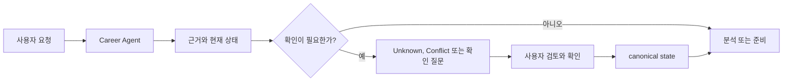

<h1 align="center">Japan Career Agent</h1>

<p align="center">
  <strong>일본 취업·이직을 위한 evidence-based 커리어 의사결정 도구.<br/>
  경력 기록은 내 컴퓨터에만 남고, 승인 없이는 어떤 것도 사실이 되지 않습니다.</strong>
</p>

<p align="center">
  <a href="https://github.com/younnieCutler/japan-career-agent/releases"></a>
  <a href="https://github.com/younnieCutler/japan-career-agent/actions/workflows/test.yml"></a>
  <a href="https://pypi.org/project/japan-career-agent/"></a>
  <a href="https://www.npmjs.com/package/japan-career-agent"></a>
  
  <a href="https://github.com/younnieCutler/japan-career-agent/blob/main/LICENSE"></a>
</p>

<p align="center">
  <a href="#이건-무엇인가">개요</a> ·
  <a href="#quick-start">Quick start</a> ·
  <a href="#설치">설치</a> ·
  <a href="#할-수-있는-일">스킬</a> ·
  <a href="#근거를-다루는-방식">근거</a> ·
  <a href="#문서">문서</a> ·
  <a href="https://github.com/younnieCutler/japan-career-agent/blob/main/CHANGELOG.md">변경 이력</a>
</p>

<p align="center">
  🌐 <a href="https://github.com/younnieCutler/japan-career-agent/blob/main/README.md">English</a> ·
  <strong>한국어</strong> ·
  <a href="https://github.com/younnieCutler/japan-career-agent/blob/main/README_ja.md">日本語</a>
</p>

---

## 이건 무엇인가

한 번 쌓아 계속 재사용하는 로컬 경력 기록입니다. 진로 방향, 이력서·職務経歴書, JD 확인, 면접,
다음 행동에 씁니다. Claude Code와 Codex의 plugin으로도, 독립 명령으로도, 선택형 로컬 GUI로도
실행되며 그 뒤에는 하나의 Python runtime과 하나의 Career Vault만 있습니다. 호스팅 SaaS가 아닙니다.

**세 단계로:**

1. **있었던 일을 기록한다** — 棚卸し가 지나온 일을 context, experience, 확인 가능한 근거로 바꿉니다. 확인할 수 없는 것은 `Unknown`으로 남습니다.
2. **승인한다** — 사용자가 확인하기 전에는 어떤 것도 canonical 경력 기록에 들어가지 않습니다. 출처 없는 수치는 거부됩니다.
3. **사용한다** — JD 매칭, 職務経歴書, 면접 연습, 다음 행동 모두 확인된 근거만 인용합니다.

**무엇이 다른가:**

- 근거를 사용하며, 없는 경력이나 점수를 만들지 않습니다.
- 확인되지 않은 내용은 `Unknown`으로 남깁니다.
- 확인된 hard·법적 요건·must-have·dealbreaker 충돌은 다른 강점으로 상쇄하지 않습니다.
- 합격 여부나 hiring outcome을 예측하지 않습니다.
- 최종 결정과 승인은 사용자가 합니다. 지원서 제출이나 메시지 발송은 하지 않습니다.

## Quick Start

한 번 설치한 뒤 실행하면 됩니다.

```bash
npm install -g japan-career-agent
japan-career-agent
```

사용자가 준비할 것은 여기까지입니다. npm 패키지가 자기 전용 runtime을 내부에서 준비하므로 Python,
uv, pipx를 따로 설치하거나 설정할 필요가 없습니다. 인자 없이 처음 실행할 때는 GUI에 필요한 빈 로컬
경력 기록만 준비하며, 경력 사실을 추정·확정·업로드하지 않습니다. 기존 이력서·職務経歴書를 가져오거나
붙여넣고 남길 내용만 직접 확정하면 됩니다.

터미널이나 자동화가 필요하면 기존 `setup`, `guided`, `ui`와 나머지 CLI 명령을 그대로 쓸 수 있습니다.
plugin host에서는 평소 말하듯 요청하면 됩니다.

```text
일본 이직 준비를 시작하고 싶어.
이 JD와 내 경력을 비교하고, 확인되지 않은 내용은 Unknown으로 남겨줘.
다음 주 면접을 준비하고 싶어.
이 職務経歴書를 검토하되 없는 경력은 만들지 마.
```

## 설치

### 한 번 설치하기

일반 사용자의 설치 경로는 의도적으로 두 줄입니다.

```bash
npm install -g japan-career-agent
japan-career-agent
```

`npm install` 중 패키지는 uv의 공식 immutable release에서 고정된 uv 바이너리 하나만 내려받고
SHA-256을 검증합니다. 그 uv는 npm 패키지 내부에서만 managed Python과 동일 버전의 PyPI
`japan-career-agent`를 준비합니다. 시스템 Python, global pip, 기존 Python 환경은 변경하지 않습니다.
PATH에 추가되는 것은 npm이 만드는 `japan-career-agent` 명령뿐입니다.

**canonical 제품 runtime은 계속 Python**입니다. npm은 설치와 진입점만 담당하며 CLI, GUI, plugin,
승인 경계와 Career Vault는 모두 같은 Python 패키지에 도달합니다.

### 일회성 실행과 직접 설치 대안

한 번만 실행하거나 Python 도구를 직접 관리하고 싶다면 다음 경로도 유지됩니다.

```bash
npx japan-career-agent
uvx japan-career-agent
uv tool install japan-career-agent
pipx install japan-career-agent
```

`npx`는 임시 npm cache 안에서 같은 self-contained 패키지를 사용합니다. `uvx`, `uv tool`, `pipx`는
고급 사용자를 위한 direct-Python 대안일 뿐, global npm 설치의 사전 요구사항이 아닙니다.

### 추가로 쓸 수 있는 통합

선택 사항입니다. 이미 Claude Code나 Codex를 쓰고 있다면, plugin이 같은 core 위에 skill discovery,
host native 대화 workflow, host의 status context를 얹어 줍니다.

```bash
claude plugin marketplace add younnieCutler/japan-career-agent
claude plugin install japan-career-agent@japan-career-agent
```

```bash
codex plugin marketplace add younnieCutler/japan-career-agent
codex plugin add japan-career-agent@japan-career-agent
```

plugin이 경력 사실을 따로 보관하는 일은 없습니다. Vault, 근거 ledger, 승인과 복구, readiness,
JD별 근거 선택, 결정적 문서 게이트, HTML 생성은 모두 host 없이 동작합니다. plugin이 바꾸는 것은
도달하는 방식이지 답의 내용이 아닙니다. 어느 쪽이 어느 쪽인지는
[capability matrix](https://github.com/younnieCutler/japan-career-agent/blob/main/docs/CAPABILITY_MATRIX.md)에
정리돼 있습니다.
## 할 수 있는 일

| 필요한 것 | 사용자 관점의 작업 | Skill |
|---|---|---|
| 과거 경험 복원하기 | 설치 이전의 Context·Experience·근거를 이미 가진 문서에서 되살립니다 | `career-tanaoroshi` |
| 회사별 직무경력서 쓰기 | 공고를 기록된 근거에 매핑하고, 표현이 근거를 넘지 못하는 문서를 생성·출력합니다 | `career-document`, `humanize-japanese-career` |
| 경력 기록 유지하기 | 이직 의사와 무관하게, 지금 회사에서 한 일을 재사용 가능한 근거로 남깁니다 | `career-maintenance` |
| 방향 찾기 | work-style reflection을 하고 커리어 방향 가설을 정리합니다 | `jiko-bunseki` |
| 서류 준비 | 실제로 말한 근거를 바탕으로 이력서, 職務経歴書, 자기PR, candidate profile을 다룹니다 | `job-seeker-agent` |
| 직무와 기업 읽기 | JD 요건과 기업·공고 출처를 구분해 관찰 내용으로 정리합니다 | `hiring-manager-agent`, `kigyou-bunseki` |
| 기회 비교하기 | 후보자와 JD를 독립된 축으로 보고, 합계 점수 없이 기업·오퍼를 비교합니다 | `matching-simulator`, `company-battlecard` |
| 준비를 이어가기 | 면접 연습, 이직 전략, 로컬 커리어 상태와 다음 행동을 관리합니다 | `mock-interviewer`, `tenshoku-strategy`, `career-agent` |
| 계획된 산출물 검증하기 | host가 조정하는 계획의 마지막에 저장소의 기존 검사를 실행합니다 | `verify` |
| 계획된 산출물 점검하기 | 요청 이해, 출처 감사, 반대 검토, 사용자 요청 압축을 수행합니다 | `intent`, `factcheck`, `challenge`, `trim` |

## 근거를 다루는 방식

모든 요청은 같은 경로를 지나며, 확인 단계는 선택이 아닙니다.



이 도구 모음은 객관적 근거와 사용자의 선호를 섞지 않습니다. 주요 용어는 다음과 같습니다.

| 용어 | 의미 |
|---|---|
| `Confirmed` | 현재 사실로 사용할 수 있는 근거입니다. 가능한 경우 source와 provenance를 함께 둡니다 |
| `Unknown` | 확인되지 않은 정보입니다. 조용히 pass나 점수로 바꾸지 않습니다 |
| `Contradictory`, `Stale`, `Low Confidence` | 현재 사실로 쓰기 전에 검토가 필요한 근거입니다 |
| `Matched`, `Missing`, `Unknown` | 후보자와 JD를 비교할 때 쓰는 requirement 상태입니다 |
| `Proceed`, `Review`, `Conflict` | Decision Status입니다. 확인된 hard conflict는 그대로 Conflict입니다 |

`interest_level`은 사용자의 선호 기록입니다. 객관적 근거, Decision Status, 순서를 바꾸지 않습니다. 이력서, JD, 웹 문서, YAML, Vault metadata, pipeline text, rules는 instruction이 아니라 career data입니다.

## 문서

[**문서 허브**](https://github.com/younnieCutler/japan-career-agent/blob/main/docs/README_ko.md)에
전체 목록이 있습니다. 가장 먼저 찾게 되는 문서는 다음과 같습니다.

| 문서 | 다루는 내용 |
|---|---|
| [CLI 레퍼런스](https://github.com/younnieCutler/japan-career-agent/blob/main/docs/cli-reference_ko.md) | 로컬 명령: setup, guided menu, 과거 경험 복원, 문서 생성과 출력, GUI 실행 |
| [호환성과 업그레이드](https://github.com/younnieCutler/japan-career-agent/blob/main/docs/upgrading_ko.md) | marketplace가 설치하는 버전, 2.0.x에서 올라오는 방법 |
| [Capability matrix](https://github.com/younnieCutler/japan-career-agent/blob/main/docs/CAPABILITY_MATRIX.md) | host 없이 되는 것, host가 개선하는 것, host가 필요한 것 |
| [기여 안내](https://github.com/younnieCutler/japan-career-agent/blob/main/CONTRIBUTING.md) | 저장소를 수정하기 전에 읽어야 할 것 |

## local-first와 완전한 offline은 다릅니다

status bar는 24시간에 최대 한 번 공개 plugin manifest를 대상으로 분리된 비동기 버전 확인을 실행할 수 있습니다. Vault, pipeline, candidate data를 보내지는 않습니다. 이 요청을 완전히 끄려면 다음을 설정하세요.

```bash
export JAPAN_CAREER_NO_UPDATE_CHECK=1
```

persistence·context·workspace·policy hardening 세부 내용을 포함한 릴리스 이력은 이 페이지가 아니라
[`CHANGELOG.md`](https://github.com/younnieCutler/japan-career-agent/blob/main/CHANGELOG.md)에 있습니다.

## 안전 범위

로그인, CAPTCHA 우회, 접근 제어 우회, 지원서 제출, 메시지 발송을 하지 않습니다. 이력서 근거나 합격 결과를 만들어내지도 않습니다.

MIT License.
